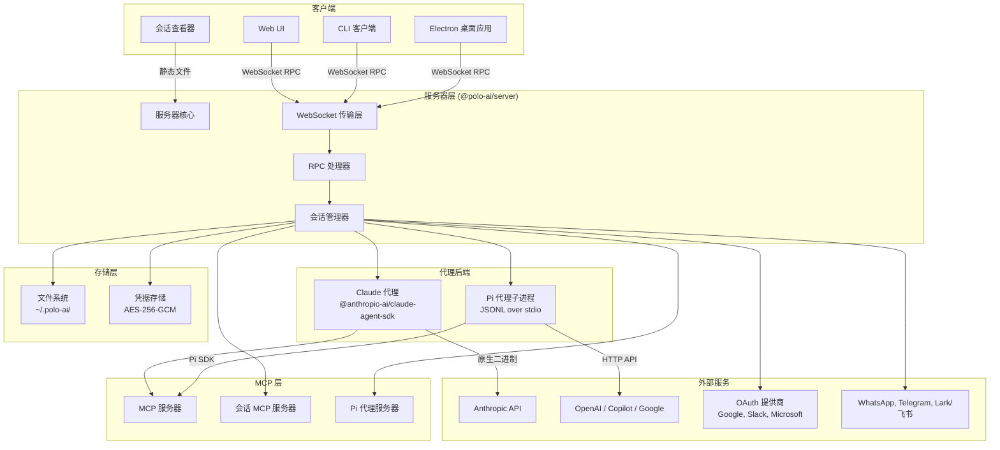
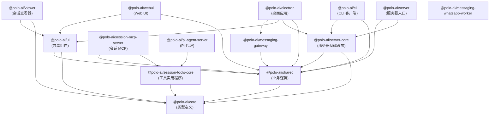
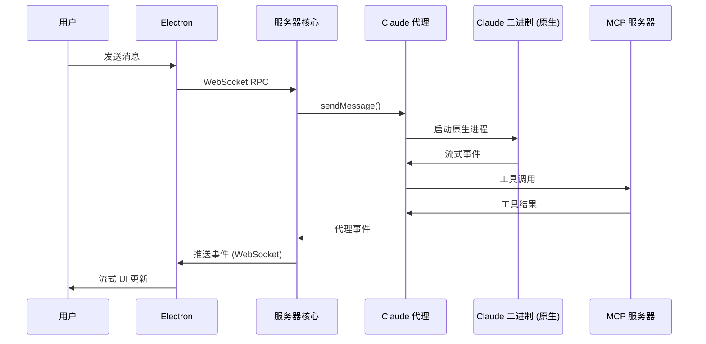
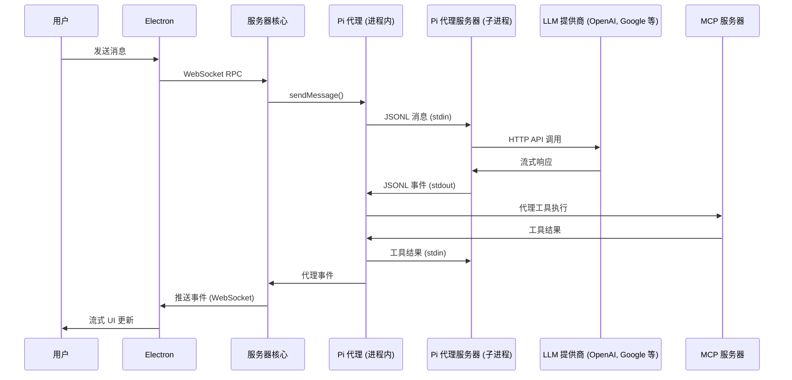
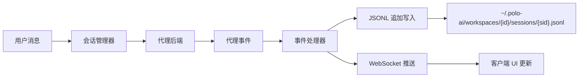
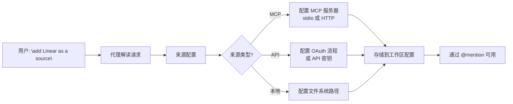

# 05 - 系统架构

## 高层架构



## 包依赖关系图



## 代理后端架构

### Claude 代理路径



### Pi 代理路径



## 数据流架构

### 会话持久化流程



### 来源配置流程



## 进程架构

### Electron 桌面应用

```
┌─────────────────────────────────────────────────┐
│ Electron 主进程                                  │
│ ├── 窗口管理                                     │
│ ├── IPC 桥接 (preload)                           │
│ ├── 服务器核心（嵌入式）                          │
│ ├── 会话管理器                                   │
│ ├── Claude 代理（启动原生二进制）                 │
│ ├── Pi 代理（通过 JSONL 启动子进程）             │
│ ├── 凭据存储                                     │
│ ├── 配置监听器                                   │
│ └── 托盘 / 菜单 / 自动更新                       │
├─────────────────────────────────────────────────┤
│ 渲染进程 (React)                                 │
│ ├── Vite HMR                                     │
│ ├── Jotai 状态管理                               │
│ ├── 聊天组件                                     │
│ ├── 会话列表                                     │
│ ├── 设置 UI                                      │
│ └── 主题系统                                     │
└─────────────────────────────────────────────────┘
```

### 无头服务器

```
┌─────────────────────────────────────────────────┐
│ Bun 进程                                         │
│ ├── WebSocket 服务器 (端口 9100)                  │
│ ├── RPC 处理器                                   │
│ ├── 会话管理器                                   │
│ ├── Claude 代理后端                              │
│ ├── Pi 代理后端                                  │
│ ├── WebUI 静态文件服务器                         │
│ ├── 消息网关                                     │
│ └── WhatsApp 工作进程 (Node.js 子进程)           │
└─────────────────────────────────────────────────┘
```

## 待确认事项

| 编号 | 内容 | 置信度 | 建议 |
|------|------|--------|------|
| TC-007 | 消息网关内部架构 | 中等 | 确认确切的消息路由拓扑 |
