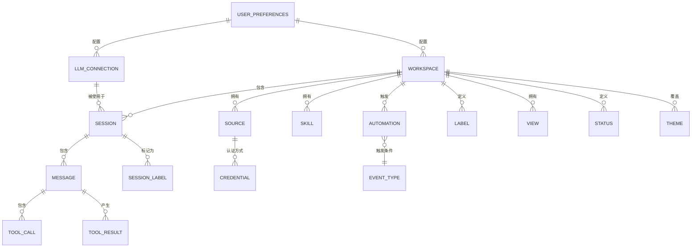

# 06 - 数据模型

## 核心实体

### ER 关系图



## 实体定义

### Config（全局配置）
**文件**：`~/.polo-ai/config.json`
**管理模块**：`@polo-ai/shared/src/config/`

| 字段 | 类型 | 说明 |
|------|------|------|
| workspaces | WorkspaceConfig[] | 工作区配置列表 |
| llmConnections | LlmConnection[] | LLM 提供商连接 |
| defaultWorkspaceId | string | 启动时的默认工作区 |

### Workspace（工作区）
**文件**：`~/.polo-ai/workspaces/{id}/config.json`
**管理模块**：`@polo-ai/shared/src/workspaces/`

| 字段 | 类型 | 说明 |
|------|------|------|
| id | string | 唯一工作区标识符 |
| name | string | 工作区显示名称 |
| slug | string | URL 安全的工作区别名 |
| directory | string | 本地文件系统路径 |
| defaultConnectionId | string | 默认 LLM 连接 |
| theme | ThemeConfig | 工作区主题覆盖 |
| sources | SourceConfig[] | 已连接的来源 |
| skills | SkillConfig[] | 工作区级别的技能 |
| statuses | StatusConfig[] | 自定义状态工作流 |
| automations | AutomationConfig | 事件驱动的自动化 |
| labels | LabelConfig[] | 工作区标签定义 |
| views | ViewConfig[] | 已保存的视图 |

### LlmConnection（LLM 连接）
**文件**：存储在 config.json 中
**管理模块**：`@polo-ai/shared/src/config/`

| 字段 | 类型 | 说明 |
|------|------|------|
| id | string | 唯一连接标识符 |
| name | string | 显示名称 |
| providerType | 'claude' \| 'pi' | 后端提供商类型 |
| authType | 'api_key' \| 'oauth' \| 'codex' | 认证方式 |
| apiKey | string (encrypted) | API 密钥（如适用） |
| baseUrl | string | 自定义 API 端点 URL |
| customEndpoint | CustomEndpointConfig | 自定义提供商设置 |
| customModels | CustomModelEntry[] | 已注册的自定义模型 |
| defaultModel | string | 此连接的默认模型 |
| midStreamBehavior | 'queue' \| 'steer' | 流式消息中途处理方式 |

### Session（会话）
**文件**：`~/.polo-ai/workspaces/{id}/sessions/{sessionId}.jsonl`
**管理模块**：`@polo-ai/shared/src/sessions/`

| 字段 | 类型 | 说明 |
|------|------|------|
| id | string | 唯一会话标识符 |
| workspaceId | string | 所属工作区 |
| name | string | 会话标题（AI 生成或手动设置） |
| status | string | 当前工作流状态 |
| labels | string[] | 已应用的标签 |
| flagged | boolean | 标记状态 |
| archived | boolean | 归档状态 |
| mode | 'safe' \| 'ask' \| 'allow-all' | 权限模式 |
| connectionId | string | 正在使用的 LLM 连接 |
| model | string | 当前模型 |
| thinkingLevel | string | 思考等级设置 |
| createdAt | string (ISO 8601) | 创建时间戳 |
| updatedAt | string (ISO 8601) | 最后更新时间戳 |

### Message（消息，JSONL 条目）
**文件**：存储在会话 JSONL 中
**管理模块**：`@polo-ai/shared/src/sessions/`

| 字段 | 类型 | 说明 |
|------|------|------|
| type | 'user' \| 'assistant' \| 'tool_result' \| 'system' | 消息角色 |
| content | string \| ContentBlock[] | 消息内容 |
| toolCalls | ToolCall[] | 工具调用（助手消息） |
| toolResults | ToolResult[] | 工具结果 |
| images | ImageBlock[] | 附加的图片 |
| files | FileAttachment[] | 附加的文件 |
| timestamp | string | ISO 8601 时间戳 |
| metadata | Record<string, unknown> | 额外的元数据 |

### Source（来源）
**文件**：`~/.polo-ai/workspaces/{id}/sources/{sourceSlug}/`
**管理模块**：`@polo-ai/shared/src/sources/`

| 字段 | 类型 | 说明 |
|------|------|------|
| slug | string | URL 安全的标识符 |
| name | string | 显示名称 |
| type | 'mcp' \| 'api' \| 'local' | 来源类型 |
| config | SourceTypeConfig | 特定类型的配置 |
| credentials | CredentialRef | 存储凭据的引用 |
| enabled | boolean | 启用状态 |

### Skill（技能）
**文件**：`~/.polo-ai/workspaces/{id}/skills/{skillSlug}/`
**管理模块**：`@polo-ai/shared/src/skills/`

| 字段 | 类型 | 说明 |
|------|------|------|
| slug | string | URL 安全的标识符 |
| name | string | 显示名称 |
| description | string | 技能描述 |
| instructions | string | 代理指令（Markdown） |

### Automation（自动化）
**文件**：`~/.polo-ai/workspaces/{id}/automations.json`
**管理模块**：`@polo-ai/shared/src/automations/`

| 字段 | 类型 | 说明 |
|------|------|------|
| version | number | 配置模式版本 |
| automations | Record<EventType, AutomationRule[]> | 事件触发的规则 |

### AutomationRule（自动化规则）
| 字段 | 类型 | 说明 |
|------|------|------|
| matcher | string | 事件匹配模式（正则表达式） |
| cron | string | Cron 表达式（用于 SchedulerTick） |
| timezone | string | Cron 的时区 |
| labels | string[] | 应用于创建的会话的标签 |
| telegramTopic | string | 可选的 Telegram 话题路由 |
| actions | AutomationAction[] | 要执行的动作 |

### AutomationAction（自动化动作）
| 字段 | 类型 | 说明 |
|------|------|------|
| type | 'prompt' | 动作类型 |
| prompt | string | 支持变量展开的模板 |

### Credentials（凭据）
**文件**：`~/.polo-ai/credentials.enc`
**管理模块**：`@polo-ai/shared/src/credentials/`

| 字段 | 类型 | 说明 |
|------|------|------|
| encryption | AES-256-GCM | 加密算法 |
| entries | Record<credentialId, CredentialEntry> | 存储的凭据 |

## 配置文件结构

```
~/.polo-ai/
├── config.json                    # 全局配置（工作区、连接）
├── credentials.enc                # AES-256-GCM 加密凭据
├── preferences.json               # 用户偏好设置
├── theme.json                     # 应用级主题
└── workspaces/
    └── {workspace-id}/
        ├── config.json            # 工作区设置
        ├── theme.json             # 工作区主题覆盖
        ├── automations.json       # 自动化规则
        ├── sessions/
        │   └── {session-id}.jsonl # 会话数据（仅追加）
        ├── sources/
        │   └── {source-slug}/
        │       └── config.json    # 来源配置
        ├── skills/
        │   └── {skill-slug}/
        │       └── instructions.md # 技能指令
        └── statuses/
            └── config.json        # 状态工作流配置
```

## 待确认事项

| 编号 | 内容 | 置信度 | 建议 |
|------|------|--------|------|
| TC-008 | CredentialEntry 内部模式 | 中等 | 确认是否存在密钥派生层次结构 |
| TC-009 | Session JSONL 条目模式的完整性 | 中等 | 确认是否存在未记录的条目类型 |
