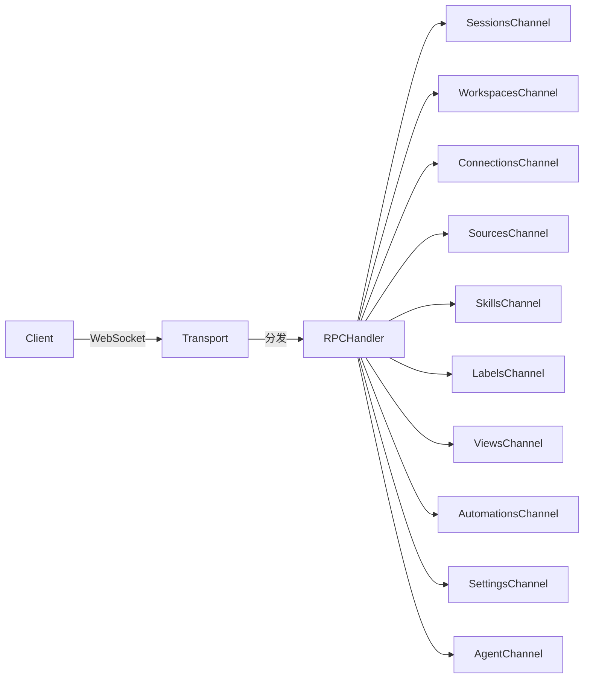

# 07 - API 接口设计

## 通信协议

### 传输层
- **协议**：WebSocket（ws:// 或 wss://）
- **默认端口**：9100
- **认证方式**：通过查询参数或请求头传递 Bearer Token
- **消息格式**：基于 WebSocket 帧的 JSON-RPC 风格消息

### 客户端类型
| 客户端 | 连接方式 | 用途 |
|--------|----------|------|
| Electron 桌面端 | WebSocket RPC | 全功能客户端 |
| CLI | WebSocket RPC | 可编程终端客户端 |
| WebUI | WebSocket RPC | 浏览器瘦客户端 |
| Viewer | 静态文件 | 只读会话分享 |

## RPC 通道架构

### RPC 通道（server-core/src/handlers/rpc/）

服务端使用基于通道的 RPC 系统，每个业务域有独立的处理器：

### RPC 端点（从 CLI 命令和 server-core 推断）

#### 会话管理
| 通道 | 方法 | 描述 |
|------|------|------|
| sessions | list | 列出工作区中的会话 |
| sessions | get | 获取会话详情 |
| sessions | create | 创建新会话 |
| sessions | delete | 删除会话 |
| sessions | archive | 归档/取消归档会话 |
| sessions | rename | 重命名会话 |
| sessions | setStatus | 修改会话状态 |
| sessions | setMode | 修改权限模式 |
| sessions | setFlag | 切换会话标记 |

#### 消息处理
| 通道 | 方法 | 描述 |
|------|------|------|
| agent | sendMessage | 发送用户消息并流式返回响应 |
| agent | cancel | 取消正在进行的生成 |
| agent | compact | 触发会话压缩 |
| agent | setAutoCompaction | 启用/禁用自动压缩 |
| agent | updateRuntimeConfig | 会话中更新模型/提供商 |

#### 工作区管理
| 通道 | 方法 | 描述 |
|------|------|------|
| workspaces | list | 列出工作区 |
| workspaces | get | 获取工作区详情 |
| workspaces | create | 创建工作区 |
| workspaces | delete | 删除工作区 |
| workspaces | update | 更新工作区设置 |

#### LLM 连接
| 通道 | 方法 | 描述 |
|------|------|------|
| connections | list | 列出 LLM 连接 |
| connections | save | 创建或更新连接 |
| connections | delete | 移除连接 |
| connections | test | 测试连接有效性 |

#### Sources（数据源）
| 通道 | 方法 | 描述 |
|------|------|------|
| sources | list | 列出已配置的数据源 |
| sources | get | 获取数据源详情 |
| sources | save | 创建或更新数据源 |
| sources | delete | 移除数据源 |
| sources | refreshCredentials | 刷新 OAuth Token |

#### Skills（技能）
| 通道 | 方法 | 描述 |
|------|------|------|
| skills | list | 列出工作区技能 |
| skills | get | 获取技能详情 |
| skills | save | 创建或更新技能 |
| skills | delete | 删除技能 |

#### Labels（标签）
| 通道 | 方法 | 描述 |
|------|------|------|
| labels | list | 列出工作区标签 |
| labels | add | 为会话添加标签 |
| labels | remove | 从会话移除标签 |

#### Automations（自动化）
| 通道 | 方法 | 描述 |
|------|------|------|
| automations | list | 列出自动化规则 |
| automations | save | 保存自动化配置 |
| automations | test | 测试自动化触发 |

#### Settings（设置）
| 通道 | 方法 | 描述 |
|------|------|------|
| settings | get | 获取偏好设置 |
| settings | update | 更新偏好设置 |
| settings | setTheme | 更新主题 |

#### 服务端信息
| 通道 | 方法 | 描述 |
|------|------|------|
| health | check | 检查凭证存储健康状况 |
| versions | get | 获取服务端运行时版本 |
| system | ping | 连接检测与延迟测量 |

## 推送事件（服务端 → 客户端）

服务端通过 WebSocket 向已连接的客户端推送事件：

| 事件类型 | 描述 |
|----------|------|
| agent_event | Agent 流式事件（工具调用、文本等） |
| session_updated | 会话元数据变更 |
| session_created | 新会话创建 |
| session_deleted | 会话删除 |
| label_added | 标签添加到会话 |
| label_removed | 标签从会话移除 |
| status_changed | 会话状态变更 |
| flag_changed | 会话标记切换 |
| mode_changed | 权限模式变更 |
| connection_updated | LLM 连接配置变更 |
| source_updated | 数据源配置变更 |
| automation_triggered | 自动化规则触发 |

## Agent 后端通信

### Claude Agent 通信
- **传输方式**：原生二进制进程（自 SDK 0.2.113 起）
- **协议**：Claude Agent SDK 内部协议
- **非 Bun 运行**：以各平台原生 `claude` 二进制文件运行

### Pi Agent 通信
- **传输方式**：基于 stdio 的 JSONL（stdin/stdout）
- **进程**：作为 Bun 子进程启动

#### Pi Agent 入站消息（服务端 → 子进程）
| 类型 | 描述 |
|------|------|
| init | 使用模型、认证、配置初始化会话 |
| prompt | 发送用户消息（可选图片） |
| register_tools | 注册/更新代理工具定义 |
| tool_execute_response | 返回工具执行结果 |
| pre_tool_use_response | 返回权限检查结果 |
| abort | 取消当前生成 |
| mini_completion | 快速 LLM 查询（用于摘要） |
| llm_query | 完整 LLM 查询请求 |
| ensure_session_ready | 确保会话已初始化 |
| set_model | 会话中切换模型 |
| set_thinking_level | 调整思考级别 |
| compact | 触发手动压缩 |
| set_auto_compaction | 切换自动压缩 |
| update_runtime_config | 更新运行时配置 |
| steer | 流中消息引导 |
| token_update | 刷新认证 Token |
| shutdown | 优雅关闭 |

#### Pi Agent 出站消息（子进程 → 服务端）
| 类型 | 描述 |
|------|------|
| ready | 会话初始化完成 |
| event | Agent 事件（流式） |
| error | 发生错误 |
| tool_execute_request | 请求工具执行 |
| pre_tool_use_request | 请求权限检查 |
| mini_completion_result | 快速补全结果 |
| llm_query_result | 完整查询结果 |
| ensure_session_ready_result | 会话就绪确认 |
| compact_result | 压缩结果 |
| session_tool_completed | MCP 工具完成通知 |
| pi_turn_anchor | 用于消息关联的轮次锚点 |

## IPC 通信（Electron 主进程 ↔ 渲染进程）

### IPC 通道
- 通过 Electron IPC 进行双向通信
- Context Bridge（预加载脚本）暴露安全 API 接口
- 渲染进程发送命令，接收事件

## CLI 命令 → RPC 映射

| CLI 命令 | RPC 通道 |
|----------|----------|
| `ping` | system.ping |
| `health` | health.check |
| `versions` | versions.get |
| `workspaces` | workspaces.list |
| `sessions` | sessions.list |
| `connections` | connections.list |
| `sources` | sources.list |
| `session create` | sessions.create |
| `session messages` | sessions.getMessages |
| `session delete` | sessions.delete |
| `send` | agent.sendMessage |
| `cancel` | agent.cancel |
| `run` | 多步骤：create + send + stream |
| `invoke` | 直接通道调用 |
| `listen` | WebSocket 事件订阅 |

## 待确认项

| ID | 内容 | 置信度 | 建议操作 |
|----|------|--------|----------|
| TC-010 | ElectronAPI 完整接口定义（500+ 行类型） | 中 | 参见 `apps/electron/src/shared/types.ts:216-704` |
