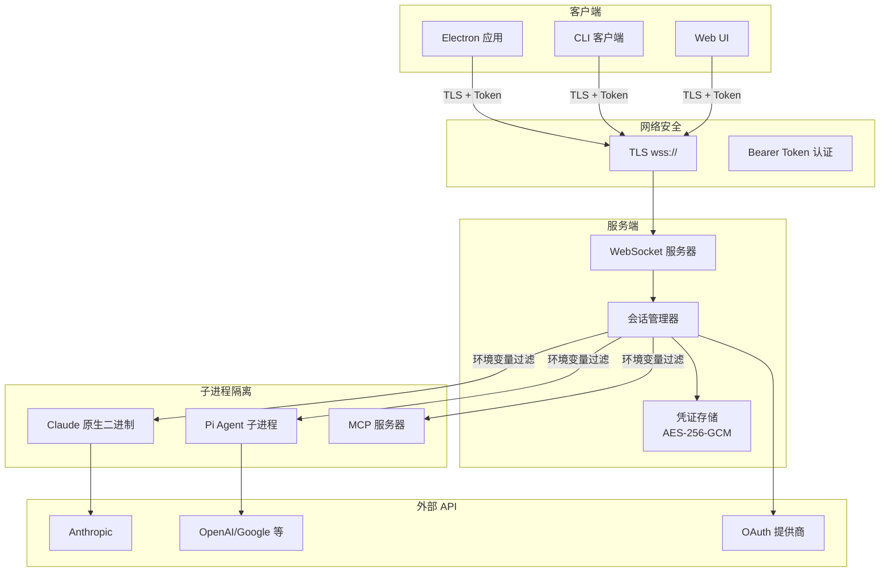

# 09 - 安全分析

## 安全架构概览

## 安全措施

### S-1：凭证加密
- **算法**：AES-256-GCM（认证加密）
- **存储位置**：`~/.polo-ai/credentials.enc`
- **覆盖范围**：所有 API Key、OAuth Token 和密钥
- **密钥派生**：基于机器特定数据的密钥派生
- **访问方式**：仅通过 `@polo-ai/shared/src/credentials/` 模块

### S-2：服务端认证
- **方式**：Bearer Token（服务端启动时生成）
- **环境变量**：`POLO_AI_SERVER_TOKEN`
- **传输方式**：通过 WebSocket 连接的查询参数/请求头传递
- **TLS**：可选的 WebSocket TLS 加密（`wss://`）
- **Docker**：通过卷挂载配置持久化凭证

### S-3：环境变量过滤
启动 MCP 服务端子进程时，以下敏感环境变量会被**过滤移除**：

| 类别 | 变量 |
|------|------|
| 应用认证 | `ANTHROPIC_API_KEY`、`CLAUDE_CODE_OAUTH_TOKEN` |
| AWS | `AWS_ACCESS_KEY_ID`、`AWS_SECRET_ACCESS_KEY`、`AWS_SESSION_TOKEN` |
| 第三方 | `GITHUB_TOKEN`、`GH_TOKEN`、`OPENAI_API_KEY`、`GOOGLE_API_KEY` |
| 支付 | `STRIPE_SECRET_KEY` |
| 包管理 | `NPM_TOKEN` |

数据源配置中的 `env` 字段可显式白名单指定需要传递的变量。

### S-4：权限系统
在工具执行层实施的三级权限模型：

| 级别 | 范围 | 执行方式 |
|------|------|----------|
| `safe` | 只读 | 在工具层阻止所有写操作 |
| `ask` | 提示审批 | PreToolUse 钩子请求用户确认 |
| `allow-all` | 完全访问 | 自动批准所有工具调用 |

### S-5：OAuth 安全
- **Google/Microsoft**：PKCE 流程（桌面端无需 client_secret）
- **Token 存储**：在凭证存储中加密保存
- **Token 刷新**：自动刷新并安全存储
- **WebUI OAuth**：使用中继重定向 URI 和 state 信封确保安全回调

### S-6：Claude SDK Bedrock 隔离
Claude SDK 子进程环境会过滤移除 Bedrock 路由变量：
- `CLAUDE_CODE_USE_BEDROCK`
- `AWS_BEARER_TOKEN_BEDROCK`
- `ANTHROPIC_BEDROCK_BASE_URL`

Pi Bedrock 使用自己的 AWS 环境路径。

### S-7：网络拦截器
- 仅限 Pi：通过 Bun `--preload` 预加载到 Pi 子进程
- 捕获并处理流式响应
- 不适用于 Claude SDK（自 0.2.113 起以原生二进制运行）

### S-8：进程隔离
- Claude Agent：以原生二进制运行（独立进程）
- Pi Agent：以子进程运行（基于 stdio 的 JSONL）
- MCP 服务器：以过滤环境变量的子进程运行
- WhatsApp Worker：以独立的 Node.js 进程运行

### S-9：内容安全
- URL 安全检查（`url-safety.ts`）
- 本地数据源的文件路径验证
- 通过 Zod Schema 进行输入验证

### S-10：消息平台访问控制
消息集成采用双层访问控制模型：
- **工作区级别**：`open`（任何人可发消息）或 `owner-only`（仅所有者）
- **绑定级别**：`inherit`（继承工作区设置）、`allow-list`（显式白名单）或 `open`
- `PendingSendersStore` 追踪被拒绝的发送者，支持在设置界面一键提升权限
- 自签名证书绕过仅限于精确的 `POLO_AI_SERVER_URL` 来源

## 威胁模型

| 威胁 | 缓解措施 | 状态 |
|------|----------|------|
| 磁盘凭证窃取 | AES-256-GCM 加密 | 已实现 |
| WebSocket 中间人攻击 | TLS 支持（wss://） | 已实现 |
| 未授权服务端访问 | Bearer Token 认证 | 已实现 |
| MCP 服务端凭证泄露 | 环境变量过滤 | 已实现 |
| 恶意工具执行 | 权限系统（ask 模式） | 已实现 |
| 跨会话数据泄露 | 工作区隔离 | 已实现 |
| OAuth Token 窃取 | 加密存储 + PKCE | 已实现 |
| 供应链攻击（npm） | package.json 中的 `trustedDependencies` | 已实现 |
| 渲染进程 XSS | Electron 沙箱 + Context Bridge | 已实现 |
| 原生代码执行 | Claude SDK 原生二进制隔离 | 已实现 |

## 待确认项

| ID | 内容 | 置信度 | 建议操作 |
|----|------|--------|----------|
| TC-011 | 加密密钥派生具体实现 | 中 | 确认是否使用 OS 钥匙串或机器 ID |
