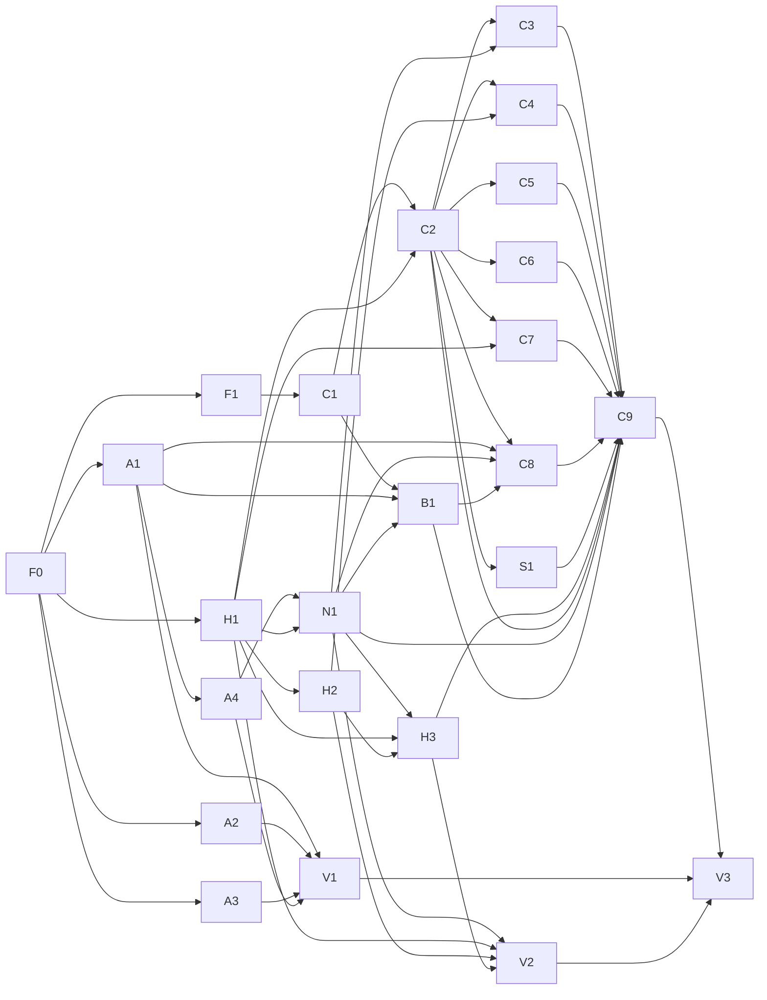

# POO-70 首批客户端开发计划

版本：planning-r4-design-rebind，2026-10-04。状态：24卡已发布的条件计划，尚未启动开发、锁定执行或产品验收。

用户范围：登录、手机号首次自动注册、首页、我的圈子、圈子详情。2张准备、19张开发、3张普通阶段验收；技能管理页面和打开助手后内置Polo助手代码暂缓。

## 来源与交付边界

本卡是 POO-70 本批客户端计划的执行切片；本次用户授权生成计划和任务，尚未授权启动开发。产品需求唯一来源 `/Users/wow/project/z-h-ai/polo-dir/POO-70/docs/client-journey-policy-interview/docs/client-journey-review/spec.md`（master-r15-closure，SHA256 44b0f01e3b710204266a85922b6615d15a4e2f233dfac921f4709fbf25c6fae6）；UI目标 `/Users/wow/project/z-h-ai/polo-dir/POO-70/docs/client-journey-policy-interview/docs/mvp-complete-flow-hifi/prototype.html`（manifest revision poo70-workbench-r15-closure，HTML SHA256 302c749194dd8f8f7fe574d33ba637d26241edcb7f4526ece49effeee02887bf）。原型是派生呈现，演示账号/金额/订单/版本不进入生产代码。

规划代码基线：`integration/poo70-client-entry-r15@ac831ea71a798030806f4e0906bdc93292bc918b`；原有代码基线为 `5cf2f903fc4f773d91723360ca4eb9e011e2c700`；扫描2026-10-04。该分支已有提交的真实登录、首页和顶栏差异，不能从dev覆盖回旧实现。目标集成线 `integration/poo70-client-entry-r15` 已建立，POO-80开工前核对实际HEAD与来源继承；不合并dev/main、不推送、不部署。每卡从执行时该线真实HEAD re-pin；Notma负责task分支/worktree，独立上下文不复制工作树；不能忽略live owner或WIP。完成局部测试、独立code-reviewer（GLM-5.3）Review修复并集成后即可供下游开发；集中验收通过才Done，不能因等待验收串行阻塞独立开发。Reviewer模型不可用需如实记录工具缺口，不静默替换。

本批只做登录（密码/验证码）、手机号首次自动注册、首页、我的圈子、圈子详情及这些流程必需的受信读取/异常恢复/浏览器交接。暂缓管理技能页面和打开助手后的Polo助手内置应用代码；助手打开按钮仅保留已有入口/回调兼容。圈子技能可只读呈现，管理/启用/安装等本批不实现。其他现有Runtime/App/安全切换能力只复用和回归，不扩成POO-44/47/48/52/55/59—66/74—76历史卡的重新派发。浏览器公开加入/支付/创作者管理由POL-114，身份约定POL-112，跨端独立联调POL-174，包格式POL-175（参考，不以整卡Done阻塞本批编码）。

适用项目设计 `.agents/skills/polo-ai-design-system/SKILL.md`（SHA256 4c61b0844fd39cb2fa8aaa0ba56785cbde9e20945a0397a8cdce706e4a11a0a2）；只消费有效确认，b82fa1e5风格与§13.9—13.13入口/文案方向已明确，具体布局/视觉仍待复看。复用当前Renderer而非历史助手转译代码；visual smoke不等于parity或生产Acceptance。F0在执行前校验来源/政策继承，不新增未经确认政策。

Status: draft（有上游的实现卡为awaiting-upstream-repin）；Readiness: scenario_defined；Reviewed/Accepted: 尚未由用户确认执行计划。普通工程解析可自主完成，产品/权限/资金/责任变化用具体例子和推荐方案请求裁决。高风险卡需要与最新Plan hash绑定的技术会签。不得把本次建卡、自检或原型检查写成execution_ready/function_accepted。

本文件是Notma计划的阅读索引；产品结论只维护于spec.md，执行切片最新正文以Notma为准。本目录JSON用于来源/图/Review追溯，不是第二套产品需求。

## 开发任务及全部直接依赖

| 任务 | 交付结果 | 直接依赖 | 验收归属 |
|---|---|---|---|
| POO-80 (F0) | 锁定客户端集成基线、范围与设计继承 | 无 | none：文档Review |
| POO-81 (F1) | 核对成员圈子接口与详情数据交接 | POO-80 | none：文档Review |
| POO-82 (A1) | 登录认证会话与错误恢复接入 | POO-80 | POO-77 |
| POO-83 (A2) | 密码登录表单与登录方式切换 | POO-80 | POO-77 |
| POO-84 (A3) | 验证码登录与首次自动注册交互 | POO-80 | POO-77 |
| POO-85 (H1) | 完整应用目录与多圈授权去重投影 | POO-80 | POO-78 |
| POO-86 (A4) | 登录后我的空间准备与重开恢复 | POO-82 | POO-77 |
| POO-87 (H2) | 首页与圈子共享应用卡及已有打开动作 | POO-80, POO-85 | POO-78 |
| POO-88 (C1) | 成员圈子客户端 API 与受信 RPC 桥接 | POO-81 | POO-79 |
| POO-89 (N1) | 外层导航与首页圈子路由基础 | POO-86, POO-85 | POO-78 |
| POO-90 (C2) | 成员圈子读取状态与账号空间隔离 | POO-88, POO-85 | POO-79 |
| POO-77 (V1) | 阶段一验收：登录、自动注册与我的空间恢复 | POO-82, POO-83, POO-84, POO-86 | 自身 per_card |
| POO-91 (H3) | 我的应用首页与搜索排序空失败态 | POO-89, POO-85, POO-87 | POO-78 |
| POO-92 (C3) | 我的圈子搜索筛选与统一列表 | POO-89, POO-90 | POO-79 |
| POO-93 (C4) | 圈子应用内容区与技能只读边界 | POO-87, POO-90 | POO-79 |
| POO-94 (C5) | 圈子更新页的可追溯展示 | POO-90 | POO-79 |
| POO-95 (C6) | 订阅详情与浏览器手动续费交接 | POO-90 | POO-79 |
| POO-96 (C7) | 退出圈子确认与逐来源授权恢复 | POO-90, POO-85 | POO-79 |
| POO-97 (B1) | 圈子网页返回协议与登录候选的主进程桥接 | POO-88, POO-82, POO-89 | POO-79 |
| POO-98 (S1) | 圈子异常帮助入口与原对象返回 | POO-90 | POO-79 |
| POO-99 (C8) | 网页返回原圈子和原订单的主动核对 | POO-90, POO-82, POO-89, POO-97 | POO-79 |
| POO-78 (V2) | 阶段二验收：首页完整目录与外层导航 | POO-89, POO-85, POO-87, POO-91 | 自身 per_card |
| POO-100 (C9) | 圈子详情三分区与外层路由组装 | POO-92, POO-93, POO-94, POO-95, POO-96, POO-99, POO-91, POO-89, POO-90, POO-97, POO-98 | POO-79 |
| POO-79 (V3) | 阶段三验收：圈子列表详情闭环及全批回归 | POO-88, POO-90, POO-92, POO-93, POO-94, POO-95, POO-96, POO-99, POO-100, POO-97, POO-98, POO-77, POO-78 | 自身 per_card |

## 并行与汇合

按task-index全部直接依赖推进；编号不是依赖。F0后认证UI、认证会话、Catalog投影与接口核对并行；认证启动与首页卡提取并行；圈子数据就绪后列表、内容、更新、订阅、退出、客服并行；返回桥接仅等待自己实际消费者。C9收口真实路由，V3最后做跨模块回归。V1/V2是独立验收支线，不阻塞无关就绪实现。

图使用稳定切片别名，对应上表真实编号；V3直接依赖全部圈子成员、B1、S1和V1/V2，完整边在dependency-graph.json。

## 任务 × 验收时机 × 检查 × 场景

| 任务 | schedule | API | browser | visual | 场景要求 | 集中任务/原因 |
|---|---|---|---|---|---|---|
| POO-80 | none | False | False | none | 准备文档核对 | 准备/合同文档通过来源核对和独立Review，不代表产品验收 |
| POO-81 | none | False | False | none | 准备文档核对 | 准备/合同文档通过来源核对和独立Review，不代表产品验收 |
| POO-82 | milestone | True | False | none | P70-AUTH-01, P70-AUTH-02, P70-AUTH-03 | POO-77 |
| POO-83 | milestone | False | True | smoke | P70-PASSWORD-01, P70-PASSWORD-02, P70-PASSWORD-03 | POO-77 |
| POO-84 | milestone | False | True | smoke | P70-PHONE-01, P70-PHONE-02, P70-PHONE-03 | POO-77 |
| POO-85 | milestone | True | False | none | P70-CATALOG-01, P70-CATALOG-02, P70-CATALOG-03 | POO-78 |
| POO-86 | milestone | True | True | smoke | P70-BOOT-01, P70-BOOT-02, P70-BOOT-03 | POO-77 |
| POO-87 | milestone | False | True | smoke | P70-CARD-01, P70-CARD-02, P70-CARD-03 | POO-78 |
| POO-88 | milestone | True | False | none | P70-CIRCLE-API-01, P70-CIRCLE-API-02, P70-CIRCLE-API-03 | POO-79 |
| POO-89 | milestone | False | True | smoke | P70-NAV-01, P70-NAV-02, P70-NAV-03 | POO-78 |
| POO-90 | milestone | True | False | none | P70-CIRCLE-STATE-01, P70-CIRCLE-STATE-02, P70-CIRCLE-STATE-03 | POO-79 |
| POO-77 | per_card | True | True | smoke | P70-AUTH-01, P70-AUTH-02, P70-AUTH-03, P70-PASSWORD-01, P70-PASSWORD-02, P70-PASSWORD-03, P70-PHONE-01, P70-PHONE-02, P70-PHONE-03, P70-BOOT-01, P70-BOOT-02, P70-BOOT-03 | 自身 |
| POO-91 | milestone | False | True | smoke | P70-HOME-01, P70-HOME-02, P70-HOME-03 | POO-78 |
| POO-92 | milestone | False | True | smoke | P70-CIRCLE-LIST-01, P70-CIRCLE-LIST-02, P70-CIRCLE-LIST-03 | POO-79 |
| POO-93 | milestone | False | True | smoke | P70-CIRCLE-CONTENT-01, P70-CIRCLE-CONTENT-02, P70-CIRCLE-CONTENT-03 | POO-79 |
| POO-94 | milestone | False | True | smoke | P70-CIRCLE-UPDATES-01, P70-CIRCLE-UPDATES-02, P70-CIRCLE-UPDATES-03 | POO-79 |
| POO-95 | milestone | True | True | smoke | P70-SUBSCRIPTION-01, P70-SUBSCRIPTION-02, P70-SUBSCRIPTION-03 | POO-79 |
| POO-96 | milestone | True | True | smoke | P70-LEAVE-01, P70-LEAVE-02, P70-LEAVE-03 | POO-79 |
| POO-97 | milestone | True | False | none | P70-RETURN-BRIDGE-01, P70-RETURN-BRIDGE-02, P70-RETURN-BRIDGE-03 | POO-79 |
| POO-98 | milestone | False | True | smoke | P70-SUPPORT-01, P70-SUPPORT-02, P70-SUPPORT-03 | POO-79 |
| POO-99 | milestone | True | True | smoke | P70-RETURN-01, P70-RETURN-02 | POO-79 |
| POO-78 | per_card | True | True | smoke | P70-NAV-01, P70-NAV-02, P70-NAV-03, P70-CATALOG-01, P70-CATALOG-02, P70-CATALOG-03, P70-CARD-01, P70-CARD-02, P70-CARD-03, P70-HOME-01, P70-HOME-02, P70-HOME-03 | 自身 |
| POO-100 | milestone | False | True | smoke | P70-CIRCLE-DETAIL-01, P70-CIRCLE-DETAIL-02, P70-CIRCLE-DETAIL-03 | POO-79 |
| POO-79 | per_card | True | True | smoke | P70-CIRCLE-API-01, P70-CIRCLE-API-02, P70-CIRCLE-API-03, P70-CIRCLE-STATE-01, P70-CIRCLE-STATE-02, P70-CIRCLE-STATE-03, P70-CIRCLE-LIST-01, P70-CIRCLE-LIST-02, P70-CIRCLE-LIST-03, P70-CIRCLE-CONTENT-01, P70-CIRCLE-CONTENT-02, P70-CIRCLE-CONTENT-03, P70-CIRCLE-UPDATES-01, P70-CIRCLE-UPDATES-02, P70-CIRCLE-UPDATES-03, P70-SUBSCRIPTION-01, P70-SUBSCRIPTION-02, P70-SUBSCRIPTION-03, P70-LEAVE-01, P70-LEAVE-02, P70-LEAVE-03, P70-RETURN-01, P70-RETURN-02, P70-CIRCLE-DETAIL-01, P70-CIRCLE-DETAIL-02, P70-CIRCLE-DETAIL-03, P70-RETURN-BRIDGE-01, P70-RETURN-BRIDGE-02, P70-RETURN-BRIDGE-03, P70-SUPPORT-01, P70-SUPPORT-02, P70-SUPPORT-03, P70-AUTH-01, P70-AUTH-02, P70-AUTH-03, P70-PASSWORD-01, P70-PASSWORD-02, P70-PASSWORD-03, P70-PHONE-01, P70-PHONE-02, P70-PHONE-03, P70-BOOT-01, P70-BOOT-02, P70-BOOT-03, P70-NAV-01, P70-NAV-02, P70-NAV-03, P70-CATALOG-01, P70-CATALOG-02, P70-CATALOG-03, P70-CARD-01, P70-CARD-02, P70-CARD-03, P70-HOME-01, P70-HOME-02, P70-HOME-03 | 自身 |

## 可独立实施的交接约定

每卡正文已有：权威来源和hash、准确现存/新增文件及owner、全部直接依赖、3条稳定要求、scene映射、实现顺序、输入输出合同、风险/恢复、局部测试命令、YAML acceptance、集成/回滚及排除范围。未落地上游接口须在其集成后自动re-pin；只读来源不构成整卡等待。

共享文件串行owner：App.tsx A4→N1；HomePage H2→H3；shared types/channels/dto C1→B1；TabContent最终只由C9组装。Locales按poo70.<slice> namespace合并，集成owner顺序处理相同JSON文件，既有sort-locales生成，不覆盖同事keys。

H1持有单一MemberCatalogProvider，N1挂载；H2提取阶段注入现有实例，H3接入共享provider；C2提供单一MemberCircleResourceProvider及invalidateAndRefresh；C9挂载，退出/返回/内容页共用同一实例。原source丢失与新scope回执必须在消费者侧拒绝。

圈子作品先按Catalog sources.circleId投影，完整身份用于现有打开流程；不猜artifactId→artifactInstanceId。更新/profile/support字段通道归F1合同与C1/C2，unsupported不是空列表成功。B1订阅先于pending getter，candidateId去重，C8核对后ack。

## 外部契约与尚未具备的执行条件

提供方静态源码参考：polo-admin/integration/pol114-creator-r26@17477dbfee2640a68d530aa144cf199ff39fe8dd。已证实GET成员circles/memberships、GET renewal preview、PATCH leave_now、GET原订单；周期/校正需核对GET checkout的权威结果。客户端无建单POST。具体DTO由F1形成来源绑定快照，再消费；静态代码不等于已部署服务。

已发现缺口：圈子ownerUserId不等于创作者displayName；更新历史、circleId到shareId映射、客服配置的实际读取需核实；原订单raw paid不足以判当前权益；provider的polo://open不携带orderId且本端默认poloai注册。F1给每项owner/版本/fixture/再查时机；B1定义受控返回协议并兼容无目标打开。未交接字段不由客户端造数据，相关真实验收pending。

POL-175只约束正式包，不把展示资料塞包里；本批不改包/运行内核，不等待包任务全卡Done。POL-174负责真实跨端独立联调，不能用合同fixture通过取代。

当前policy_readiness检查为needs_preparation：缺policy inventory，不能报告已execution_ready。F0沿项目既有设计/政策确认补继承和入口；不新增高层政策或重新访谈已有确认。

## 分拆审计与三轮迭代

独立审查按实际源码发现并修复五项P1；第二轮修Provider时序、排序出处、迟订阅；第三轮修订阅/读取竞争并检查DAG、路径与覆盖。planning-review.json保存最小追溯记录。无P0/P1残留，结论仅为可发布条件计划。

Scope脚本父卡结论split_required；所有卡都保留draft readiness。A4/C6/C7/C8及验收节点仍有split-audit-required：本轮审查判为单一恢复/订阅/退出/返回结果或纯验收节点，已将原C8客服另拆S1；不因安全/并发风险继续拆成会破坏单次事务的重复卡。执行接受后重新评估，必要技术会签/原子证据仍须绑定最终Plan hash。

未生成可派发v3 scope-manifest：其脚本要求全部child dispatch_allowed；当前只是规划授权、缺执行确认和技术会签，不伪造accepted。task-index/dependency-graph为阅读/编排输入，dispatch_allowed=false；开工时按supa-ai完成对应门禁后再封存。

## 阶段验收如何落地

POO-77：认证API、验证码登录/首次注册、会话和个人空间启动/重开；POO-78：首页完整目录、来源身份、空失败离线与Header、入口/route状态，真实圈子页留POO-79；POO-79：圈子列表→三分区→续费网页→原单返回→退出→首页逐源结果与认证/首页回归。

Browser使用zcode，真实Electron/RPC及API权限用实际native入口与独立证据；按TRL资源协议准备和清理；视口light 1440×900、1024×768。Smoke正式验布局可达/遮挡，已确认风格/入口/文案仍是实现约束；待复看布局不选parity，也不虚报visual PASS。

缺服务或身份权限不能写完整PASS；成员实现、Review、集成可推进下游，正式Done等source-bound集中receipt。纯验收没有业务/空提交。

## 可复制开发编排提示词

见[dev-plan-prompt.md](dev-plan-prompt.md)，参考用户指定/Users/wow/project/dev-plan-prompt.md；只生成，没有执行提示词。

## 当前设计来源传播

Skill版本 `poo70-client-design-r2-20261004`；最低设计源提交 `ac831ea71a798030806f4e0906bdc93292bc918b`。当前源模型、基础CSS、增量CSS、模板、生成出口及manifest已经进入独立集成线。后续任务在自身worktree核对提交继承和source hashes，再按最新Plan重新会签。完整传播路径与既有worktree待传播状态见 [design-propagation.md](design-propagation.md) 和机器索引 design-propagation.json。主卡及24子卡已更新，20张既有客户端队列卡仅追加来源与re-pin说明，不纳入本批或重新派发。
