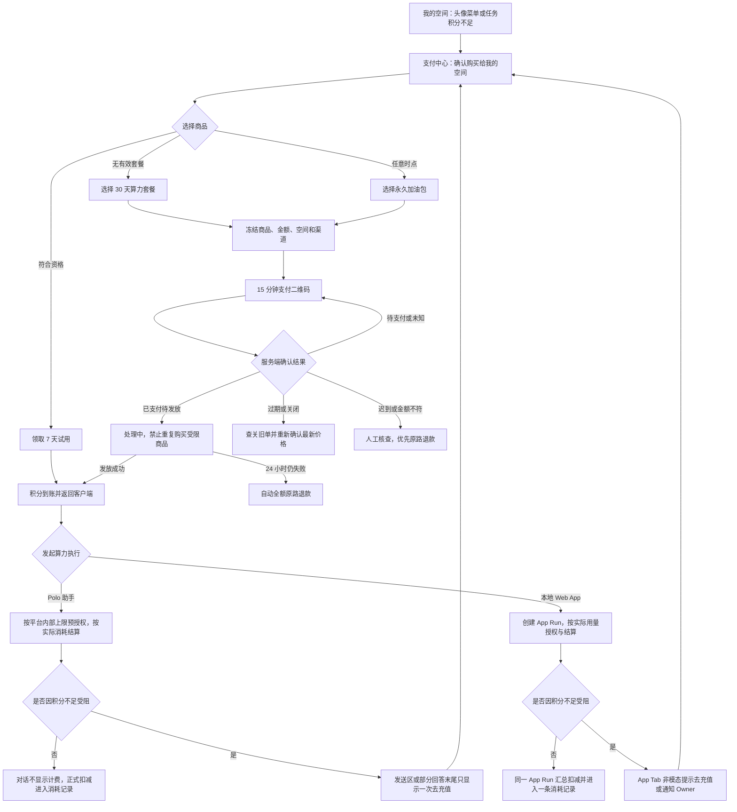
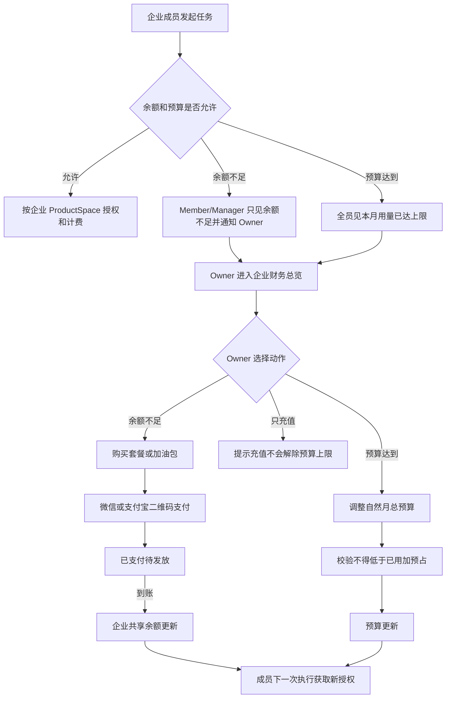
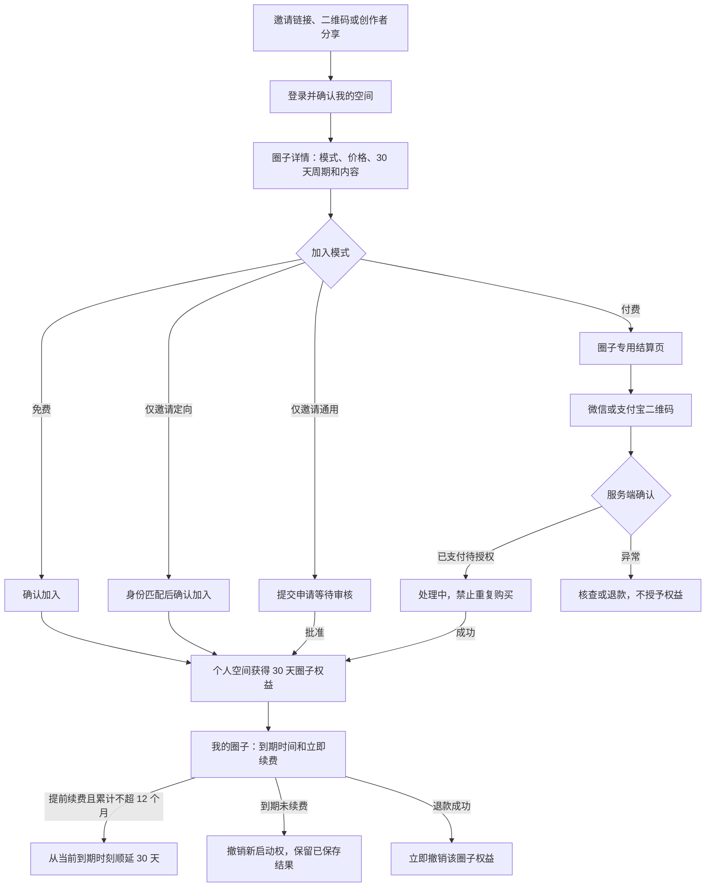

# Polo 第二轮支付用户流程与页面状态设计

> 状态：低保真流程基线，已纳入 Polo 助手计费交互的最新人工裁决
>
> 日期：2026-08-23
>
> 权威需求：[`payment-requirements-round2-handoff.md`](./payment-requirements-round2-handoff.md)
>
> 适用范围：第二轮增量 A（算力支付）与增量 B（圈子支付）的信息架构、跨端流程、页面状态和 UI 责任

## 1. 文档定位

本文承接第二轮支付需求交接，完成进入高保真 UI 前必须冻结的四项输入：

1. 旧文档、冻结 UI 与第二轮规则的逐项差异；
2. 个人算力、企业算力、圈子订阅三条端到端用户流程；
3. Polo 客户端、浏览器支付中心、企业管理端、创作者工作台和平台运营端的页面与状态清单；
4. 跨端交接、权限、通知和异常恢复责任。

本文不冻结价格数字、数据库 Schema、API Path、支付 Provider 协议或最终视觉稿，也不修改第一轮 [`implementation-orchestration-plan.md`](./implementation-orchestration-plan.md) 的任务边界。所有状态名均为产品概念名；技术方案可以使用不同的内部枚举，但不得改变用户可见行为。

## 2. 设计前提

### 2.1 不可破坏的边界

- ProductSpace 是算力订单、积分、执行、供应商凭证和企业预算的唯一归属边界。
- “我的空间”与企业空间分别拥有余额；圈子不是 ProductSpace，也不进入空间切换器。
- 圈子订阅产生个人空间的内容权益和创作者收入，不产生积分。
- 积分只支付 AI 算力，不购买圈子、App 或 Skill。
- Polo 客户端负责消费、余额不足恢复和支付后返回；系统浏览器负责商品、人民币订单、积分余额、消耗记录和财务自助。
- 任何支付、积分、权益和收入纠错都追加事实，不覆盖原订单或历史流水。
- 普通用户界面不展示模型、Token、供应商、成本公式或支付风控规则。

### 2.2 页面状态表达规则

每个页面先表达“现在是什么状态”，再提供当前允许的动作：

| 状态族 | 页面要求 |
| --- | --- |
| 加载中 | 保留页面结构，使用骨架或局部进度；不显示旧空间或旧订单缓存为当前事实 |
| 空状态 | 说明当前没有记录，并只给一个与本页有关的主动作 |
| 可操作 | 支付和财务页明确目标空间、金额/积分/周期、当前可用余额及动作后果；Polo 助手正常对话不展示这些财务信息 |
| 处理中 | 显示最近状态时间和查询动作；禁用会造成重复订单、发放、退款或执行的动作 |
| 受限 | 说明可理解的限制类别和恢复入口；不暴露风控规则或其他主体数据 |
| 失败 | 区分可重试、需重新确认和需人工处理；不能用通用“失败”吞掉资金状态 |
| 完成 | 展示最终归属和下一步；支付完成不等于权益已发放完成 |

## 3. 旧规则到第二轮规则的差异矩阵

本表是更新旧流程、旧 ADR 和冻结 UI 时的直接改稿清单。发生冲突时，以右侧第二轮规则为准。

| 主题 | 旧文档或冻结 UI | 第二轮规则 | UI/流程改动 |
| --- | --- | --- | --- |
| 圈子续费 | 自动续费、取消续费、续费失败宽限期 | 完全手动续费，无自动扣款、取消续费和 `grace_period` | 删除 `cancel-renewal`、`grace-period`；改为“立即续费”、到期提醒、到期失效 |
| 圈子周期 | UI 使用“¥x/月”并暗示自然月或连续扣款 | 每次购买固定获得连续 30 天权益 | 展示“¥x / 30 天”和精确到期时间 |
| 提前续费 | 旧流程未冻结明确上限 | 从当前到期时刻顺延，最多累计 12 个月 | 续费确认页展示续费后到期时间；达到上限时禁用购买 |
| 模式变化 | 有付费成员时只能关闭或新建圈子 | 免费/邀请转付费给现有成员 30 天过渡；付费转免费保留已付周期后转免费 | 创作者工作台增加变化影响预览、通知和过渡状态 |
| 作品跨圈 | 同一作品可向多个圈子分发并共享稳定版本 | 一个作品只能分发到一个圈子；多圈必须重新上传形成不同作品 ID | 删除多圈选择器；上传/创建时绑定唯一目标圈子，复制内容也必须形成新作品 |
| 普通消费来源 | App 卡片、详情、Skill 选择器持续展示创作者或圈子来源 | 普通消费界面不额外展示来源；圈子关系和交易页仍展示目标圈子 | 从首页、普通 App 详情、Skill 选择器移除来源行；“我的圈子”和订阅页保留圈子信息 |
| 同名能力选择 | 依赖来源标签区分同名 Skill | 普通界面不持续展示来源，但仍需可辨认地选择具体作品 | 使用名称、用途说明和作品图标等消费信息消歧；内部仍以作品 ID 和圈子来源授权 |
| 算力单位 | `monthlyQuotaTokens`、`QuotaPeriod`、`UsageRecord` 按用户和 Token | ProductSpace 积分批次、预占、扣减、退款、过期和对账 | 新建积分信息架构；旧 Token 月配额不得作为余额或预算显示 |
| 算力商品 | 早期 POL-94 只有永久预付积分 | 一次性 7 天试用、一款 30 天套餐、三档永久加油包 | 商品页区分试用、套餐、加油包及其购买约束 |
| 套餐复购 | 未定义或可重复购买 | 每空间最多一个有效套餐；用完但未到期只能买加油包 | 商品卡显示“有效中/已用完”；有效期内禁用再次购买套餐 |
| 助手计费 | 第二轮原型在输入区显示单轮上限，回答显示“已结算”、实际消耗、剩余积分和复杂中断卡片 | 每轮实际扣费，但保护上限只在平台内部生效；对话不展示任何积分或结算信息 | 删除上限入口、消耗/余额/已结算行和复杂中断卡；仅在余额不足时显示一次轻量恢复提示，正式消耗改在“积分 -> 消耗记录”展示 |
| App 计费 | Polo 页面模拟 App 任务、报价与结果 | FDE Web App 在本机 localhost 独立运行，本轮统一按实际用量计费 | 删除 Polo 中转页；Catalog/Index 显示计费模式，App Run 归集内部多次 AI 调用 |
| App 启动 | 安装、打开和任务页面存在多次中转 | 已安装一键打开；首次安装确认版本、大小和权限后自动安装、启动并打开 | Polo 负责启动到 App Tab，FDE 核心任务三次点击以内仅作为产品建议 |
| 付款主体 | 旧流程以用户或企业账单概括 | 算力价值归不可变目标 ProductSpace；扫码人可以是他人 | 下单前明确“购买给谁”；订单详情只展示脱敏付款标识，不给代付人产品权限 |
| 企业财务可见性 | Manager 可看企业用量、费用和异常 | Manager 与 Member 只看企业算力可用/不足/本月额度达上限；不看积分金额、消耗记录或任何企业财务详情 | 企业管理端对 Manager 隐藏全部财务导航；客户端头像菜单只显示无金额状态 |
| 企业预算 | 总预算或消费上限，账期语义不完整 | Owner 可选自然月企业总预算；新月只重置用量，不重置余额 | 展示账单时区、周期、已用+预占；充值页在触顶时提示充值不会解除预算上限 |
| 支付入口 | 仅原则性说明系统浏览器结算 | 桌面二维码完整支付；移动浏览器只查看并提示使用另一设备扫码 | 所有创建、刷新、切换渠道和支付结果查询在支付中心完成 |
| 支付渠道 | 未冻结真实首发渠道状态 | 中国大陆人民币，微信 Native 与支付宝二维码，同价 | 支付页用渠道选择和二维码；不设计 H5/App 拉起或长按识别 |
| 订单恢复 | 只说明支付未知不重复扣款 | 同空间+商品+渠道复用待支付订单；切渠道前查询/关闭；深链只传订单 ID | 浏览器和客户端恢复时始终重新查服务端，不接受客户端自报成功 |
| 支付与发放 | 支付成功通常等同权益生效 | 已支付待发放是独立状态；24 小时失败自动原路退款 | 结果页拆分“已支付，处理中”和“已到账”；处理中阻止受限商品重复购买 |
| 二维码过期 | 未完整定义迟到支付 | 15 分钟；过期先查/关旧单，再按最新价下新单；迟到支付人工核查 | 过期页不能直接刷新同一二维码；显示旧单处理状态和重新确认价格 |
| 退款 | 泛化的订单退款 | 算力只退原订单当前全部可退部分；批次冻结；圈子不按剩余天数自助退款 | 订单详情计算可退事实；不提供任意数量或任意金额输入 |
| 拒付 | 泛化为处理中 | 扣回未使用价值；已消费部分形成目标空间待偿金额并暂停新执行 | 空间显示待偿限制；创作者收入单独冻结或冲减 |
| 创作者收入 | 有退款、拒付、待结算、可结算的概念 | 仅圈子内容收入参与分成；30 天风险期、月结、100 元门槛、负余额抵扣 | 收入页明确不包含积分/算力；增加可结算、结算批次、负余额和收款账户等待期 |
| 关闭善后 | 核清账单和责任的原则流程 | 企业按原付款人/渠道逐批退款；圈子选择服务到期或未履约退款 | closing 页面展示逐项责任清单，不能把余额统一退给当前 Owner |

## 4. 全局入口与导航

### 4.1 Polo 客户端入口

- 顶部当前空间区域对所有角色都不显示积分数字或财务状态。
- 点击头像展开账号菜单后，“我的空间”本人和企业 Owner 显示当前空间四位小数可用积分；余额 `>= 100` 使用默认文字色，`> 10` 且 `< 100` 使用橙色，`<= 10` 使用红色。Manager/Member 只显示“企业算力可用”或“企业算力不足”，不显示金额。
- 账号菜单提供“积分与订单”浏览器入口；企业空间中只有 Owner 看见“企业财务管理”，Manager/Member 不显示。
- 助手与 App 在余额不足时提供带任务上下文的恢复动作；个人和 Owner 可“去充值”，Manager/Member 只能“通知 Owner”。
- 低余额不进入 Polo 助手对话，只在头像菜单以积分数字颜色表达，并通过客户端通知中心提醒一次。
- “我的圈子”仅在“我的空间”出现，负责圈子关系、到期和手动续费。

### 4.2 浏览器支付中心一级信息架构

| 一级入口 | 内容 |
| --- | --- |
| 算力商品 | 试用资格、30 天套餐、加油包、目标 ProductSpace |
| 积分 | “余额”页签展示总余额、批次、预占、到期和核对状态；“消耗记录”页签展示正式消耗与返还 |
| 订单 | 算力订单与圈子订单分栏，不合并购物车 |
| 退款 | 可退事实、批次冻结、原渠道退款和人工异常 |
| 发票 | 基于人民币订单申请、开票、红冲状态 |

圈子结算可从邀请链接或“我的圈子”进入专用结算页，但复用同一订单、渠道、退款和发票基础设施。

### 4.3 页面身份头

支付和财务页面必须始终显示当前业务目标：

- 算力页面显示“购买给：我的空间”或具体企业名称；
- 圈子页面显示目标圈子和归属“我的空间”；
- 企业财务页面显示当前企业切换器；
- 订单创建后目标不可编辑，切换目标必须返回商品页重新创建；
- 不显示“实际扫码付款人拥有权益”之类的误导表达。

## 5. 流程 A：个人算力

### 5.1 主流程图

### 5.2 首次试用

1. 已完成手机号验证的用户进入“我的空间”商品页。
2. 服务端返回试用资格：可领取、已领取、已过期或风险不发放。
3. 可领取时，用户确认后获得一次 7 天试用积分批次。
4. 高风险用户仍能购买正式商品；页面只说明“当前无法领取试用积分”，不暴露规则。
5. 试用到账后返回客户端，不承诺固定任务次数。

### 5.3 购买套餐或加油包

1. 用户从头像菜单的“积分与订单”或任务恢复入口打开支付中心。
2. 页面从已验证会话确定 personal ProductSpace，并显示“购买给：我的空间”。
3. 商品页展示人民币价格、积分数量、有效期和算力使用范围。
4. 有有效套餐时，套餐卡显示到期时间；积分已用完时显示“套餐积分已用完”，仍不能复购套餐。
5. 用户选择商品和渠道；服务端创建或复用同空间、商品、渠道的待支付订单。
6. 桌面显示 15 分钟二维码和倒计时；移动端只显示订单状态和使用电脑或另一设备扫码的引导。
7. “我已支付”和二维码页轮询都只触发服务端查询；Polo 客户端不轮询充值结果。
8. 支付渠道确认后进入“已支付，积分发放中”；发放成功才显示新余额。
9. 从任务进入的用户通过订单 ID 和一次性任务恢复上下文返回客户端；客户端弹出“是否已完成充值？”，只在用户点击“已完成，查询结果”时查询一次；不自动执行。
10. 30 天套餐从渠道确认成功的 `paidAt` 起算连续 30×24 小时，以北京时间展示年月日和时分；发放延迟不顺延到期时间。
11. 三档加油包和企业扩展规格使用相同的每积分单价，不用档位折扣或企业折扣诱导选择。

### 5.4 Polo 助手计费

1. 服务端在发送前按 ProductSpace 原子授权，并使用平台内部单轮保护上限；对话输入区不展示上限、积分或调整入口。
2. 正常完成后按实际消耗结算，单轮不设最低 1 积分；回答不显示“已结算”、实际消耗、剩余积分或任何计费图标。
3. 正常回答完成后余额恰好为零时，不显示“本次生成已停止”；下一次发送时再进入发送前余额不足状态。
4. 用户主动中止时保留已返回内容，只在回答末尾显示“已停止生成”；输入框立即恢复可用，不显示积分或充值信息。
5. 个人空间在发送前余额不足时，不创建助手消息，保留可编辑草稿，禁用发送，并只在输入框上方显示“积分不足，暂时无法发送”和“去充值”。
6. 个人空间在生成中余额耗尽时，停止后续生成并保留部分输出；只在该回答末尾显示“积分不足，本次生成已停止”和“去充值”，输入区禁用但不再重复横幅。
7. Enterprise Owner 的对应文案使用“企业积分不足”和“去充值”；Manager/Member 使用“企业积分不足”和“通知 Owner”，不显示企业余额、Owner 姓名或财务数据。
8. 企业本月额度达上限时使用“企业本月算力额度已达上限，暂时无法发送”；Owner 的动作是“调整预算”，Manager/Member 的动作是“通知 Owner”。已授权生成可在授权范围内完成，只阻止下一次发送。
9. 无法确认余额、对账或供应商状态时，发送前统一显示“服务暂时不可用，请稍后重试”，生成中统一显示“服务异常，本次生成已停止”；只提供“重试”，不显示“核对中”、供应商或充值入口。
10. 系统错误且没有可用输出时不扣积分、不生成零消耗记录；有可用部分输出时只扣相应部分。
11. 充值到账后移除积分不足提示并恢复普通输入框；不自动发送、不自动续写、不增加“继续生成”按钮，用户可主动输入“继续”或改变指令后发起新请求。

#### 5.4.1 充值返回查询

1. “去充值”打开当前 ProductSpace 的“算力商品”页，明确显示“购买给：我的空间”或企业名称，但不自动选择商品、推荐充值金额或创建订单。
2. 用户返回 Polo 客户端时弹出“是否已完成充值？”，主按钮为“已完成，查询结果”，次按钮为“还没有”。
3. 客户端不轮询；用户每次点击“已完成，查询结果”或“再次/重新查询”只触发一次服务端查询。
4. 已到账时关闭弹窗并恢复发送；处理中显示“充值处理中”和“再次查询”；未查到付款时显示“暂未查询到充值结果”和“重新查询”；查询失败显示“暂时无法确认充值结果”和“重新查询”。
5. “还没有”只关闭弹窗并保留原不足状态；所有结果都不自动发送或续写。

### 5.5 本地 Web App 运行与计费

1. App 由 FDE 制作并下载到用户设备，在 localhost 独立运行；Polo 只负责 Catalog/Index、分发、启动、权限、App Tab 和本地 AI API，不承载 App 的任务输入、执行过程或结果页面。
2. 本轮所有 App 统一按实际用量计费；Catalog/Index 显示“按实际用量计费”，固定价 App、操作级固定报价和整 App 一次性固定计费均延期且排期未定。
3. 已安装 App 从 Catalog/Index 一次点击后直接启动并打开；首次安装在用户确认版本、大小和权限后自动下载、安装、启动并打开，未新增权限的更新不增加确认。
4. FDE App 为一次用户可理解的任务创建一个 App Run，任务内多次本地 AI 调用携带同一 Run ID；App 明确结束 Run，异常退出或长期未结束时由 Polo 超时收口。
5. 同一 App Run 汇总实际用量并形成一条以 App 名称展示的消耗记录；内部 API 请求不逐条出现在用户记录中。
6. AI 没有返回可用输出时不扣费；部分输出按实际部分计费。AI 已正常返回后，FDE App 后处理或最终交付失败仍按实际算力计费，不自动退款；补偿只追加账本事实。
7. 积分不足时 localhost API 拒绝本次调用且不产生消耗；Polo 在当前 App Tab 上方显示非模态平台提示，个人/Owner 可“去充值”，Manager/Member 只能“通知 Owner”。
8. 充值返回沿用用户点击后的单次查询；到账后保留原 App Tab、移除阻断但不自动重试，用户在 App 内重新发起任务。
9. “从任务首页到发起并完成核心任务不超过 3 次关键点击”只作为 FDE 产品建议，不作为本轮交付规范或验收标准。

### 5.6 批次、精度与流水

1. 试用、套餐、加油包和补偿分别形成可追踪批次，消耗时优先使用最早到期批次。
2. 预占记录所用批次；释放时恢复原批次和原到期时间，已经到期的部分保持过期。
3. 内部账本使用高于四位小数的精度；头像菜单余额、正式消耗与返还记录均固定显示四位小数，不逐次向上取整。
4. 多设备并发通过原子预占防止重复使用；流水保留 ProductSpace、任务、操作者、设备和批次关联。
5. 任务结束后不显示预计扣减；只有正式扣减形成后，才在支付中心追加一条消耗记录。
6. 对账差异时，支付中心显示“核对中”并暂停该空间新付费执行；Polo 助手只显示通用服务异常，补扣、返还和纠错只追加流水。
7. 供应商迟报超出预授权的部分不得把用户余额扣成负数，由 Polo 承担并进入供应商异常；确认作弊另走风控。

#### 5.6.1 消耗记录

1. 页面命名固定为“积分 -> 消耗记录”；“订单”只表示人民币购买，不与积分消耗混称“账单”。
2. 一次 Polo 助手请求对应一条正式消耗记录，固定且唯一的默认展示为：`2026-08-20 14:32 · Polo 助手 · 消耗 2.4100 积分`。
3. 独立 App 使用 App 名称，例如：`2026-08-20 15:08 · 客户访谈整理 · 消耗 18.0000 积分`。Polo 助手调用 Skill 仍统一记为“Polo 助手”。
4. 记录时间使用用户发起请求的时间，不是扣减完成时间；我的空间使用北京时间，企业空间使用企业账单时区，时区只在页面标题旁统一说明。
5. 单条记录不可点击或展开，不增加对话标题、结算状态、剩余余额、成员、模型、Token、Skill 或供应商。
6. 返还和纠错不修改原消耗记录，另追加：`2026-08-20 16:05 · Polo 助手 · 返还 2.4100 积分`。无扣减时不生成“消耗 0.0000 积分”。
7. 小于 `0.0001` 积分的正式变动显示“消耗不足 0.0001 积分”或“返还不足 0.0001 积分”，不向上取整。
8. 记录按 ProductSpace 分开、按时间倒序，只提供“近 7 天 / 近 30 天 / 自定义时间”和分页；不提供模型、Skill、供应商或其他复杂分类筛选。
9. Enterprise Owner 可查看当前企业的全部消耗记录，但单条不显示成员；Manager/Member 不能访问企业消耗记录或任何积分金额。Owner 的成员用量聚合另在企业财务总览展示，不改变单条记录格式。
10. 页面底部统一提供“账单有疑问”入口；用户选择时间范围并描述问题，平台使用 ProductSpace 和内部流水定位，不在单条记录上放申诉动作。

### 5.7 个人退款与发票

1. 用户从原订单进入详情。
2. 页面显示该订单当前未使用、未预占、未过期的全部可退积分及按原单价计算的金额。
3. 用户重新验证身份后一次性申请退回当前全部可退部分，不能输入数量。
4. 申请后冻结相关批次；退款成功后追加退款流水，30 天套餐立即结束。
5. 退款原路返回实际付款人；原渠道不可退时转人工实名核验流程。
6. 发票按人民币订单申请；已退款不可重复开票，已开票退款必须进入红冲。

## 6. 流程 B：企业算力

### 6.1 主流程图

### 6.2 成员侧体验

- Member 与 Manager 在客户端只看“企业算力可用”“企业积分不足”“企业本月算力额度已达上限”以及不含内部原因的通用服务异常。
- 两者都看不到企业总余额、任何积分金额、消耗记录、购买批次、订单、成员用量、预算金额、充值、退款或发票入口。
- 发送前企业积分不足时，保留可编辑草稿，禁用发送，只显示“企业积分不足，暂时无法发送”和“通知 Owner”。
- 生成中企业积分耗尽时，保留部分回答，只在回答末尾显示“企业积分不足，本次生成已停止”和“通知 Owner”。
- 通知成功后主动作变为“检查是否恢复”；每次点击只查询一次，不轮询。Owner 收到的通知只包含成员、企业、时间和能力类型，不包含任何对话或文件内容。
- 余额恢复后，成员在下一次执行时获得新凭证；旧的中断任务不自动重跑。
- 被人工暂停的成员不因企业充值或调整预算自动恢复。

### 6.3 Owner 购买与预算

1. Owner 从客户端账号菜单或企业管理端进入当前企业财务总览。
2. 总览展示可用余额、预占、套餐状态、最近到期、自然月已用/预占/上限和成员用量汇总。
3. Owner 选择充值时，目标 enterprise ProductSpace 由服务端确定并冻结。
4. 商品、支付、发放、退款和发票流程与个人复用相同基础设施，但订单、积分和流水均归企业。
5. 企业可以展示更大积分规格，但每积分价格不降低。
6. 达到预算上限后仍可充值；商品页和确认页持续显示“充值不会解除本月用量上限”。
7. Owner 调低预算时，新值不得低于本月已用加预占；并发变化要求刷新重确认。
8. 新自然月只把用量计数归零，不改变企业余额或积分批次。

### 6.4 Owner 转让与企业关闭

- 转让确认前关闭未支付订单；已支付待发放订单继续处理。
- 转让后企业余额、订单、发票、待偿和历史不动，新 Owner 获得财务权限，原 Owner 立即失去。
- 企业进入 `closing` 后禁止新购买和新执行，但保留 Owner 的账单、退款、发票和导出。
- 每个可退购买批次分别退回原付款人和原渠道；不能把企业余额统一退给当前 Owner。
- 余额、退款、发票、拒付、待偿和争议未核清时，不得完成关闭。

## 7. 流程 C：圈子订阅

### 7.1 主流程图

### 7.2 购买与续费

1. 付费圈子页面明确展示目标圈子、Creator Owner、30 天价格、当前/续费后到期时间和权益范围。
2. 企业空间上下文不能创建圈子订单；用户必须回到“我的空间”。
3. Creator Owner 或授权管理员不能购买自己管理的圈子。
4. 每次支付只购买一个圈子订阅，不与算力商品合并付款，也不能使用积分抵扣。
5. 到期前手动续费从原到期时刻顺延 30 天；最多累计到 12 个月。
6. 到期前创建且在二维码有效期内支付成功的订单按连续订阅处理；过期后支付进入迟到支付核查。
7. 调价不影响当前周期；续费时展示已审核的新价格并要求重新确认。
8. 到期后不进入宽限期，不能启动圈内 App/Skill；重新购买形成新的有效周期。
9. 首次定价和后续调价都必须位于平台配置边界内并通过审核；创作者不能设置积分或算力价格。

### 7.3 模式变化

| 变化 | 现有成员 | 新用户 | 页面状态 |
| --- | --- | --- | --- |
| 免费/仅邀请 -> 付费 | 获得 30 天过渡期，必须主动购买 | 按付费模式进入结算 | 成员看到过渡到期时间和“购买订阅” |
| 付费 -> 免费 | 当前已付周期继续，到期自动成为免费成员，不退款 | 停止新付费订单，按免费模式加入 | 成员看到“到期后转为免费” |
| 创作者赠送资格 | 从已有付费周期结束后顺延 | 直接获得赠送周期 | 展示赠送来源和独立到期时间，不覆盖订单 |

### 7.4 到期、退款与停服

- 到期、退款成功或退出后，撤销该圈子内容及 App/Skill 的后续启动权，不影响其他圈子、Polo 助手或个人积分。
- 到期前已预授权的任务可以完成；已合法保存到个人空间或本地的结果不追溯删除。
- 不提供按剩余天数自助退款；重复扣款、系统故障或停服可以退款，其他原因进入人工审核。
- 创作者主动停服先停止新订阅，再选择服务到全部订阅结束，或按未履约部分退款后提前关闭。
- 拒付后暂停对应订阅，并冻结或冲减创作者待结算收入；订单保留独立争议状态。
- Polo 支付或平台系统故障导致的退款由 Polo 承担；创作者停服、违规移除核心内容或无法履约导致的退款冲减创作者收入。

## 8. 支付订单共享状态机

以下状态适用于算力和圈子订单，权益结果按订单类型分别写入积分账本或圈子权益账本。

| 用户可见状态 | 含义 | 允许动作 | 禁止动作 |
| --- | --- | --- | --- |
| 待支付 | 二维码有效且渠道未确认付款 | 查询状态、关闭页面、在规则内切换渠道 | 重复创建同目标同商品同渠道订单 |
| 查询中 | 正在服务端查渠道事实 | 等待、稍后重试查询 | 由客户端声明成功 |
| 状态未知 | 渠道暂时不能给出确定事实 | 继续查询、联系支持 | 新建冲突订单、发积分或权益 |
| 已支付待发放 | 渠道已确认，业务权益尚未完成 | 查看进度、关闭页面后再恢复 | 重复购买受限商品、重复发放 |
| 成功 | 支付与权益均已完成 | 查看订单、返回任务、申请发票或符合条件的退款 | 改目标空间或圈子 |
| 已过期 | 15 分钟内未确认付款 | 查询并关闭旧单、按最新价格重新下单 | 直接复活旧二维码 |
| 已关闭 | 订单已安全关闭 | 返回商品页 | 继续支付或发权益 |
| 迟到支付核查 | 关闭/过期后渠道出现付款 | 查看核查进度 | 自动发积分或订阅权益 |
| 金额不符 | 实付与订单金额不同 | 查看人工核查和退款/补款结果 | 按比例发放、客户端改价 |
| 自动退款中 | 支付后 24 小时仍无法发放 | 查看退款进度 | 再补发原权益 |
| 已退款 | 原渠道退款完成 | 查看退款事实和发票红冲 | 恢复已退权益 |
| 人工处理 | 原渠道不可退或事实争议 | 提交必要身份材料、查看进度 | 退给当前使用者或当前 Owner |

渠道切换顺序固定为：查询原订单 -> 能关闭则关闭 -> 不能确定则保持未知并阻止切换 -> 确认关闭后按新渠道创建订单。

两个分别合法创建的订单都被渠道确认支付时，两笔都按各自订单事实入账，不能因商品相同吞掉后支付的一笔。浏览器关闭、回调重复或查询与回调并发都不得改变这一规则。

## 9. 五端页面与状态清单

### 9.1 Polo 客户端

| 页面/组件 ID | 页面或组件 | 关键状态 | 主动作 |
| --- | --- | --- | --- |
| `PC-CREDIT-01` | 头像菜单积分入口 | 个人/企业 Owner 显示四位小数总数，并按 `100`、`10` 两档阈值改变数字颜色；Manager/Member 只显示企业算力可用或不足；顶部当前空间区不显示积分 | 符合权限时打开“积分与订单”或企业财务 |
| `PC-AI-01` | 助手发送区 | 正常、授权中、发送前积分不足、企业预算达到、服务暂时不可用 | 发送；按角色去充值/调整预算/通知 Owner/重试 |
| `PC-AI-02` | 助手单轮结果 | 生成中、正常完成、用户中止、生成中积分耗尽、部分输出、无输出失败、服务异常 | 中止；按角色去充值/通知 Owner/重试；恢复后由用户在普通输入框发起新请求 |
| `PC-APP-01` | App Catalog/Index 与直接启动 | 已安装、未安装、安装中、启动中、更新、新增权限、不可用 | 直接打开；确认后自动安装并打开；查看原因 |
| `PC-APP-02` | 本地 App Tab 平台状态 | 正常运行、App Run 进行中、个人积分不足、企业积分不足、预算达到、服务不可用 | 保持 App；按角色去充值/通知 Owner/调整预算/重试 |
| `PC-RECOVER-01` | 充值后任务恢复 | 返回询问、查询中、订单处理中、已到账、未查到、查询失败、余额仍不足 | 已完成，查询结果；还没有；再次/重新查询；回到原 App 后由用户重新发起 |
| `PC-CIRCLE-01` | 我的圈子列表 | 空、有效、过渡期、即将到期、已到期、暂停、退款中 | 查看圈子、立即续费 |
| `PC-CIRCLE-02` | 圈子详情 | 免费、仅邀请、付费有效、模式过渡、到期、停服、退款/拒付处理中 | 加入、购买、续费、退出、查看处理进度 |
| `PC-SPACE-01` | 空间切换器 | personal、enterprise、访问失效、运行中阻止切换 | 切换 ProductSpace、先终止运行 |

客户端普通 App 卡片或 Index 只增加“按实际用量计费”，不新增积分换算、预估价格、模型、供应商或创作者/圈子来源标签。Polo 助手正常对话和本地 App 结果页面都不展示积分、余额、实际消耗或结算状态。圈子详情因处理圈子关系和交易，继续展示圈子与创作者信息。

### 9.2 浏览器支付中心

| 页面 ID | 页面 | 必须覆盖的状态 |
| --- | --- | --- |
| `PAY-HOME-01` | 支付中心首页 | 当前目标、个人/企业权限差异、未完成订单、财务受限 |
| `PAY-PRODUCT-01` | 算力商品页 | 试用可领/不可领/已领；套餐可买/有效/已用完；加油包可买；商品加载失败 |
| `PAY-CHECKOUT-01` | 算力购买确认 | 目标空间、商品快照、渠道、企业预算触顶提示、风险/金额限制 |
| `PAY-CIRCLE-01` | 圈子订阅确认 | 首购、提前续费、调价重确认、累计 12 个月上限、过渡期购买、自有圈子禁购 |
| `PAY-QR-01` | 二维码支付 | 微信、支付宝、15 分钟倒计时、轮询、查询中、状态未知、渠道停用 |
| `PAY-RESULT-01` | 订单结果 | 支付共享状态机中的全部状态 |
| `PAY-CREDIT-01` | 积分 -> 余额 | 总可用、套餐/加油包/试用/补偿批次、预占、到期、核对中 |
| `PAY-USAGE-01` | 积分 -> 消耗记录 | 正式消耗、返还、空、时间筛选、分页、账单有疑问；单条固定格式且不可点击 |
| `PAY-ORDER-01` | 订单列表与详情 | 算力/圈子分栏、待支付、处理中、成功、退款、争议、代付脱敏信息 |
| `PAY-REFUND-01` | 退款申请与结果 | 可退、无可退、批次冻结、退款中、成功、失败、原渠道不可退 |
| `PAY-INVOICE-01` | 发票申请与结果 | 可申请、开票中、已开票、退款阻止、红冲中、已红冲 |
| `PAY-RESTRICT-01` | 账号/空间受限 | 未验证、暂停、注销善后、空间准备中、风控拒绝、大额限制、渠道不可用 |

订单创建资格由服务端判断：只有状态正常、已完成手机号验证且 ProductSpace 已就绪的业务账号可以购买。工作人员账号、暂停账号和空间准备中的账号不能创建订单；单笔或单日超限时不拆单规避，只显示人工联系入口。

### 9.3 企业管理端

| 页面 ID | 页面 | Owner | Manager/Member |
| --- | --- | --- | --- |
| `ENT-FIN-01` | 财务总览 | 总余额、预占、批次、自然月预算、成员汇总、异常 | 不可见 |
| `ENT-FIN-02` | 企业充值 | 选择商品、二维码支付、订单恢复 | 不可见 |
| `ENT-FIN-03` | 企业订单 | 查看、退款、发票、导出 | 不可见 |
| `ENT-FIN-04` | 月度预算 | 开启/关闭、设置金额、调低冲突、账单时区、变更审计 | 不可见 |
| `ENT-FIN-05` | 成员用量汇总 | 按成员查看聚合用量；不从逐条消耗记录进入成员对话 | 不可见；客户端只看不含金额的企业算力状态 |
| `ENT-FIN-06` | 财务限制恢复 | 余额不足、预算达到、核对中、待偿、渠道停用 | 不可见 |
| `ENT-CLOSE-01` | 企业关闭财务清单 | 多付款人批次、退款、发票、拒付、待偿、争议、导出 | 不可见 |
| `ENT-OWNER-01` | Owner 转让影响确认 | 未支付订单关闭、在途订单、权限切换、历史责任 | 不可见 |

企业管理端不能通过只读方式向 Manager 泄露总余额、订单、预算金额或其他成员用量；应直接隐藏入口并在无权深链时返回拒绝页。

### 9.4 创作者工作台

| 页面 ID | 页面 | 关键状态 |
| --- | --- | --- |
| `CRE-PAID-01` | 付费开通准入 | 身份未完成、协议未签、收款未绑定、价格待审、可开启 |
| `CRE-PRICE-01` | 圈子价格 | 首次定价、审核中、通过、拒绝、调价待审、未来生效 |
| `CRE-MODE-01` | 加入模式变化 | 免费/邀请转付费 30 天过渡、付费转免费、停止新订单、通知进度 |
| `CRE-MEMBER-01` | 成员订阅 | 有效、过渡、赠送顺延、到期、暂停、退款/拒付处理中 |
| `CRE-WORK-01` | 作品与唯一圈子 | 未绑定圈子、已绑定、目标圈子不可用、需为其他圈子重新上传 |
| `CRE-REV-01` | 收入总览 | 实付、退款、拒付、待结算、可结算、已结算、负余额 |
| `CRE-SETTLE-01` | 结算单 | 30 天风险期、未达 100 元累计、待付款、已付款、失败、负余额暂停 |
| `CRE-PAYOUT-01` | 收款账户 | 正常、重新验证、7 天等待期、原/新联系方式通知、变更完成 |
| `CRE-CLOSE-01` | 圈子停服/关闭 | 停止新订阅、服务到期、未履约退款、责任未清、已关闭 |
| `CRE-TRANSFER-01` | 圈子所有权转让 | 平台审核中、支付时间切分收入、通过、拒绝 |

创作者收入页面不得展示成员积分余额、单次算力金额、对话、文件或 App 输入输出；算力购买与消耗不进入创作者收入。

### 9.5 平台运营端

| 页面 ID | 页面 | 处置对象与状态 |
| --- | --- | --- |
| `OPS-PAY-01` | 支付异常队列 | 回调未知/乱序、迟到支付、金额不符、渠道关闭、重复事实 |
| `OPS-GRANT-01` | 发放异常 | 已支付待发放、重试、24 小时自动退款、退款后禁止补发 |
| `OPS-REFUND-01` | 退款/发票异常 | 原渠道不可退、红冲失败、退款成功权益更新失败 |
| `OPS-RECON-01` | 积分与供应商对账 | 差异发现、空间暂停、处理中、追加修正、恢复 |
| `OPS-DISPUTE-01` | 拒付与待偿 | 扣回未用积分、计算待偿、空间限制、补缴恢复 |
| `OPS-USAGE-01` | 任务计费申诉 | 待处理、核对事实、用户附加材料、成立补偿、不成立 |
| `OPS-COMP-01` | 服务补偿 | 关联事件、30 天补偿批次、金额重确认、审计完成 |
| `OPS-CREATOR-01` | 创作者财务 | 定价审核、结算、负余额、退款归责、收款账户等待期 |
| `OPS-CLOSE-01` | 财务核清 | 企业关闭、圈子关闭、账号注销的责任清单与最终确认 |

所有资金处置页必须展示原始事实和拟追加动作；平台工作人员不能直接编辑订单、余额、历史积分、历史用量或创作者收入。

每个任务同时只允许一条有效计费申诉。平台默认只比较订单、预占、用量回执和任务状态，不读取对话、文件或 App 输入输出；只有用户主动附加的材料可以进入该申诉。

## 10. 权限与数据可见性

| 能力 | 个人用户 | Enterprise Owner | Manager/Member | Creator Owner | 平台工作人员 |
| --- | --- | --- | --- | --- | --- |
| 查看个人余额/订单 | 本人 | 仅自己的个人空间 | 仅自己的个人空间 | 仅自己的个人空间 | 必要财务元数据 |
| 查看企业总余额/订单 | 无 | 有 | 无 | 无 | 必要财务元数据 |
| 企业充值/退款/发票/预算 | 无 | 有，退款和发票资料修改需重验证 | 无 | 无 | 仅异常处置，不代替 Owner 日常操作 |
| 查看企业积分消耗记录 | 无 | 有，但单条不显示成员 | 无 | 无 | 必要运行元数据 |
| 查看其他成员用量 | 无 | 有 | 无 | 无 | 默认仅聚合/必要元数据 |
| 购买圈子订阅 | personal ProductSpace 有 | 只能以个人身份购买 | 只能以个人身份购买 | 不可购买自己管理的圈子 | 无 |
| 查看成员内容 | 本人内容 | 企业权限内按业务能力 | 企业权限内按业务能力 | 无 | 默认无；紧急授权另行审计 |
| 修改账本历史 | 无 | 无 | 无 | 无 | 无，只能追加修正 |

扫码付款人不因支付获得上述任何权限。订单管理、退款和发票权限始终按业务订单主体判断，退款去向始终按真实原付款渠道判断。

## 11. 跨端交接与恢复

| 交接 | 携带内容 | 接收端必须重新验证 | 禁止携带 |
| --- | --- | --- | --- |
| 客户端 -> 算力商品页 | 当前 ProductSpace 意图、可选任务恢复引用 | 会话、空间访问、购买权限、商品和限制 | 余额真值、价格真值、账号 ID 自报 |
| 客户端 -> 圈子结算 | circleId、来源页面 | personal ProductSpace、圈子模式、价格、购买资格 | 企业 ProductSpace 作为权益目标 |
| 支付中心 -> 客户端 | 只携带 orderId；任务恢复上下文由服务端关联 | 用户点击“已完成，查询结果”后才单次验证订单、权益和余额 | `paid=true`、积分数量、成功状态或任务输入自报；客户端自动轮询或自动重试 App 操作 |
| 企业管理端 -> 支付页 | enterprise ProductSpace 意图 | 当前 Owner、企业状态、预算提示、商品 | Manager 声明、企业余额缓存 |
| 运营端 -> 财务对象 | 稳定订单/空间/圈子/事件 ID | 工作人员会话、事件领取、最新状态、重验证 | 用户业务内容、可编辑历史快照 |

浏览器关闭、客户端退出或设备切换都不能取消服务端回调、发放、退款或结算。恢复只依赖稳定 ID 查询服务端事实。

### 11.1 账号、空间与渠道善后

- 个人账号暂停或注销中禁止新购买和新执行，但保留余额、订单、退款、发票和争议的只读与必要处理入口。
- 注销前退回所有符合条件的已购积分；试用、补偿和已过期积分不可兑现金，经用户明确确认后失效。
- 注销申请同时停止后续圈子续费并退出圈子；企业 Owner、Creator Owner 和未结创作者收入必须先完成转让、关闭或财务善后。
- 企业关闭和账号注销在资金、发票、拒付、争议或 Owner/Creator Owner 责任未清时保持阻塞。
- 单一支付渠道停用只停止该渠道新订单；旧订单仍能查询、接收回调、退款和人工处理，已有积分和圈子权益不受影响。
- 支付成功但积分发放队列不可靠时，平台暂停新订单；查询、退款和财务善后能力继续可用。

## 12. 通知设计

| 事件 | 接收人 | 渠道与动作 |
| --- | --- | --- |
| 积分到期前 7/3/1 天 | ProductSpace 责任人；企业只通知 Owner | 客户端状态通知 + 站内通知；批次已用完则取消后续提醒 |
| 低余额 | 个人本人；企业只通知 Owner | 头像菜单以积分数字颜色表达（不足 `100` 为橙色，`10` 以内为红色）+ 客户端通知中心一次；不显示“余额较低”标签，不进入 Polo 助手对话 |
| 余额不足 | 个人本人；企业 Owner；受影响成员可主动通知 Owner | 个人/Owner 可充值；成员先“通知 Owner”，再“检查是否恢复”；不自动充值或轮询 |
| 企业预算达到 | Owner 与受影响成员 | Owner 可调整预算；成员通知 Owner 并主动检查恢复；充值不解除预算上限 |
| 订单支付/发放/退款状态变化 | 订单业务主体 | 打开订单详情；同一事件跨设备只生成一条 |
| 计费规则明显变化 | 下一次执行的操作者 | 在助手发送前或 App Catalog/Index 中提示更新 |
| 圈子到期/调价/模式变化 | 对应个人成员 | 立即续费或确认新价格；不自动续费 |
| 拒付/待偿 | ProductSpace 责任人；圈子成员与 Creator Owner 分别收对应通知 | 查看限制、补缴或争议状态 |
| 收款账户变化 | Creator Owner 的原、新联系方式 | 查看 7 天等待期并处理非本人操作 |

通知只提示业务状态，不包含完整付款标识、渠道密钥、对话、文件或 App 输入输出。成员触发的 Owner 通知文案例如“林然在「北辰智能科技」使用 Polo 助手时遇到企业积分不足”，通知主按钮为“去充值”；Owner 不得由此进入成员对话。

## 13. 响应式与设备边界

- Polo 客户端按正式桌面壳设计，不新增手机成员工作台。
- 桌面浏览器可以创建订单并显示支付二维码。
- 移动浏览器可以查看商品、订单和状态，但创建支付后只引导使用电脑或另一设备扫码。
- 首版不展示微信 JSAPI/H5、支付宝 App 拉起、保存二维码或长按识别动作。
- 管理端移动视图可以只读检查状态和处理低风险事项；高密度财务核对、导出和高风险处置优先要求桌面宽度。

## 14. 需求覆盖索引

| 需求范围 | 本文对应章节 |
| --- | --- |
| FR-001—FR-007 商品与积分 | §2、§3、§5、§9.2 |
| FR-008—FR-010 助手/App 计费 | §5.4、§5.5、§9.1 |
| FR-011—FR-016 支付与风控 | §4、§5.3、§8、§13 |
| FR-017—FR-021 账本、并发与供应商 | §2、§5.4—§5.6、§9、§11 |
| FR-022—FR-028 退款、拒付、申诉、发票 | §5.7、§8、§9.5 |
| FR-029—FR-031 企业预算与生命周期 | §6、§9.3 |
| FR-032—FR-038 圈子订阅 | §7、§9.1、§9.2、§9.4 |
| FR-039—FR-042 创作者收入与结算 | §7.4、§9.4—§9.5 |
| FR-043—FR-044 账号与渠道生命周期 | §8、§9.2、§9.5 |

## 15. 低保真评审门槛

进入高保真 UI 前，评审必须逐项确认：

- [ ] 三条主流程都能从入口走到成功、处理中、失败和人工恢复；
- [ ] 任一页面都不会把支付成功误写为积分或订阅已经发放成功；
- [ ] 订单目标 ProductSpace 或圈子在支付前明确、支付后不可转移；
- [ ] 个人、企业和圈子三类价值不会出现在同一购物车或互相抵扣；
- [ ] Manager/Member 看不到企业财务数据和入口；
- [ ] Polo 助手正常对话已移除保护上限、积分、余额、实际消耗和“已结算”；
- [ ] 发送前积分不足和生成中耗尽各只出现一次轻量恢复提示，不在输入区和回答末尾重复；
- [ ] 充值返回弹窗由用户点击触发单次查询，Polo 客户端不轮询、不自动发送或续写；
- [ ] 本地 App 已移除报价、报价过期和执行结果中转页；Catalog/Index 只显示“按实际用量计费”；
- [ ] 已安装 App 一键打开，首次安装确认后自动安装、启动并打开；
- [ ] App Run 将一次用户任务内的多次 AI 调用汇总成一条消耗记录；
- [ ] App 积分不足只显示非模态平台提示，充值到账后不自动重试；
- [ ] “积分 -> 消耗记录”单条固定显示时间、能力名称和四位小数积分变动，不可点击，返还不改写原记录；
- [ ] 手动续费、无宽限期和作品单圈归属已替换冻结 UI 的旧场景；
- [ ] 普通 App/Skill 消费页已移除持续来源标签，圈子交易页仍保留目标圈子；
- [ ] 二维码过期、状态未知、迟到支付、金额不符和 24 小时未发放都有独立状态；
- [ ] 充值返回、任务中止和余额耗尽都不会自动执行或自动重跑；
- [ ] 退款、拒付、对账修正和服务补偿都表达为追加事实；
- [ ] 企业关闭能按原付款人和原渠道逐批善后；
- [ ] 移动端没有伪装成可用的同设备二维码支付动作。

## 16. 仍待真实输入的设计占位

以下参数保持配置占位，不阻塞低保真流程评审，也不得在视觉稿中虚构：

- 套餐、加油包、试用积分的具体金额和数量；
- 圈子订阅最低/最高价、审核阈值和创作者分成；
- “明显涨价”、支付风控和企业预算默认开关；
- 真实商户、税务、发票类目、法务文案与人工处理 SLA；
- 供应商凭证、计费公式、对账 SLA 和容量指标。
- 固定价 App、操作级固定价格和整 App 一次性固定计费的排期及未来 FDE 展示约定。

低保真确认后，下一步应依据本文页面 ID 制作可点击流程原型；高保真视觉只在页面责任、状态和跨端恢复均确认后开始。
