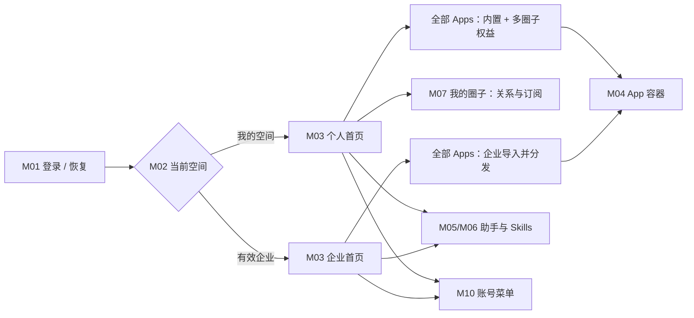
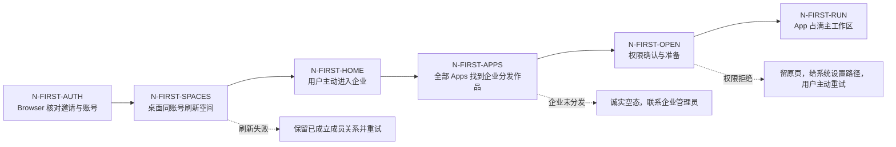
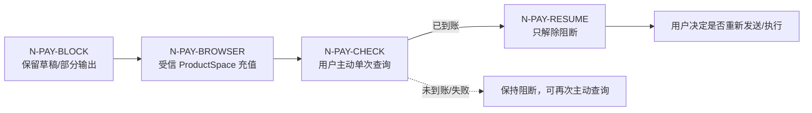
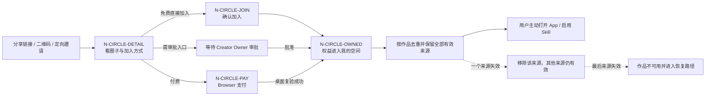

# Polo 客户端产品与用户流程说明

版本：`POO-70 master-r10` · 日期：2026-09-17 · 父任务：POL-111 · 共享身份：POL-112 r11

> **唯一阅读与维护入口。** POO-70 卡片保留原始确认、变更记录和接受证据；本文件汇总客户端当前产品方案。`module-review.md`、`implementation-delta-review.md`、旧 `product-flow.html`、早期线框和旧原型任务材料均是历史或派生评审材料。冲突时先按已接受决定与本文件处理；尚未裁决的跨端共享冲突才交 POL-116 收口。D-PC-09 已明确替代 POL-94 的旧单圈限制，不再属于待决冲突。
>
> 当前成熟度为 `scenario_defined`。本轮只整理产品文档并维护原型一致性，没有启动产品编码、发布或真实产品验收。

## 1. 两分钟评审

**用户能完成什么**：登录 Polo，进入自己有权使用的空间，找到并打开可用 App；App 在自身页面完成业务并负责产出。用户也可以使用当前空间的 Polo 助手，在原对话中查看消息、附件与生成文件。

三个代表例子：

1. **首次使用**：小王收到企业邀请，在 Browser 登录并确认；桌面用同一账号刷新到企业，主动进入。首页没有常用 App 时点“全部 Apps”，打开企业分发的 App，在 App 内完成工作。没有邀请也能直接进“我的空间”。
2. **日常使用**：小王再次从应用列表打开 App；从企业切到个人时，先终止原空间的全部活动，再整体切换目录、助手、权限和计量归属。取消则不切；终止失败保留原空间。
3. **失败恢复**：执行因积分不足停止，小王去 Browser 充值；返回桌面后主动点“已完成，查询结果”。每次点击仅查询一次；到账只解除阻断，是否再次发送或执行由小王决定。

### 已确认、直接继承

| ID | 产品结论 | 原始确认 |
| --- | --- | --- |
| D-PC-01 | 保留首页；零常用时明确引导“全部 Apps”，不自动挑选或固定 App | 本卡 r2 用户同意第一项推荐 |
| D-PC-02 | App 自己负责业务内容、保存、历史与找回；Polo 提供容器、授权应用列表与打开能力 | 本卡 r3 用户以浏览器/网页类比说明 |
| D-PC-03 | 独立“文件”汇总页延后；助手附件与生成文件仍在原对话内 | 本卡 r4 用户“先不做吧，这个需求后面再做” |
| D-PC-04 | M01—M11 的完整功能、流程与范围接受；实现和验收状态仍单独记录 | 本卡 r5 用户确认集中方案 |
| D-PC-05 | App 打开后占满 Polo 主工作区；FDE 负责 App 内部界面，Polo 只画容器与平台反馈 | 本卡 r6 用户以浏览器承载网站类比确认 |
| D-PC-06 | 现有 Polo 助手、附件、Skills、追问和恢复框架直接复用 | 本卡 r7 用户确认已有流程跑通 |
| D-PC-07 | M03 首页、M04 关闭、M07 圈子入口、M09 积分提示按推荐收口；所有管理入口统一放账号菜单 | 本卡 r8 用户逐项同意并指定 M10 |
| D-PC-08 | 圈子只向个人空间提供 App/Skill 权益；多个圈子聚合在唯一“我的空间”，圈子不是空间；企业只消费自己导入、启用、分发的作品，不继承个人圈子、不订阅圈子；不建公开市场，私域分发不等于仅邀请 | 本卡 r9 用户明确要求 |
| D-PC-09 | 同一创作者的同一 App/Skill 可分发到自己的多个圈子；作品与稳定版本唯一，各圈分发、成员、定价、收入和关闭责任独立；我的空间按作品去重并保留全部有效来源；单一来源失效不阻断，最后来源失效才不可用；企业不继承个人圈子来源 | 2026-09-16 用户明确接受推荐并要求修改文档 |
| D-PC-10 | 顶栏常驻当前空间名称与标识，不提供独立空间下拉；头像菜单设「切换空间」入口，进入我的空间与有效企业列表；同一登录账号下切换工作空间，运行中仍按 M02 安全确认 | 2026-09-21 用户接受推荐并要求更新原型及相关文档 |

这些结论不再重复裁决。创作者 SDK/API 属于未来需求；本轮不要求 App 上报结果或保存状态，不显示“尚未保存到 Polo”。既有受信 Runtime、授权、计量与平台错误接口仍可复用，不由浏览器类比推出删除基础设施或只支持远程网页。

### 本次整理的变化

本版在 master-r9 的统一方案上补回 D-PC-09：修正“POL-68 与 POL-94 多圈冲突待决/优先 POL-94”的旧结论，明确用户已接受多圈分发，并把目录去重、逐来源撤权和最后来源失效写入客户端流程。手动续费、充值恢复、退款/结算、首发延期和 POL-112 r11 的共享身份结论保持不变；本次编辑不把历史实现、任务 Done 或高保真页面提升为已发布/已验收。

## 2. 范围与责任

### Must：本轮必须覆盖

- 登录/恢复的桌面承接、唯一个人空间、企业列表与安全切换；身份定义引用 POL-112，不在本端重建。
- 当前空间 App 发现、来源/版本/状态、准备和权限确认、打开/聚焦/关闭/终止、重新打开及错误恢复。
- 当前空间 Skills 的授权与本人启停；Polo 助手及其会话、附件、工具上下文的隔离。
- 我的圈子加入、详情、获得作品、手动订阅及到期/退出；支付由 Browser 承载。
- 平台积分阻断、Browser 充值、用户单次查询；账号偏好和按资格管理跳转。
- 无权、作品/版本失效、断网、部分输出、重开、契约不兼容的真实状态与恢复入口。

### 空间、圈子与企业边界

| 场景 | 当前产品规则 | 用户看到的结果 |
| --- | --- | --- |
| 个人加入多个圈子 | 各圈子给同一个 personal ProductSpace 授予 App/Skill；同一作品可来自多个圈子；各圈子的加入、续费、到期、退款和撤权独立 | 所有有效作品聚合进“我的空间”；同一作品只显示一次并列出全部有效来源；失去一个来源仍可使用，最后来源失效才进入不可用/恢复；空间选择器不会出现圈子 |
| 私域分发 | 可由定向邀请、创作者分享链接、二维码、免费直接加入、付费入口或需审批链接承接；按圈子的加入模式校验 | 没有公开 App/圈子市场；“私域”不被实现成“一律只能收到邀请” |
| 企业消费 | 企业管理员导入交付包，启用并按成员/角色/组分发；企业实例、版本、数据和费用独立 | 企业目录只出现该企业向本人分发的 App/Skill；个人圈子作品不能补授权 |
| 企业与圈子 | 企业不能订阅、持有、续费或接收圈子权益 | 企业空间没有“我的圈子”、圈子订阅订单或个人圈子内容；企业需要能力时走自己的导入/分发流程 |
| 同一账号切空间 | personal 与每个 enterprise ProductSpace 强隔离；切换时目录、助手、权限、运行和计量主体整体切换 | 不混合目录、不搬数据、不把旧回执写入新空间；有活动先确认并全部停止后再切 |

圈子内容订阅和平台计算积分是两套责任：订阅决定个人空间是否有内容权益，积分只支付运行产生的计算费用。企业作品导入也不建立对个人圈子的订阅关系。

### 产品规则与首发范围分开记录

| 类型 | 当前结论 |
| --- | --- |
| 已确认并纳入客户端方案 | M01—M11、PC-F01—11、PC-N01—04、C-R01—08、J-PC-01—07；D-PC-01—09 |
| 已确认规则，但可分阶段交付 | 圈子详情与生命周期、完整充值往返、全部失败恢复、管理跳转接线、契约升级恢复等；延后实施不撤销规则 |
| 明确延后 | 独立跨对话文件汇总页；面向创作者的新 SDK/API 产品 |
| 当前不建设 | 公开 App/圈子市场、关注信息流、统一待办/跨 App 工作项、跨空间后台运行、未知 App 旁加载、桌面管理端写操作、普通客户端 staff 入口、自助创作者申请 |

### 本轮移出或延后

- **移出容器责任**：第三方 App 的业务结果聚合、统一历史、保存状态判断、跨 App 文件找回。内容责任与数据/付款归属是两件事：企业内容不因 App 自管而转为个人所有。
- **延后**：独立跨对话文件汇总页；面向创作者的新 SDK/API 产品。已有助手对话附件、文件打开与授权能力继续保留。
- **沿用不做**：公开 App/圈子市场、关注信息流、统一待办或跨 App 工作项、跨空间后台运行、旁加载未知 App、管理端写操作、普通客户端 staff 入口、自助创作者申请。
- 本轮仅定义产品流程，不设计新的品牌/无障碍标准，不改产品代码、旧卡执行快照或上线状态。

### 完整功能地图

| 模块 | 用户能做什么 | 自然入口 | 当前方案与首发处置 | 已有与待补 |
| --- | --- | --- | --- | --- |
| M01 登录与空间承接 | 登录、恢复会话、首次获得唯一“我的空间”，承接邀请/创建企业返回 | 桌面启动；Browser 邀请/创建回跳 | 保留；身份与登录引用 POL-112 | 已有登录与刷新基础；待补错账号、待审批、未安装、冷启动全程验收 |
| M02 空间切换 | 在“我的空间”和有效企业间安全切换 | 头像菜单 → 切换空间；顶栏只显示当前空间 | 保留；圈子不进入选择器；有活动先确认并全部停止 | 集成候选已有状态机；入口按 D-PC-10 调整，待验 App/助手/权限/计量整体切换 |
| M03 首页与全部 Apps | 打开助手、常用 App，浏览当前空间完整目录 | 首页；“全部 Apps” | 保留；助手固定，最多 5 个用户选择的常用 App；我的空间按作品去重并展示有效来源；无公开市场 | 已有首页/Catalog；待补零常用、真空目录、失败和逐来源撤权状态 |
| M04 App 容器与运行 | 准备、授权、全屏使用 App，关闭/后台/终止/重开 | App 卡片；标签页；顶部运行入口 | 保留容器；App 内部交互、结果与历史归 FDE/App | 已有 Runtime/目录基础；待补标签、终止竞态、OS 权限恢复闭环 |
| M05 Polo 助手 | 新建/恢复当前空间对话，发送、停止、回答追问 | 首页固定助手 | 直接复用现有框架 | owner 已确认流程跑通；实施仍需做空间隔离回归证据 |
| M06 Skills 与工具 | 查看当前空间授权，按本人启停，使用 Sources/Automations/Browser | 助手内 Skills/工具 | 保留；授权、本人启用、设备准备分开 | 已有组件；待验同名、失权、跨设备与企业隔离 |
| M07 我的圈子 | 查看关系，经私域入口加入、订阅、续费、退出并取得作品 | 个人空间“我的圈子”；分享链接/二维码/邀请 | 保留完整产品规则；退出/到期按授权来源生效；首发不建公开市场；企业无此模块 | 已有关系摘要和 Browser 部分能力；桌面详情、来源合并、回跳和到期闭环待补 |
| M08 内容与文件 | 从 App 自身找内容；从助手原对话找附件/生成文件 | App 列表重开；助手原对话 | 简化；独立文件汇总页延后，App 结果聚合移出 | 助手附件已有基础；待验文件缺失、跨空间导入导出和旧数据隔离 |
| M09 积分阻断与充值 | 看见准确阻断，去 Browser 充值，返回后主动单次查询 | App 容器提示；助手输入/回答提示；账号菜单 | 保留；不自动查询、发送、续写或重试 | POL-94 已设计；客户端状态、角色动作和跨端返回待闭环 |
| M10 账号、偏好与管理跳转 | 管客户端设置，按资格打开企业/创作者/账单页面 | 账号菜单 | 保留；所有管理入口统一在账号菜单 | 设置已有；资格菜单与真实返回接线待补 |
| M11 受限、离线、重开与升级 | 在撤权、断网、失败、版本不兼容时回安全入口 | 原页面状态；启动/重开 | 保留；不把未知状态伪装成功 | 部分 ContractGate/空间错误已有；整条恢复仍需验证 |

## 3. 全部既有流程的覆盖与处置

缺口用以下维度，不以任务 Done 替代：未设计、已设计未实现、已实现未集成/发布、已实现但流程不闭合、局部已验收、证据不足。没有真实部署证据的项目均不宣称已发布。

| 场景 / 用户目标 | 来源场景 | 当前入口、权限、状态证据 | 实现/集成与验收 | 缺口类型 | 本版处置 / 下一步 |
| --- | --- | --- | --- | --- | --- |
| PC-F01 首次进入和有效会话恢复 | S-001；A-DOC、POL-112 | C1 登录；C2 个人空间；C3 固定助手/空快捷入口 | C-INT 有基础；完整首登未验收 | 已实现但流程不闭合；证据不足 | 保留；身份引用 POL-112；补首次找 App 引导 PC-N01 |
| PC-F02 个人 App 找到、启动、使用 | S-012/014/016；A-PAY PC-APP-01 | C3 全部 Apps、来源/版本、首次权限确认；C6 固定空间运行 | POO-43/54 已集成；POO-55/56/57/58 分属后续 | 已设计未实现或未集成；全程证据不足 | 调整：保留首次准备/计费；D-PC-02 明确 App 负责内容和保存，移出平台统一结果/文件步骤 |
| PC-F03 加入、付费、续费、退出圈子 | S-010/011/014/015/016、S-043；D-PC-09 | C4 仅非空关系摘要；A-INT 有 circle/join、circle/pay、memberships 页面/API | Browser 有局部实现；Desktop 详情/来源合并/回跳未闭合，未做全程验收 | 已实现但流程不闭合；证据不足 | 调整：多圈子聚合到“我的空间”；同一作品按作品去重并保留全部有效来源；单一来源失效继续可用，最后来源失效才阻断；私域入口不限邀请；按 A-PAY 完全手动续费，移出旧自动续费/宽限期；企业不订阅圈子；不建公开市场 |
| PC-F04 启用 Skill、助手使用 | S-013；POO-41/48/52 | C7 有历史助手/Skill 组件；启用在助手内，不是首页独立 App | POO-59/60/61/63/64 待交付；没有强隔离全程验收 | 已设计未实现；证据不足 | 保留；分别验证授权、本人启用、设备准备，不能把三个状态混为一谈 |
| PC-F05 邀请/创建企业后进入桌面 | S-002/003；POL-112 | C5 刷新不强切；指定邀请直接确认、共享邀请审批继承文档 | A-INT 邀请 API + C-INT 刷新接线；跨端未验收 | 已实现但流程不闭合；证据不足 | 保留；身份/未安装返回由 POL-112，客户端补刷新失败与待审批说明 |
| PC-F06 安全切换与取消 | S-004/005 | C2 顶部选择器、运行项终止/失败/取消、契约重验 | POO-42 局部验收且集成；助手深层隔离/Tab 仍需下游 | 局部已验收；完整流程证据不足 | 保留“终止全部并切换”；个人/企业不并行后台；不自动打开目标旧对话 |
| PC-F07 企业 App/Skill/助手消费 | S-020/021 | C3 企业目录；C6 企业实例；个人圈子不能补企业授权 | App 基础已集成；助手 POO-48/59—62 未闭合 | 已设计未实现；证据不足 | 调整：App 内容/保存归 App；容器授权和空目录说明保留，助手仍须通过企业授权 |
| PC-F08 被移除、作品阻断、企业受限 | S-006/016/022/023 | C2 受限/安全回个人；C3 保留不可用条目；C6 拒绝新启动 | 有局部代码与 POO-42/54 证据；所有容器运行/助手数据撤权未全验收 | 局部已验收；流程不闭合 | 调整：保留容器即时收回操作权和空间隔离；App 内保存/历史不转为 Polo 托管职责 |
| PC-F09 账号偏好、管理与账单入口 | S-007；POL-112 D-ID-09/10 | C1 账号设置；C4 企业区旧发布跳转；真正资格菜单接入仍缺证 | A-INT 独立登录页不等于 Client 菜单完成 | 已实现但流程不闭合；旧规则已部分被替代 | 调整：消费 POL-112 r11，不再强制退出、不提供 MVP 创作者自助申请；账单/复杂责任留 Browser，引用共享已确认入口及安全返回 |
| PC-F10 离线、断网、重开恢复 | S-060；POO-47/55—57 | C3 离线阻止新启动；C2 缓存不当授权；部分历史会话恢复代码 | 离线打开已有 targeted tests 源码；容器与助手恢复全程未验收 | 已设计未实现/未集成；重开闭环待实现核验 | 调整：Polo 恢复容器与自身管理的数据；第三方 App 离线历史/业务恢复由 App 提供，不作为容器验收 |
| PC-F11 契约不一致升级 | S-062 | C2 ContractGate 显示升级/失败/帮助，阻止业务 | POO-42 有局部验收；真实升级下载/帮助目的地未验证 | 局部已验收；证据不足 | 保留；不能降级解释旧组织/圈子空间缓存，补真实升级失败返回验收 |

新增交叉场景继续使用原 ID：**PC-N01**（零常用/真空目录/加载失败）、**PC-N02**（从授权列表重开 App，内容归 App）、**PC-N03**（积分阻断及充值人工恢复）。本次补记 **PC-N04**（助手等待用户回答与重开恢复，对照 POO-53 已有范围），不新增产品能力。没有重编号。

### 功能基线逐项映射

| 原功能 ID | 本版场景及处置 |
| --- | --- |
| PC-01 / PC-02 | PC-F01/09：保留认证承接与首次个人空间 |
| PC-03 / PC-04 / PC-05 | PC-F06/08：保留空间列表、整体切换、先终止 |
| PC-06 / PC-07 | PC-F05：保留企业邀请/创建 Browser 交接 |
| PC-08 / PC-09 | PC-F09：按 POL-112 更新资格入口，保留偏好 |
| PC-10 / PC-11 | PC-F02/07、PC-N01：保留目录、来源、版本和三类空/错态 |
| PC-12 / PC-13 / PC-14 | PC-F02/07/10：保留容器运行、准备/更新/错误与必要无内容日志 |
| PC-15 / PC-16 | PC-F02/08：保留个人控制与撤权；App 结果保存改归 App |
| PC-17 | 继续不做未知 App 旁加载 |
| PC-18 / PC-19 / PC-20 / PC-21 / PC-22 | PC-F04/07：保留 Skill、助手、空间隔离和同名来源辨识 |
| PC-23 | 继续不允许 Web App 任意调用用户本地/未打包 Skill |
| PC-24 / PC-25 / PC-26 | PC-F03：保留邀请、圈子详情、确认加入和 Browser 支付 |
| PC-27 / PC-28 | PC-F03/S-015：调整为第二轮手动续费，无自动续费、取消自动续费或宽限期 |
| PC-29 | PC-F03、PC-N03：保留内容订阅与计算费用分离 |
| PC-30 / PC-31 | 继续不做关注信息流及公开市场 |
| PC-32 | PC-F04：保留助手内 Sources/Automations/Browser，其他高级上下文不主导首页 |
| PC-33 | PC-F02/06：保留当前执行状态与终止；不据此保留结果聚合页 |
| PC-34 | 继续不做平台级“继续工作”及跨 App 统一工作项 |

## 4. 信息结构与自然入口

```text
桌面启动 → 本端登录/恢复 → 契约检查 → 当前有权空间
  顶栏显示当前空间；头像菜单 → 切换空间：我的空间、有效企业（不含圈子/创作者/staff/本地 Workspace）
  首页：当前空间 + 固定 Polo 助手 + 最多 5 个用户常用 App
    全部 Apps：当前空间完整目录、个人控制、打开/重新打开
      我的空间：内置能力 + 多个圈子的有效 App 权益聚合
      企业空间：该企业导入、启用并向本人分发的 App；不混入个人圈子
    我的圈子（仅个人）：关系列表 → 详情 → App / 助手内 Skill 启用
  App Tabs：承载各 App；顶部运行入口：当前空间运行状态、重新打开、终止
  Polo 助手：当前空间会话列表/新对话 → 消息、附件、生成文件
    Skills / Sources / Automations / Browser：助手内部
  账号与偏好：账号、安全、外观、通知、本机存储、授权记录
    按资格打开 Browser：企业管理、创作者工作台/责任只读、充值账单、复杂注销
```

本轮不要求独立“任务与结果”聚合页或“文件”页；运行入口继续服务查看/终止/重新打开，不扩张成业务任务中心。尚无圈子关系也应有可理解的“我的圈子”空态与已有邀请的使用指引，不推荐虚构公开市场。

此图只确认功能与入口关系，继承 POO-41 未受影响的视觉规则。窄窗保护沿用冻结方案；不由历史 390 宽截图推出支持手机工作台。不重新冻结整套 UI。



### 三条关键旅程图

#### J-PC-01 首次登录、加入企业并打开 App



#### J-PC-03 积分不足、浏览器充值与返回



#### J-PC-05 私域加入圈子并获得能力



## 5. 全旅程与共同恢复契约

以下 C-R01—C-R08 适用于每个 PC-Fxx；各场景再列特有行为。不适用的业务保存责任留给 App，不能靠增加“统一结果页”补闭环。

| 恢复条款 | 用户可见行为与责任 |
| --- | --- |
| C-R01 会话/账号 | 本端失效重新登录，重新验证原目标权限后才恢复安全页面和已保存数据。不能自动执行原动作；无权则拒绝。退出不删除业务数据，不新增通用未提交表单跨端/跨重开恢复承诺，已有 PC-N04 专项恢复继续保留；账号被暂停不进入业务。具体身份规则引用 POL-112 ID-C01—10、D-ID-09—18。 |
| C-R02 空/失败 | 加载中、真实零条、网络失败、权限受限分别展示。失败不拿另一个账号/空间缓存填充；保留安全返回与重试入口。 |
| C-R03 上下文 | 目录、会话、Skills、Tab、运行、数据读取与内部计量使用同一已提交空间；异步旧回执不改变新空间。缓存不成为授权依据，圈子不是空间。 |
| C-R04 取消/中断 | 未提交动作可取消并留原入口；已经完成的加入/支付/终止不被关闭窗口回滚。终止前取消可继续原执行；部分已终止后取消切换不自动复活已停任务。操作结果未知不得写成成功。 |
| C-R05 重新打开 | 重开先恢复有效身份、空间并重验权限/契约，再显示目录与 Polo 已保存的会话数据。App 可从有权列表重新打开，内部历史由 App 提供；不重发旧 Prompt、不复用过期启动凭证、不把崩溃中的运行猜成成功或自动重跑。 |
| C-R06 桌面权限 | 只在用户主动打开/选择材料时请求必要权限；首次权限说明、更新新增权限重新确认。拒绝或取消留原页面、不启动依赖该权限的动作；已在 OS 拒绝时给设置路径，用户授权后主动重试。撤销后下一次实际调用重新校验，不能仅凭旧 UI 开关继续读。此恢复交互已随本版功能方案接受（D-PC-04），沿用已有最小权限边界，不增加权限种类。 |
| C-R07 数据转移 | 正常切空间从不搬数据。继承 POO-48/62 的助手显式 allowlist 导出/导入和旧 owner 不明数据隔离：只转被允许内容，不转凭证、隐藏上下文、权限或可调用源引用；目标生成新对象。取消/失败不得产生可跨空间访问的半成品。不将此助手能力扩展为 App 结果托管。 |
| C-R08 Browser 返回 | Browser 完成只代表该端事实；桌面需要同账号/目标验证与自身刷新。未安装给下载/稍后打开指引，冷启动重新验证候选目标；错误账号/过期目标拒绝或引导正确登录，不执行深链附带的业务动作。支付查询另受 PC-N03 限制。 |

### PC-F01 / S-001：首次登录与我的空间

- **角色/前置**：小王首次安装、无企业邀请；或原用户重新打开。自然入口为桌面启动。
- **页面与动作**：按 POL-112 登录 → 检查契约 → 找到或幂等创建唯一“我的空间” → 首页 → 全部 Apps/助手。无企业不阻塞使用。
- **成功/空态**：个人空间可用；零常用而目录非空时引导全部 Apps（PC-N01/D-PC-01）；真空目录说明尚无可用作品，助手按自身可用状态展示。
- **拒绝/失败/取消/恢复**：暂停账号拒绝；个人空间准备中允许原规则的幂等自动重试，不能创建第二个。目录失败明确重试；登录取消留登录入口，重开按 C-R01/05。此幂等准备重试不包含支付查询或任务执行。
- **交接/归属**：登录共享 POL-112，桌面自行恢复；个人内容及内部计算费用归个人，App 内容自管。

### PC-F02 / S-012、S-014、S-016：找到、使用并重新打开个人 App

- **角色/前置/入口**：小王已在个人空间；从首页常用、全部 Apps 或圈子详情选 App。目录只含内置能力与其已加入多个圈子明确分发的有效作品。普通卡片不常驻显示付款方；圈子详情、交易页及需要区分同名作品时展示实际圈子/作品来源、稳定版本和状态。
- **动作/成功**：主动打开 → 必要权限确认 → 透明准备 → App Tab。由 App 完成业务与展示/保存；Polo 可观察成功是正确 App 在正确空间打开，执行状态及平台错误真实，不检查保存（PC-N02/D-PC-02）。运行固定启动版本，更新下次启动生效。
- **个人控制**：隐藏、停用、移出常用不退出圈子；从仍有权的圈子作品列表恢复。首次准备/更新失败可主动重试，权限取消不启动。未知来源不旁加载。
- **关闭/中断**：无活动直接关闭；有活动按既有 POO-55 提供取消、后台继续、终止并关闭。同空间后台可继续，从运行入口或目录聚焦正确实例；只有确认停止才能终止并关闭，失败留可恢复状态。空间切换另须全停，客户端退出/崩溃后不承诺后台自动继续。
- **拒绝/空/恢复**：撤权、下架或版本阻断给具体原因；过期缓存不绕过鉴权；普通空目录与失败按 C-R02。网络/重开按 PC-F10；App 内部分结果、取消和历史由 App 解释，Polo 不把未知执行写为业务成功。
- **数据/付款**：账号+个人空间+作品实例/版本隔离；通过 Polo 能力的运行计量固定上下文，内容订阅与计算分账。App 自管不转移所有权或解除费用同意。

### PC-F03 / S-010、S-011、S-014、S-015、S-016：圈子加入与订阅

- **角色/前置/入口**：普通业务账号，从创作者分享链接、二维码、定向邀请或其他受控私域入口进入；已有关系从个人“我的圈子”进入。圈子按免费、仅邀请或付费模式校验，私域分发不等于所有入口都要求定向邀请。企业不创建、持有或续费圈子订单；不展示公开市场。
- **免费/邀请**：详情显示创作者、方式和分发说明 → 用户确认 → 成员生效/按圈子规则待审批 → 详情列“获得的 Apps 和 Skills”。加入不自动打开 App 或启用 Skill；Skill 跳助手内入口。重复加入复用现有关系。
- **付费**：看价格/周期 → Browser 确认支付 → 桌面验证成员资格并刷新详情。付费资格与计算积分独立，不可用计算积分抵扣，不给自己管理圈子买订阅。订单、价格及授权以服务端为准；付款成功但目录失败允许重刷，不能再买一次代替恢复。
- **手动续费（S-015 调整）**：按 A-PAY 第二轮 30 天周期；到期前从有效期末延长、最多累计 12 个月；到期后重新购买，无自动续费或宽限期。价格变化重新确认。免费/邀请转付费、付费转免费、赠送资格的过渡沿 A-PAY §7，不在客户端重算。
- **作品聚合与版本**：同一创作者的同一作品可以分发到自己的多个圈子；作品归属、版本和发布生命周期唯一。我的空间按稳定作品 ID 去重，不按名称合并不同作品，并在唯一条目上保留全部有效授权来源。新稳定版影响所有分发该作品的圈子，提示受影响圈子后，各圈成员下次启动使用同一新版本；需要独立品牌、功能、版本或发布时间时另建作品。
- **退出/拒绝/空态**：立即退出须确认，只撤销该圈子提供的授权来源；其他圈子仍有效的同一作品继续可用。某圈到期或停止分发也按同样规则处理；只有最后一个有效来源失效，作品才进入不可用与恢复路径。关闭确认不退出；空关系引导用户使用已有分享链接、二维码或邀请，空作品解释尚未分发。链接失效/停止加入不建关系，需审批时不能先授予。
- **失败/恢复**：支付未知保留处理中，不重复扣款/授予；已付事实与桌面刷新分开。会话过期按 C-R01/08；付款取消回详情，已完成付款不会被返回回滚。退款/争议交已有运营流程，无本轮自助按比例退款。
- **到期与内容**：到期先撤销该圈子来源；同一作品无其他有效来源时才停止新启动。普通订阅到期允许已预授权任务自然结束，紧急全局阻断仍立即停。App 自己保管其合法历史；助手已保存内容按所有权保留，不自动删除或搬迁。

### PC-F04 / S-013：Skills 与助手对话

- **角色/前置/入口**：当前空间成员，首页固定 Polo 助手 → 本空间会话列表/新对话 → Skills；圈子详情可引导进入该位置。
- **动作/成功**：看来源与状态 → 明确启用/停用 → 在对话发送任务；助手可按配置自动选用已经启用且仍授权的 Skill。启用按账号+空间+Skill/作品实例同步到本人设备，不替其他成员启用；设备下载不是第二次启用。
- **消息/文件**：对话内选择材料、看附件与生成文件；通过原对话打开合法可访问文件，文件已移动/删除给明确说明与重新选择入口，不替用户伪造恢复。无独立上传入口或跨对话文件汇总页（D-PC-03）。
- **空/拒绝**：空会话可新建；无额外 Skill 不虚构推荐/自动开通；同名展示来源。启用时无权拒绝，运行前失效不调用；紧急阻断终止相关调用并标记历史来源版本，不自动删历史。
- **失败/取消/恢复**：权限拒绝按 C-R06；手动停止显示停止而非余额不足。失败保留已经实际保存的消息/附件与真实状态；部分输出按 PC-N03。网络/重开和会话过期按共同条款，不能借恢复自动重发。
- **等待用户回答（PC-N04，POO-53 已有能力）**：助手提出问题后，用户可回答或暂不回答；问题状态及该功能已有草稿恢复在重开后保留，回答只形成一条可读消息并在原会话续答，取消不续答；已回答、过期、原会话删除/无权时不重复提交或误投到新会话。瞬时失败可重试核对真实状态，不产生重复消息。这里保留既有问题交互恢复，不推导所有 App/所有表单都有草稿恢复。
- **高级上下文/转移**：Sources/Automations/Browser 只在助手内部并随空间隔离；显式允许导出导入及旧数据隔离按 C-R07。当前空间名称持续可见，付款方不常驻。

### PC-F05 / S-002、S-003：企业邀请/创建后进桌面

- **角色/前置/入口**：被邀请小王从 Browser 链接进入；基础验证用户从客户端“创建企业”进入企业管理端。
- **邀请**：Browser 登录回原邀请页 → 指定身份匹配确认即加入；快速共享申请待 Owner/Manager 审批 → 提示打开/下载桌面 → 同账号刷新空间列表 → 用户主动选择企业。不得把待审批企业当有效空间，亦不强切其他设备。
- **创建**：Browser 完成企业创建 → 成为唯一 Owner → 返回桌面刷新列表；失败由原端保留表单及幂等重试，客户端不复制创建逻辑。未打开桌面时下次启动重新取列表。
- **拒绝/空/失败**：错账号提示正确认证；过期/取消/用尽/已暂停不得绕过；已有成员不重复加入。已加入但加载失败保留成员事实、可重试；企业空目录提示尚未分发及联系管理员，不混入个人作品。
- **取消/会话/恢复**：确认前关闭不加入；确认后离开不退出企业；认证/深链按 C-R01/08。默认或原目标选择引用 POL-112 已确认的有权目标规则；邀请本身不改当前空间。
- **数据/付款**：只有实际进入并授权执行后按企业空间上下文使用企业数据与费用；邀请回执不等于运行许可。

### PC-F06 / S-004、S-005：安全切换

- **角色/前置/入口**：小王拥有个人与企业；顶栏持续标识当前空间，点击头像 →「切换空间」进入目标列表。同一账号，不重新登录。
- **无活动**：验证目标 → 原子提交上下文 → 首页切换落目标首页，助手内切换落目标会话列表/新对话，不自动开旧对话。
- **有活动**：列全 App/助手/AI 运行项 → “终止全部并切换” → 显示逐项状态 → 全停才提交。后台活动也包含在内。
- **取消/失败**：操作前取消保持原空间及运行；部分已停后取消不重启已停项。终止失败只重试失败项/取消；目标加载失败不展示混合内容，可重试或回仍有权原空间。
- **拒绝/会话/恢复**：目标无权不进入，移除或标不可用；会话过期先停止有权上下文操作并重新验证，旧回执不提交切换；重开按 C-R05。无其他有效企业时只列个人，个人也不可加载则安全受限页。
- **责任**：切换只影响本设备；全部目录、Skills、对话/附件、权限、运行与内部付款主体一起换，不迁移企业资料到个人。

### PC-F07 / S-020、S-021：企业消费

- **角色/前置/入口**：有效 Member/Manager/Owner 在桌面都以消费者使用企业目录/助手。
- **动作/成功**：企业已导入交付包、检查、启用并向本人分发作品 → 打开企业 App 或本人启用企业 Skill → 使用企业助手。个人圈子授权不补企业缺失授权；企业不订阅圈子；同名 App 的个人/企业实例、版本、状态互不覆盖。
- **空/拒绝**：空目录联系企业管理员分发；没有 Skill 授权不允许调用个人版本替代；停用/撤权按 PC-F08。
- **失败/取消/会话/返回**：App 准备、权限拒绝、关闭按 PC-F02；助手按 PC-F04；切换按 PC-F06；重开按 PC-F10。用户从 App 返回仍是原企业范围，不跳个人。
- **内容/责任**：App 负责业务内容管理；企业输入、内容、助手消息/附件与计算费用仍归企业。客户端提供隔离和权限边界，不托管所有 App 输出。预算及付款动作按 PC-N03，不因 Manager 能管理作品而授予财务。

### PC-F08 / S-006、S-016、S-022、S-023：撤权、企业限制、作品失效

- **角色/入口**：使用中成员被移除/暂停，或企业/作品变受限；可在启动、调用或状态更新时发现。
- **成员失权**：给原因与联系管理员入口，停止新操作并终止企业活动，清除可操作上下文，安全回个人。个人加载失败显示受限页，不继续展示企业内容。
- **企业治理暂停/关闭中/既有欠费限制**：执行平台规定的全企业阻断与活动终止，Owner 在 Browser 处理账单/导出/申诉；Member/Manager 不能绕过。积分耗尽和预算阈值另按 PC-N03，不把不同原因混成同一弹窗。
- **作品状态**：撤销/停止分发/退出/到期先移除对应授权来源；仍有其他有效来源时继续可用并更新来源显示。最后来源失效才显示不可用原因、拒绝新启动；普通订阅到期与紧急全局版本阻断分别按 PC-F03，不将普通到期误实现为紧急全停。
- **失败/取消/恢复**：拒绝不能被“取消提示”绕过；终止确认未知保持不可操作并可重查真实状态。权限恢复只恢复仍合法关系/启用状态，不自动任务；会话重登/断网/旧链接不能恢复已撤权限。
- **内容/付款**：不删除合法保留记录或转移企业数据；App 自身保存归 App，Polo 自有历史必须按所有权验证。治理/邀请/充值成功均不抵消其他未解除的阻断。

### PC-F09 / S-007：账号与管理入口

- **角色/入口**：账号菜单 → 账号与偏好。普通用户完成已有安全/外观/通知/本机存储等操作。
- **管理交接**：具对应企业 Owner/Manager 权限才展示企业管理；有效创作者可进入工作台，资格失效保留责任只读入口。后台各自登录和鉴权，不要求退出另一端；不增加统一三选一门户或普通 staff 快捷入口。具体认证和找回原样引用 POL-112 ID-C01—10、D-ID-09—18。
- **账单/责任**：充值账单、创作者收入、复杂注销在对应 Browser 端处理；企业财务仅合资格 Owner，注销未结所有权/财务列阻塞。没有资格的空菜单不显示可写管理动作。
- **失败/取消/返回**：链接打不开给可重试入口；Browser 会话到期在其本端恢复到有权原页；取消停留账号页。手机号不可用按 POL-112 线下运营核验恢复原账号，不建自助申请或找回工单。退出结束本端会话，不删本地业务数据，重新登录重验权限。

### PC-F10 / S-060：离线、部分结果与重开

- **角色/入口**：客户端离线启动，或当前 App/助手执行中断网。
- **可见状态**：仅在有效归属下展示 Polo 已存本地助手历史/附件及缓存目录说明，明确缓存不代表最新授权。第三方 App 历史、离线内容、业务部分结果由 App 自己提供；Polo 不做统一结果恢复承诺。
- **限制/失败**：离线不得新开 App/助手/AI 执行；运行中停止新的网络/AI 调用，显示等待恢复或终止，不把超时/未知伪装成功或积分不足。不能借本地缓存访问已撤销企业数据。
- **恢复/取消**：网络恢复后重验空间、作品、版本及计量权限；先恢复可操作资格，由用户决定继续/重新发起，不自动重放业务动作。用户可终止；App 内执行恢复由 App 决定。重开按 C-R05，已保存 Polo 消息/附件可重新访问，文件不存在明确提示。
- **责任**：按实际用量和输出事实结算，不用“显示结果失败”代替账务事实；切空间/换账号后的回执不能落到新上下文。

### PC-F11 / S-062：契约不兼容

- **角色/入口**：启动/登录后的版本检查；包括更新后重开。
- **主/拒绝**：无法安全理解服务端契约时阻止业务，显示升级与帮助；未公开发布阶段不提供旧语义降级运行。
- **失败/取消/恢复**：网络检查失败提供重试；升级失败/取消留阻断页及帮助，不开放业务。完成升级再检查成功才能返回安全入口，仍失效会话重新登录。
- **归属**：旧 Creator Space/Organization/授权/Runtime 缓存失效重建，不能猜成当前 ProductSpace；不得以兼容为由串数据或付款主体。

### PC-N03：平台积分不足与充值人工恢复

- **入口/角色**：App 运行或助手发送/生成时收到平台明确 `insufficient_credit`；个人用户/企业 Owner 可去充值，Manager/Member 仅通知 Owner，不暴露 Owner 私人信息或企业财务。
- **发送前**：不创建新的助手消息；保留当前可编辑输入，发送不可用，输入框上方阻断及充值入口。
- **生成中**：停止下一段生成、保留已产出的部分，仅消息末尾提示，不重复输入框提示。用户主动停止不报积分耗尽；刚好正常完成且余额为零不谎称中断。
- **App**：非模态平台提示、保留页面；不替 App 设计业务续跑/结果页。无输出不扣积分/不造零账单，部分输出按实际用量；固定空间、App、版本和费率的运行事实由平台计量。
- **预算/服务错误**：预算超限由 Owner 调预算，已预授权生成可完成、下一次发送阻断；通用服务失败/未知不冒充积分不足。企业治理限制另外判断。
- **Browser**：去当前受信空间的支付中心；页面可按其支付流程查询订单，但桌面不因此取得自动轮询许可。
- **返回桌面**：用户点击“已完成，查询结果”才针对受信订单/上下文单次查询；未到账、处理中、查询失败分别保留阻断；“还没有”仅关闭询问。切空间/换账号后旧订单返回不得影响新空间。
- **成功/后续**：确认到账且其他权限仍有效，仅解除相应阻断。用户使用正常发送/执行动作继续，不自动发送、续写、重试，也不加一键自动继续。焦点变化、浏览器返回、重开、定时器均不得自行查询充值结果。

## 6. 跨端输入与输出

| 场景 | Desktop / Browser 输入 | 对端完成事实 | 桌面必须验证/失败恢复 |
| --- | --- | --- | --- |
| PC-F05 企业邀请 | 邀请目标；原邀请页认证 | 有效成员或待审批，不是桌面切换成功 | 同账号重取成员和空间；待审批不列企业；刷新失败保留成员事实并重试 |
| PC-F05 企业创建 | 基础验证业务账号、创建意图 | 创建成功、唯一 Owner | 重新取空间列表不强切；未运行下次启动；失败不复制创建逻辑 |
| PC-F03 圈子加入/订阅 | 个人空间、圈子目标、订单候选 | 成员/支付状态及有效期 | 复验成员授权后展示详情/作品；不重复开通，不自动启用；支付未知与目录失败分开 |
| PC-N03 充值 | 受信空间与支付入口/订单 | Browser 已支付仅是该端事实 | 用户主动单次查询；未恢复不解除阻断；成功不重发任务 |
| PC-F09 管理/责任 | 候选企业或创作者目标 | 独立会话下完成有权操作 | 返回后重验资格/原安全目标；不传递另一端会话假设、不暴露 staff |
| PC-F09 找回/注销 | 共享规则规定的运营/Browser 流程 | 原账号恢复或责任处理状态 | 本端重新认证、保持原所有权，不恢复已撤资格；复杂写操作不在客户端 |

共享验收沿用 POL-112 r11 的 AC-ID-01/03/05/06/07/10；客户端承接资格菜单、误入口、独立会话、创作者责任只读、企业创建返回及原账号恢复，不承接 staff 预置或管理端写操作。GAP-ID-01/03/08 是入口接线/默认目标与真实环境验收的工程交接，不是新增产品待决。

深链只是候选目标，不能自报身份、空间、付款方或“成功”。已安装打开、未安装下载、冷启动、错账号、过期/已消费目标都要有可重放验收；产品规则已明确，具体 URI、域名和服务端校验方法属于后续工程设计。

## 7. Policy 应用、缺口与执行点

产品结论 owner：需求提出者（或其指定产品 owner）；身份由 POL-112 收口、计量/支付由 POL-94 收口。可复用 policy 的具体维护 owner 及工程化交付交 POL-116，不把开发卡 assignee 当政策 owner。

| 政策 / 来源版本 | 可复用规则 | 本版判断 / 缺口类型 | 强制执行点与后续 |
| --- | --- | --- | --- |
| 身份/账号，POL-112 r11 ID-C01—10、D-ID-09—18；A-DOC | 独立端会话、同业务账号、按资格入口、找回不转责任 | Spec 满足；实现/运营证据待补；包装未发现 | 登录、菜单、深链、服务端授权；不复制共享身份定义 |
| 空间隔离，A-DOC product-space-contract / POO-48 | 固定归属、原子切换、不默认迁移、不读 owner 不明数据 | Spec 满足；助手全资源验收证据不足；包装未发现 | 存储/IPC/Tab/Runtime/附件/缓存及 await 前后重验 |
| App/Skill 授权，A-DOC PC-F02/04/07/08；POO-43/52 | 授权、本人启用、设备准备分开；运行前重验 | Spec 满足；已有设计，启用/撤权闭环未验收 | 目录、获取、启动、调用、停用；不能仅隐藏按钮 |
| 执行/费用，A-PAY、POL-94、ADR 0019 | 固定运行上下文、实际用量、用户单次查询、不自动再执行 | Spec 满足；已有后续规则取代前轮；实现与跨端验收待证 | 计量服务、App/助手阻断、订单归属、查询入口 |
| App 内容责任，本卡 D-PC-02 | App 自己保存/找回；Polo 不聚合、不判断保存 | 已确认取代旧聚合要求；旧任务/原型仍有冲突文字 | POL-116 调整 POO-47/56/57 与设计引用；不热改既有锁定快照 |
| 助手保存/文件，本卡 D-PC-03 + POO-48/59/62 | 原对话存取，显式允许转移，独立汇总页延后 | Spec 满足；实际持久化/迁移/丢失文件恢复待验收 | 读写权限、文件打开、导出导入、重开恢复 |
| Browser 交接，POL-112 r11、A-PAY、A-DOC PC-F05 | 对端成功与本端刷新分开、目标重验 | Spec 满足；入口已设计，冷启动/错账号闭环证据不足 | 深链入口、恢复原页、成员刷新、手动充值查询 |
| 桌面权限，A-PAY PC-APP-01、POO-47 | 首次必要权限及新增权限确认、限制目录、不旁加载 | 边界可复用；C-R06 拒绝/设置/重试已随本版接受，OS 行为证据仍不足 | 实际文件选择/调用处校验，取消/撤销不越权；不新增权限类型 |
| 圈子，A-PAY FR-032—038 / A-DOC S-010—016、S-043 | 多圈子聚合到 personal ProductSpace；企业无圈子权益；私域入口可为分享/二维码/邀请；手动续费；同一作品可分发到多个圈子，作品/版本唯一，各圈关系与费用责任独立；内容与计算分账 | 后续支付规则明确替换旧自动续费/宽限期；D-PC-08 补齐空间边界；D-PC-09 明确替代 POL-94 旧单圈限制 | Browser 订阅服务、桌面详情/授权到期，不在本端重算期限；客户端按作品去重并消费逐来源 entitlement |
| 设计，POO-41 ef3528ef、POL-94 第二轮、C-INT DESIGN alpha | Apps 首页、助手内 Skills、非模态阻断、窄窗保护 | 未受影响规则复用；D-PC-02/03 影响页待同步；包装未发现 | 后续原型只改受影响节点；视觉冻结与流程接受分别记录 |
| 无障碍，C-INT docs/DESIGN.md alpha | 现有语义控件可复用 | **无法评估合规**：统一标准/owner/全键盘读屏及对比度验收证据缺失 | 推荐以键盘走完主流程、错误反馈与焦点恢复作基础检查；具体标准/政策 owner 交 POL-116，不宣称 WCAG 达标 |

### Flagged concerns 与待办分流

1. **已裁决但未同步的规则冲突**：旧 POO-41/47/56/57 要求 App 结果/文件汇总，与 D-PC-02/03 冲突。本版按用户确认裁剪；旧任务和原型后续在 POL-116 同步，不把这些缺口重新作为本轮必做功能。
2. **多圈规则已由用户裁决**：POL-68 的“同一作品可分发到多个圈子”继续有效；用户在 2026-09-16 接受 D-PC-09，明确替代 POL-94 第二轮的旧单圈限制。客户端按稳定作品 ID 去重，保留全部有效授权来源；不按名称误合并不同作品。此前发给 POL-116 的冲突事件 `evt_3750ff41cd984b6e9dbc7bec817310b7` 属于过时判断，不能再作为待决依据。本轮不并发修改 POL-116。
3. **政策无法评估**：未找到明确适用的统一无障碍合规目标及维护 owner；不伪称“只缺 Skill 包装”。此项由政策收口安排，当前 Spec 不新增法定/认证承诺；若后续制定标准改变当前流程，再请对应 owner 裁决。
4. **工程/验收缺口**：真实部署地址/版本、桌面 OS 权限恢复、助手所有资源隔离、冷启动深链/返回地址、旧数据迁移等由后续 Plan/验收补证。没有证据不等于没设计，也不需要用户先给技术答案。

本轮没有需要用户新增选择才能整理本端正文的冲突。D-PC-08 继续约束个人圈子与企业边界；D-PC-09 已解决同一作品跨多个圈子分发的产品选择。本端只同步已确认行为，不借此改变退款、结算、定价、首发延期或其他未决事项。

## 8. 旧任务与本版变更范围清单

下表是产品范围对照，不是对旧任务状态、执行依赖或锁定合同的修改；不新建重复卡，不因引用历史卡就让访谈等待全部实现。

| 卡片/范围 | 本版结论 | 收口后动作与依据 |
| --- | --- | --- |
| POO-41 UI 冻结 | 保留未受影响首页/Tab/助手规则；调整系统工具与旧结果/文件页 | 按 D-PC-01/02/03 更新受影响原型，记录新旧场景对应，不重画整套 |
| POO-42 空间 / POO-43 Catalog | 保留；新增零常用指引与真空/失败区分 | 用 PC-F01/02/05/06/08/11、PC-N01 补闭环验收 |
| POO-47 协调 | 调整第三方结果/文件聚合要求；运行/隔离/计量保留 | 更新协调与后续集成验收范围，不要求已移出能力交付 |
| POO-53 助手提问交互 | 保留既有 request_user_input 的回答、暂不回答、重启/草稿恢复与单消息续答；架构纠偏沿原卡 | PC-F04/07、PC-N04；不误列为 App 集成卡，不加第三个独立 Codex 执行后端 |
| POO-54 Runtime 基础 | 保留受信 API、隔离、鉴权与计量边界 | 不把 SDK/API 延后解释成拆除既有基础；结果上报不是本轮 App 准入前置 |
| POO-55 App Tabs | 保留打开、关闭三选项、同空间后台、终止与重新打开 | 切空间全部终止；重开不承诺 App 业务历史由 Polo 恢复 |
| POO-56 运行中心/任务结果 | 调整：当前运行状态/重开/终止保留，App 业务结果聚合移出 | 取消结果页作为本轮完成条件；运行页面必要结构复用，避免另开统一业务任务中心 |
| POO-57 最近文件 | 延后独立汇总页；移出第三方 App 文件聚合 | 原对话附件和文件能力仍留 POO-48/59 范围，不能全删 |
| POO-58 App 积分 | 保留 | PC-N03、POL-94 单次查询、无自动任务恢复 |
| POO-48、POO-59/60/61 | 保留助手消息/附件、Skills/Sources/Automations、Browser/后台隔离 | PC-F04/06/07/08/10；不因 App 自管而削弱助手隔离 |
| POO-62 | 保留助手显式允许导出/导入与旧 owner 不明数据隔离 | C-R07；不扩为 App 结果平台，具体 allowlist 在对应实施设计确定 |
| POO-52、POO-63/64 | 保留成员 Skill 启停与版本化深链 | 助手内部启用；授权重验/错空间/过期恢复按 PC-F04 |
| POO-49、POO-65/66 | 保留发送前/生成中积分状态和人工恢复 | PC-N03；区分部分结果、主动停止、恰好完成、服务失败 |
| POL-94 / POL-116 | 支付、计量、退款与结算共享依据保留；POL-94 旧单圈限制已被 D-PC-09 替代；其余真正跨端问题仍由 POL-116 收口 | 原计量生产验收和本次访谈是不同交付；不机械拼接两轮需求，也不把过时冲突事件当作当前结论 |

## 9. 验收场景与画布索引

当前为 `scenario_defined`；不声称 `execution_ready` 或 `function_accepted`。这里只定义可验收结果，**未执行产品验收**。后续测试、演示与缺陷沿用 PC-Fxx/S-xxx、PC-Nxx 及下列 J/N/B ID；画布可点击表示预期流程可演练，不等于系统可用或用户接受。

| 原场景 / 代表例子 | 通过条件 | 画布对应 |
| --- | --- | --- |
| PC-F01/S-001、PC-N01 | 无邀请登录得唯一个人空间；零常用可去全部 Apps；真空、失败不混淆，无别空间缓存 | J-PC-01，N-FIRST-LOGIN/PERSONAL，B-FIRST-30—39；N-FIRST-HOME/APPS |
| PC-F05/S-002/003 | 指定邀请/待审批/错账号/创建成功/冷启动分别验证；成员成功不强切，刷新失败可重试 | J-PC-01，N-FIRST-AUTH/SPACES，B-FIRST-01—08；C-R08 |
| PC-F02/07、PC-N02 | 目录作品来源/稳定版本明确，个人企业授权分离；打开/重开同范围 App，不插入保存判断步骤 | J-PC-01，N-FIRST-OPEN/RUN/RESULT，B-FIRST-07—25/29；J-PC-07 |
| PC-F06/S-004/005 | 全停才切；取消前无变化，部分终止取消不复活；失败不半切；目标助手不自动开旧对话 | J-PC-02，N-SWITCH-CONFIRM/TARGET，B-SW-01—06 |
| PC-F03/S-010/011/014/015/016/S-043 | 邀请/审批/免费/付费/取消/未知/到期/退出分别可恢复；获得作品不自动开/启用；无自动续费宽限期；同一作品来自两个圈子只显示一次；失去一个来源仍可使用；最后来源失效才阻断；企业空间无圈子来源 | J-PC-05，N-CIRCLE-DETAIL/JOIN/PAY/OWNED，B-CIRCLE-*；D-PC-09；原型 S4 |
| PC-F04/S-013、PC-F07/S-020/021 | 授权≠本人启用≠设备准备；同名可辨；原对话文件可访问，跨空间无泄漏；无独立文件页 | J-PC-04，N-ASSIST-LIST/SKILL/CHAT，B-ASSIST-*；C-R07 |
| PC-N04、PC-F04/07 | 等待问题重开可恢复；回答一次只形成一条消息，暂不回答不续答，失效/已答/会话删除不误投 | J-PC-04，N-ASSIST-QUESTION，B-ASSIST-18—25 |
| PC-F08/S-006/016/022/023 | 被移除全停且安全回个人；普通订阅到期不误当紧急全停；无权缓存/旧回执不得重新授权 | J-PC-01 N-FIRST-RUN/revoked；J-PC-06 N-GATE/RECOVERY；PC-F03 |
| PC-F09/S-007 | 无资格不显示可写管理；有资格独立端登录不要求互退；找回原账号不转移责任；注销责任交 Browser | J-PC-06，N-ACCOUNT/MANAGE/RECOVERY，B-GATE-* |
| PC-F10/S-060 | 离线不新执行，未知不冒充成功；恢复先重验，重开不自动重发；助手已保存内容可回原对话 | J-PC-06，N-GATE/RECOVERY；J-PC-04；C-R05 |
| PC-F11/S-062 | 不兼容挡业务，取消/升级失败仍阻断；成功重查后进入；不解释旧缓存为新空间 | J-PC-06，N-GATE/RECOVERY，B-GATE-* |
| PC-N03 | App 非模态、助手发送前不建消息/生成中留部分；去 Browser、取消/查询失败/到账；每次用户点击一次查询且不重发 | J-PC-03，N-PAY-BLOCK/BROWSER/CHECK/RESUME，B-PAY-01—09 |
| PC-F02/06、C-R06 | 拒绝权限不启动；关闭可取消/后台/终止，终止失败可恢复；切空间不能把后台活动留在原空间 | J-PC-07，N-TAB / N-TAB-CLOSE / N-TAB-BACKGROUND；J-PC-02 |

键盘与错误焦点检查可作为后续基础验收候选；无障碍标准达标需补正式依据。画布仅覆盖关键可讨论节点，详细边界由 §5 同 ID 条款补足；不按节点数或旧原型自报数量宣称完全验收。

## 10. 来源、实现和证据边界

本次整理重新读取固定来源和当前任务正文；未 fetch 远端，也未验证用户正在访问的部署版本。源码、历史 Acceptance 和离线原型只用于说明“已有/待补”，不能证明当前线上可用。

| 代号 | 仓库工作树 / branch | HEAD / 状态 |
| --- | --- | --- |
| A-DOC | `/Users/wow/project/z-h-ai/polo-admin-dir/POL-68/refactor/comm-defs`；`POL-68/refactor/comm-defs` | `c43754bab5700f20998eef971c0ff27f36eba743`；干净 |
| A-PAY | 同 Admin 仓库 `POL-94/feat/product-space-credit-recharge` | `9ae3e7308317fe2dce5b5fb714bd0955c7054335`；干净 |
| A-INT | 同 Admin 仓库 `integration/pol68-g5-admin` | `1fbf393811bc78b02a8a2de17796b6d61d3d88ee`；干净 |
| A-DEV | 同 Admin 仓库 `dev` | `04c64fd5afb14e918463c699c0994789551d6944`；未跟踪 .DS_Store，未动 |
| C-INT | `/Users/wow/project/z-h-ai/polo-dir/integration/pol68-g5-client`；`integration/pol68-g5-client` | `3dc20ca373a9ad64c8b0701d1156a5adaf55aef8`；干净 |
| C-DEV | 同 Client 仓库 `dev` | `01f4447cf77612ca2c62d9c7155601a51bdb7b5b`；干净 |
| 本卡 | 同 Client 仓库 `POO-70/docs/client-journey-policy-interview` | master-r9 基线 `66cef07e523440f52a57b0bf73f08540ad8e3c02`；旧原型代码已合并到本需求分支，本轮只维护本分支文档、阅读页和原型 |

源码定位（路径均相对对应 Git 工作树）：

- C1：C-INT `apps/electron/src/renderer/components/onboarding/AdminLoginStep.tsx` / `PhoneAuthStep.tsx`：手机认证受配置控制，另有密码模式；设置密码页面不等于找回闭环已完成。
- C2：C-INT `apps/electron/src/renderer/hooks/useProductSpaceContext.ts`，`components/product-space/ProductSpaceSwitcher.tsx` / `ProductSpaceSwitchDialog.tsx` / `ProductSpaceContractGate.tsx`：访问重验、终止后提交、受限与契约阻断。
- C3：C-INT `apps/electron/src/renderer/components/tab-browser/HomePage.tsx`、`AllAppsView.tsx`、`hooks/useAppCatalog.ts`：空快捷配置不自动挑选 App；全部 Apps 可找目录作品；首次准备确认；不可用作品说明。
- C4：C-INT `apps/electron/src/renderer/components/product-space/HomeSpaceContext.tsx`：个人圈子非空才显示关系入口，列表行仅呈现名称与关系，没有完整详情/加入/订阅动作。企业区还显示成员/发布跳转，不能当作新身份政策。
- C5：C-INT `apps/electron/src/renderer/App.tsx:1205`：邀请/创建企业深链触发列表刷新，不自动切换；A-INT `src/app/api/enterprise-invitations/[token]/` 提供接受、申请及状态接口。冷启动、账号不匹配和整条 Browser→Desktop 路径仍需验收。
- C6：C-INT `apps/electron/src/main/local-app-runtime/app-api-gateway.ts`、`scoped-registry.ts`、`runtime-coordinator.ts`：受信运行基础。它不等于任务结果、文件与 App Tab 用户流程已交付。
- C7：C-INT `packages/shared/src/sessions/types.ts` 已有可选 productSpaceId 字段；仅字段存在不足以证明助手所有读取、附件、Skills、Browser、恢复均强隔离。
- C8：C-INT `docs/DESIGN.md` 为 alpha 视觉基础，明示对比度未做 WCAG 审计；所查 C-INT `.agents/skills` 未发现 SKILL.md，仅有设计资产，不能说没有设计依据。

### 首轮局部验收与集成证据（不是本次重新验收）

| 能力 | 本轮核验 | 解释限度 |
| --- | --- | --- |
| POO-42 | `ee964d3c2dac3ee8ff8b16d9ba445b42a671c92d` 是 C-INT 祖先；其 `.pipeline/result.json` 记录 pass、功能 49/49、用户接受视觉残余 | 历史局部验收，不能代表完整客户端无残余或当前部署验收 |
| POO-43 | `1f0d737d265ee74b26b1f18de37a5ec3a575f6aa` 是 C-INT 祖先；读取卡片明确排除结果/文件/Runtime 外壳 | 源码已集成；本轮未完成最终 Acceptance 证明链核对，不由 Done 推断 |
| POO-54 | `27e0db560d30160c43456892eadf8a2b48f96d16` 是 C-INT 祖先；`.pipeline/result.json` 记录最终 HEAD、Review/Acceptance pass、11 requirements / 12 checks | 历史运行基础验收，非 App→文件全旅程验收；没有重新验证当前远端相等 |
| POO-55 | 读取 HEAD `a8d09ba2f7c8347d8c40bc6f983442506e9bbbe4`，非 C-INT 祖先 | 有独立工作树，尚未集成该 HEAD；不诊断或干预运行任务 |
| POO-57 | 读取 HEAD `47ca212eb7f9b9e2dfc772e50629663085431ba1`，非 C-INT 祖先 | 文件能力在独立任务推进，不等于集成用户可用 |


### 设计与跨分支引用

- A-DOC：Admin 仓库 `POL-68/refactor/comm-defs@c43754bab5700f20998eef971c0ff27f36eba743` 的 `CONTEXT.md`、`docs/polo-client-user-flows.md`、`docs/product-function-baseline.md`、`docs/user-flows-permissions-and-states.md`、`docs/product-space-contract.md`、`docs/adr/0019-runtime-metering-and-prepaid-recharge-are-separate.md`，及有关 ENT/CRE/OPS 同源流程。PC-F01—11 和原 S ID 以此为基线。
- A-PAY：Admin 仓库 `POL-94/feat/product-space-credit-recharge@9ae3e7308317fe2dce5b5fb714bd0955c7054335` 的 `docs/payment-requirements-round2-handoff.md`、`docs/payment-round2-user-flows-and-page-states.md`、`docs/payment-round2-implementation-orchestration-plan.md`。第二轮优先处理明确接续范围，不把两套计划并成新需求。
- 支付前两篇中的 `./implementation-orchestration-plan.md` 在 A-PAY 分支悬空；其第一轮目标是 **Admin 仓库 `POL-68/refactor/comm-defs@c43754bab5700f20998eef971c0ff27f36eba743:docs/implementation-orchestration-plan.md`**。不能因支付分支没有同名文件说没有设计。本轮记录显式定位，未改旧分支文档。
- POO-41 设计冻结指向 Client 仓库 `POO-41/feat/polo-client-g4-ui@ef3528ef`，`docs/g4-polo-client-ui/` 与 `design-demos/polo-client-g4-ui/review-record.md`；冻结事实来自最新卡片，未把历史静态视觉验收当本轮功能验收。
- A-INT 首页是 `/login`、`/enterprise/login`、`/creator-workbench/login` 三个独立入口说明；A-DEV 首页仍是 Platform admin login 与 Organization App management。两者不得混称当前线上产品；新共享入口政策引用 POL-112，源码偶然行为不提升为政策。

### 当前任务与接受来源

| 来源 | 本次消费版本 | 用途 |
| --- | --- | --- |
| POO-70 | 整理输入 rev `78cf28a3e35dd97faf145e846c3a84fc065603513af3d600fe6f47e6739ef18b`；master-r10 正文发布并读回 rev `1ae4e9fd889af3aa758d2d31a299673add0966959eca496756251db427626ab3` | 本端已接受决定、D-PC-08、D-PC-09、本说明唯一入口与视觉维护交接；状态保持 `in-progress` |
| POL-112 | rev `c7545bbe507571abb840e75dd5891f5fb6b4c38cbc4884215389a1172e9e5545` | ID-C01—10、D-ID-09—18；共享账号、入口、会话与恢复，只引用不改写 |
| POL-116 | 历史交接事件 `evt_3750ff41cd984b6e9dbc7bec817310b7` | 事件把多圈分发误列为未决，现已过时；D-PC-09 是用户已确认结论。本轮按约束不修改 POL-116，后续协调时应以本更正摘要替换旧判断 |
| POO-71 | 历史原型卡，状态 `done` | 原型代码已合并到 POO-70；本轮未打开、修改、评论或启动该卡，当前评审入口只维护在本需求分支 |

## 11. 接受记录与下一阶段

- Intent/继续整理：用户已授权在本卡访谈、只读盘点、生成 Spec 与流程画布；本轮“好，继续”授权收口，不代替对尚未呈现的整版 Spec 接受。
- 产品确认：D-PC-01 r2、D-PC-02 r3、D-PC-03 r4 有原话和来源快照；全部继承。
- 本版整体流程及变更范围：**已接受，D-PC-04**。用户在收到完整模块文档后回复“确认”；C-R06 恢复交互随本版接受，不回写成更早轮次已确认。原话及呈现版本保存在 sources/user-decision-r5.md。
- App 容器、助手复用和入口布局：D-PC-05—07 已确认，原话分别保存在 sources/user-decision-r6.md、r7.md、r8.md。
- 本轮共享边界：D-PC-08 记录在 `sources/user-decision-r9.md`；D-PC-09 记录在 `sources/user-decision-r10.md`，并保留确认消息与被替代旧规则的追溯。两项均不自动把首发实现或视觉方案标成完成。
- 本轮基线、差异、过时交接更正、任务读回与验证记录保存在 `sources/master-r10-change-log.md`；master-r9 历史记录及修订前 Spec/manifest 均保留。
- 视觉：高保真只用于评审当前方案；本轮发现的明确规则遗漏直接修订为下一次走查材料。未获得 owner 视觉复看前保持“修改待复看”。
- 下一步：复看本分支 `poo70-master-r10-v2-4` 的五个受影响场景，按四个方面记录行为、布局与视觉接受范围：作品去重、单一来源失效、最后来源失效、企业无圈子泄漏。产品进入开发前再以本文件和同版原型生成 Plan。其余真正跨端问题仍由 POL-116 收拢。本次不编码或发布。
