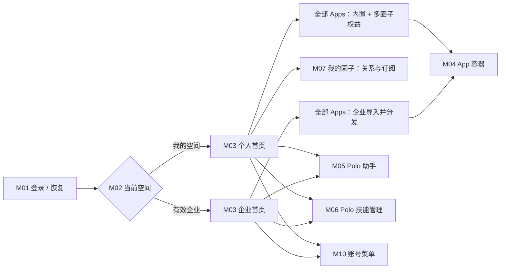
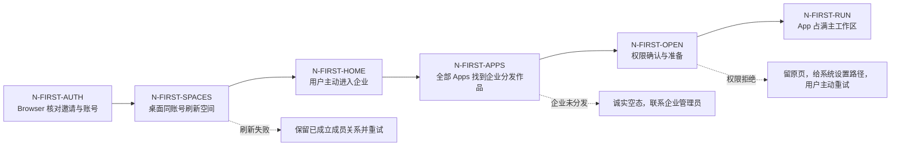
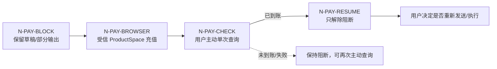
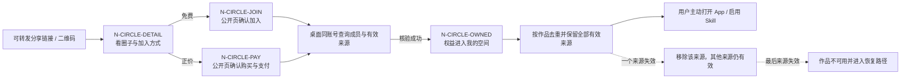

# Polo 客户端产品与用户流程说明

版本：`POO-70 master-r15`（2026-10-02 全客户端 UI/UX 原型复看） · 日期：2026-10-02 · 父任务：POL-111 · 共享身份：POL-112 r11 + D-ID-19—21

> **客户端产品方案的唯一 SoT。** 功能地图、范围、流程、异常恢复、跨端边界、政策缺口、已确认决定与验收场景只在本文件维护。POO-70 任务卡只保留本文件入口和进度；原型、场景清单、源码追溯和验证报告是派生产物或证据，不单独定义需求。
>
> 当前成熟度为 `scenario_defined`。产品规则沿既有确认及 D-PC-11—14 的明确替代；本轮调整页面的布局/视觉待复看；没有启动产品编码、发布或真实产品验收。共享身份引用 POL-112，资金责任冲突交 POL-116；D-PC-09 已替代旧单圈限制。

**阅读导航**：§2 完整功能地图与范围 → §3 原场景处置 → §4 入口与旅程图 → §5 实际流程和失败恢复 → §6 跨端 → §7 政策 → §8 变更清单 → §9 验收 → §10 来源 → §11 确认状态 → §12 原型与验证 → §13 本轮整体交互调整。


## 1. 两分钟评审

**用户能完成什么**：登录 Polo，进入自己有权使用的空间，找到并打开可用 App；App 在自身页面完成业务并负责产出。用户也可以使用当前空间的 Polo 助手，在原对话中查看消息、附件与生成文件。

三个代表例子：

1. **首次使用**：小王收到企业邀请，在 Browser 登录并确认；桌面用同一账号刷新到企业，主动进入。首页直接展示当前企业向本人分发的 App，找到并打开需要的 App，在 App 内完成工作。没有邀请也能直接进“我的空间”。
2. **日常使用**：小王再次从应用列表打开 App；从企业切到个人时，先终止原空间的全部活动，再整体切换目录、助手、权限和计量归属。取消则不切；终止失败保留原空间。
3. **失败恢复**：执行因积分不足停止，小王去 Browser 充值；返回桌面后主动点“已完成，查询结果”。每次点击仅查询一次；到账只解除阻断，是否再次发送或执行由小王决定。

### 已确认、直接继承

| ID | 产品结论 | 原始确认 |
| --- | --- | --- |
| D-PC-01 | 历史：保留首页、零常用引导全部 Apps；常用配置和排序已被 D-PC-11/12 替代 | 本卡 r2 用户同意第一项推荐 |
| D-PC-02 | App 自己负责业务内容、保存、历史与找回；Polo 提供容器、授权应用列表与打开能力 | 本卡 r3 用户以浏览器/网页类比说明 |
| D-PC-03 | 独立“文件”汇总页延后；助手附件与生成文件仍在原对话内 | 本卡 r4 用户“先不做吧，这个需求后面再做” |
| D-PC-04 | M01—M11 的完整功能、流程与范围接受；实现和验收状态仍单独记录 | 本卡 r5 用户确认集中方案 |
| D-PC-05 | App 打开后占满 Polo 主工作区；FDE 负责 App 内部界面，Polo 只画容器与平台反馈 | 本卡 r6 用户以浏览器承载网站类比确认 |
| D-PC-06 | 现有 Polo 助手、附件、Skills、追问和恢复框架直接复用 | 本卡 r7 用户确认已有流程跑通 |
| D-PC-07 | M03 首页、M04 关闭、M07 圈子入口、M09 积分提示按推荐收口；所有管理入口统一放账号菜单 | 本卡 r8 用户逐项同意并指定 M10 |
| D-PC-08 | 圈子只向个人空间提供 App/Skill 权益；多个圈子聚合在唯一“我的空间”，圈子不是空间；企业只消费自己导入、启用、分发的作品，不继承个人圈子、不订阅圈子；不建公开市场，私域分发不等于仅邀请 | 本卡 r9 用户明确要求 |
| D-PC-09 | 同一创作者的同一 App/Skill 可分发到自己的多个圈子；作品与稳定版本唯一，各圈分发、成员、定价、收入和关闭责任独立；我的空间按作品去重并保留全部有效来源；单一来源失效不阻断，最后来源失效才不可用；企业不继承个人圈子来源 | 2026-09-16 用户明确接受推荐并要求修改文档 |
| D-PC-10 | 顶栏常驻当前空间名称与标识，不提供独立空间下拉；头像菜单设「切换空间」入口，进入我的空间与有效企业列表；同一登录账号下切换工作空间，运行中仍按 M02 安全确认 | 2026-09-21 用户接受推荐并要求更新原型及相关文档 |
| D-PC-11 | 助手作为内置应用保留 Polo 顶栏；取消手动配置首页常用应用；助手固定第一；全局设置从助手抽出；圈子应用应更容易直接找到 | 2026-10-02 本卡原型反馈；替代 D-PC-01/07 中相关旧入口规则，D-PC-06 的聊天能力复用继续有效 |
| D-PC-12 | 首页默认按最近使用排列，Polo 助手固定第一；频率排序作为可切换选项 | 2026-10-02 本卡问答：“最近使用优先（推荐）” |
| D-PC-13 | Polo 一级「技能」入口，集中管理来源、启停、版本与更新；助手保留选用技能和跳转管理 | 2026-10-02 本卡问答：“Polo 一级「技能」入口（推荐）”；替代 D-PC-06/07 中技能管理位置，不撤销能力复用 |
| D-PC-14 | 本轮先管理创作者提供的技能更新；新的自行编辑、个人分支和发布能力单列范围 | 2026-10-02 本卡问答：“先管理创作者提供的技能更新（推荐）”；既有本地技能能力不因此删除 |

未受影响结论不再重复裁决。创作者 SDK/API 属于未来需求；本轮不要求 App 上报结果或保存状态，不显示“尚未保存到 Polo”。既有受信 Runtime、授权、计量与平台错误接口仍可复用，不由浏览器类比推出删除基础设施或只支持远程网页。

**中文界面术语（2026-09-23 用户要求）**：面向用户的中文文案统一称「技能」，包括助手内的管理入口、状态和圈子/企业来源说明；`Skill`、`SKILL.md` 仅用于技术标识、历史原文或英文语境。此项只调整用语，不改变技能的授权、安装和调用规则。

### 本轮跨端收口（2026-10-02）

本轮消费已确认规则，不重建身份或支付政策：POL-112 D-ID-21 规定公开网页与客户端分工；POL-114 PRD r26 的免费/正价、日历月/年及自助加入替代旧圈主审批和固定 30 天；POL-115 D-OPS-15/17 承接本期付费圈子资金责任与外部客服二维码。来源修订、owner 和适用摘录见 docs/mvp-complete-flow-hifi/sources/closure-r13-inputs.json。

- 圈子不审批、不要求定向身份匹配；返回后同账号核对实际资格。企业指定邀请仍匹配受邀身份，共享邀请仍审批，两者不得混用。
- 圈子公开页由 POL-114 维护，企业公开邀请页由 POL-113 维护；本端只提供交接摘要与客户端接收页，不复制对端完整表单、支付或后台导航。
- 圈子按创建时固定的日历月/年展示权威价格、起止时间与续费上限；免费老成员、已购周期保护和付费转免费不自动退款沿 PRD r26。
- 客服展示平台配置的真实二维码及本角色有权看到的必要信息，由用户主动联系；未配置/加载失败明确提示，不用样例码冒充可联系，不伪造工单、受理或退款。
- 助手功能与已确认复用范围不变。新页面呈现待复看，不把原型检查当实际跨端、支付或产品验收。
- POL-116 的手续费承担/结算公式冲突仍由资金责任人收口；客户端不计算创作者结算金额，不阻断此处已明确的展示与回查。

## 2. 范围与责任

### Must：本轮必须覆盖

- 登录/恢复的桌面承接、唯一个人空间、企业列表与安全切换；身份定义引用 POL-112，不在本端重建。
- 当前空间 App 发现、来源/版本/状态、准备和权限确认、打开/聚焦/关闭/终止、重新打开及错误恢复。
- 当前空间 Skills 的授权与本人启停；Polo 助手及其会话、附件、工具上下文的隔离。
- 我的圈子加入、详情、获得作品、手动订阅及到期/退出；支付由 Browser 承载。
- 平台积分阻断、Browser 充值、用户单次查询；账号偏好和按资格管理跳转。
- 无权、作品/版本失效、断网、部分输出、重开、契约不兼容的真实状态与恢复入口。

### 空间、圈子与企业边界

| 场景 | 当前产品规则 | 用户看到的结果 |
| --- | --- | --- |
| 个人加入多个圈子 | 各圈子给同一个 personal ProductSpace 授予 App/Skill；同一作品可来自多个圈子；各圈子的加入、续费、到期、退款和撤权独立 | 所有有效作品聚合进“我的空间”；同一作品只显示一次并列出全部有效来源；失去一个来源仍可使用，最后来源失效才进入不可用/恢复；空间选择器不会出现圈子 |
| 私域分发 | 使用可转发的创作者分享链接或二维码自助加入；0 元确认加入，正价权威支付成功后获权；无圈主审批或定向身份匹配 | 没有公开 App/圈子市场；“私域”不被实现成“一律只能收到邀请” |
| 企业消费 | 企业管理员导入交付包，启用并按成员/角色/组分发；企业实例、版本、数据和费用独立 | 企业目录只出现该企业向本人分发的 App/Skill；个人圈子作品不能补授权 |
| 企业与圈子 | 企业不能订阅、持有、续费或接收圈子权益 | 企业空间没有“我的圈子”、圈子订阅订单或个人圈子内容；企业需要能力时走自己的导入/分发流程 |
| 同一账号切空间 | personal 与每个 enterprise ProductSpace 强隔离；切换时目录、助手、权限、运行和计量主体整体切换 | 不混合目录、不搬数据、不把旧回执写入新空间；有活动先确认并全部停止后再切 |

圈子内容订阅和平台计算积分是两套责任：订阅决定个人空间是否有内容权益，积分只支付运行产生的计算费用。企业作品导入也不建立对个人圈子的订阅关系。

### 产品规则与首发范围分开记录

| 类型 | 当前结论 |
| --- | --- |
| 已确认并纳入客户端方案 | M01—M11、PC-F01—11、PC-N01—04、C-R01—08、J-PC-01—07；D-PC-01—14（含各自替代关系） |
| 已确认规则，但可分阶段交付 | 圈子详情与生命周期、完整充值往返、全部失败恢复、管理跳转接线、契约升级恢复等；延后实施不撤销规则 |
| 明确延后 | 独立跨对话文件汇总页；面向创作者的新 SDK/API 产品 |
| 当前不建设 | 公开 App/圈子市场、关注信息流、统一待办/跨 App 工作项、跨空间后台运行、未知 App 旁加载、桌面管理端写操作、普通客户端 staff 入口、自助创作者申请 |

### 本轮移出或延后

- **移出容器责任**：第三方 App 的业务结果聚合、统一历史、保存状态判断、跨 App 文件找回。内容责任与数据/付款归属是两件事：企业内容不因 App 自管而转为个人所有。
- **延后**：独立跨对话文件汇总页；面向创作者的新 SDK/API 产品。已有助手对话附件、文件打开与授权能力继续保留。
- **沿用不做**：公开 App/圈子市场、关注信息流、统一待办或跨 App 工作项、跨空间后台运行、旁加载未知 App、管理端写操作、普通客户端 staff 入口、自助创作者申请。
- 本轮仅定义产品流程，不设计新的品牌/无障碍标准，不改产品代码、旧卡执行快照或上线状态。

### 完整功能地图

| 模块 | 用户能做什么 | 自然入口 | 当前方案与首发处置 | 已有与待补 |
| --- | --- | --- | --- | --- |
| M01 登录与空间承接 | 登录、恢复会话、首次获得唯一“我的空间”，承接邀请/创建企业返回 | 桌面启动；Browser 邀请/创建回跳 | 保留；身份与登录引用 POL-112 | 已有登录与刷新基础；待补错账号、待审批、未安装、冷启动全程验收 |
| M02 空间切换 | 在“我的空间”和有效企业间安全切换 | 头像菜单 → 切换空间；顶栏只显示当前空间 | 保留；圈子不进入选择器；有活动先确认并全部停止 | 集成候选已有状态机；入口按 D-PC-10 调整，待验 App/助手/权限/计量整体切换 |
| M03 首页与全部 Apps | 打开助手、常用 App，浏览当前空间完整目录 | 首页；“全部 Apps” | 保留；助手固定第一，其余默认最近使用，可切换频率排序，无需配置常用；我的空间按作品去重并展示有效来源；无公开市场 | 已有首页/Catalog；待补自动排序、首页完整目录、真空目录、失败和逐来源撤权状态 |
| M04 App 容器与运行 | 准备、授权、全屏使用 App，关闭/后台/终止/重开 | App 卡片；标签页；顶部运行入口 | 保留容器；App 内部交互、结果与历史归 FDE/App | 已有 Runtime/目录基础；待补标签、终止竞态、OS 权限恢复闭环 |
| M05 Polo 助手 | 新建/恢复当前空间对话，发送、停止、回答追问 | 首页固定助手 | 直接复用现有框架 | owner 已确认流程跑通；实施仍需做空间隔离回归证据 |
| M06 Skills 与工具 | 查看当前空间授权，按本人启停，使用 Sources/Automations/Browser | Polo 一级「技能」；助手内选用/跳转；数据源与工具留助手 | 保留；授权、本人启用、设备准备分开；管理创作者版本更新 | 已有组件；待验同名、失权、跨设备与企业隔离 |
| M07 我的圈子 | 查看关系，经私域入口加入、订阅、续费、退出并取得作品 | 个人空间“我的圈子”；分享链接/二维码/邀请 | 保留完整产品规则；退出/到期按授权来源生效；首发不建公开市场；企业无此模块 | 已有关系摘要和 Browser 部分能力；桌面详情、来源合并、回跳和到期闭环待补 |
| M08 内容与文件 | 从 App 自身找内容；从助手原对话找附件/生成文件 | App 列表重开；助手原对话 | 简化；独立文件汇总页延后，App 结果聚合移出 | 助手附件已有基础；待验文件缺失、跨空间导入导出和旧数据隔离 |
| M09 积分阻断与充值 | 看见准确阻断，去 Browser 充值，返回后主动单次查询 | App 容器提示；助手输入/回答提示；账号菜单 | 保留；不自动查询、发送、续写或重试 | POL-94 已设计；客户端状态、角色动作和跨端返回待闭环 |
| M10 账号、偏好与管理跳转 | 管客户端设置，按资格打开企业/创作者/账单页面 | 账号菜单 | 保留；全局设置和企业/创作者管理跳转在账号菜单；技能管理按 D-PC-13 提升为一级入口 | 设置已有；资格菜单与真实返回接线待补 |
| M11 受限、离线、重开与升级 | 在撤权、断网、失败、版本不兼容时回安全入口 | 原页面状态；启动/重开 | 保留；不把未知状态伪装成功 | 部分 ContractGate/空间错误已有；整条恢复仍需验证 |

## 3. 全部既有流程的覆盖与处置

缺口用以下维度，不以任务 Done 替代：未设计、已设计未实现、已实现未集成/发布、已实现但流程不闭合、局部已验收、证据不足。没有真实部署证据的项目均不宣称已发布。

| 场景 / 用户目标 | 来源场景 | 当前入口、权限、状态证据 | 实现/集成与验收 | 缺口类型 | 本版处置 / 下一步 |
| --- | --- | --- | --- | --- | --- |
| PC-F01 首次进入和有效会话恢复 | S-001；A-DOC、POL-112 | C1 登录；C2 个人空间；C3 固定助手/空快捷入口 | C-INT 有基础；完整首登未验收 | 已实现但流程不闭合；证据不足 | 保留；身份引用 POL-112；补首次找 App 引导 PC-N01 |
| PC-F02 个人 App 找到、启动、使用 | S-012/014/016；A-PAY PC-APP-01 | C3 全部 Apps、来源/版本、首次权限确认；C6 固定空间运行 | POO-43/54 已集成；POO-55/56/57/58 分属后续 | 已设计未实现或未集成；全程证据不足 | 调整：保留首次准备/计费；D-PC-02 明确 App 负责内容和保存，移出平台统一结果/文件步骤 |
| PC-F03 加入、付费、续费、退出圈子 | S-010/011/014/015/016、S-043；D-PC-09 | C4 仅非空关系摘要；A-INT 有 circle/join、circle/pay、memberships 页面/API | Browser 有局部实现；Desktop 详情/来源合并/回跳未闭合，未做全程验收 | 已实现但流程不闭合；证据不足 | 调整：多圈子聚合到“我的空间”；同一作品按作品去重并保留全部有效来源；单一来源失效继续可用，最后来源失效才阻断；私域入口不限邀请；按 A-PAY 完全手动续费，移出旧自动续费/宽限期；企业不订阅圈子；不建公开市场 |
| PC-F04 启用 Skill、助手使用 | S-013；POO-41/48/52 | C7 有历史助手/Skill 组件；启用在助手内，不是首页独立 App | POO-59/60/61/63/64 待交付；没有强隔离全程验收 | 已设计未实现；证据不足 | 保留；分别验证授权、本人启用、设备准备，不能把三个状态混为一谈 |
| PC-F05 邀请/创建企业后进入桌面 | S-002/003；POL-112 | C5 刷新不强切；指定邀请直接确认、共享邀请审批继承文档 | A-INT 邀请 API + C-INT 刷新接线；跨端未验收 | 已实现但流程不闭合；证据不足 | 保留；身份/未安装返回由 POL-112，客户端补刷新失败与待审批说明 |
| PC-F06 安全切换与取消 | S-004/005 | C2 顶部选择器、运行项终止/失败/取消、契约重验 | POO-42 局部验收且集成；助手深层隔离/Tab 仍需下游 | 局部已验收；完整流程证据不足 | 保留“终止全部并切换”；个人/企业不并行后台；不自动打开目标旧对话 |
| PC-F07 企业 App/Skill/助手消费 | S-020/021 | C3 企业目录；C6 企业实例；个人圈子不能补企业授权 | App 基础已集成；助手 POO-48/59—62 未闭合 | 已设计未实现；证据不足 | 调整：App 内容/保存归 App；容器授权和空目录说明保留，助手仍须通过企业授权 |
| PC-F08 被移除、作品阻断、企业受限 | S-006/016/022/023 | C2 受限/安全回个人；C3 保留不可用条目；C6 拒绝新启动 | 有局部代码与 POO-42/54 证据；所有容器运行/助手数据撤权未全验收 | 局部已验收；流程不闭合 | 调整：保留容器即时收回操作权和空间隔离；App 内保存/历史不转为 Polo 托管职责 |
| PC-F09 账号偏好、管理与账单入口 | S-007；POL-112 D-ID-09/10 | C1 账号设置；C4 企业区旧发布跳转；真正资格菜单接入仍缺证 | A-INT 独立登录页不等于 Client 菜单完成 | 已实现但流程不闭合；旧规则已部分被替代 | 调整：消费 POL-112 r11，不再强制退出、不提供 MVP 创作者自助申请；账单/复杂责任留 Browser，引用共享已确认入口及安全返回 |
| PC-F10 离线、断网、重开恢复 | S-060；POO-47/55—57 | C3 离线阻止新启动；C2 缓存不当授权；部分历史会话恢复代码 | 离线打开已有 targeted tests 源码；容器与助手恢复全程未验收 | 已设计未实现/未集成；重开闭环待实现核验 | 调整：Polo 恢复容器与自身管理的数据；第三方 App 离线历史/业务恢复由 App 提供，不作为容器验收 |
| PC-F11 契约不一致升级 | S-062 | C2 ContractGate 显示升级/失败/帮助，阻止业务 | POO-42 有局部验收；真实升级下载/帮助目的地未验证 | 局部已验收；证据不足 | 保留；不能降级解释旧组织/圈子空间缓存，补真实升级失败返回验收 |

新增交叉场景继续使用原 ID：**PC-N01**（零常用/真空目录/加载失败）、**PC-N02**（从授权列表重开 App，内容归 App）、**PC-N03**（积分阻断及充值人工恢复）。本次补记 **PC-N04**（助手等待用户回答与重开恢复，对照 POO-53 已有范围），不新增产品能力。没有重编号。

### 功能基线逐项映射

| 原功能 ID | 本版场景及处置 |
| --- | --- |
| PC-01 / PC-02 | PC-F01/09：保留认证承接与首次个人空间 |
| PC-03 / PC-04 / PC-05 | PC-F06/08：保留空间列表、整体切换、先终止 |
| PC-06 / PC-07 | PC-F05：保留企业邀请/创建 Browser 交接 |
| PC-08 / PC-09 | PC-F09：按 POL-112 更新资格入口，保留偏好 |
| PC-10 / PC-11 | PC-F02/07、PC-N01：保留目录、来源、版本和三类空/错态 |
| PC-12 / PC-13 / PC-14 | PC-F02/07/10：保留容器运行、准备/更新/错误与必要无内容日志 |
| PC-15 / PC-16 | PC-F02/08：保留个人控制与撤权；App 结果保存改归 App |
| PC-17 | 继续不做未知 App 旁加载 |
| PC-18 / PC-19 / PC-20 / PC-21 / PC-22 | PC-F04/07：保留 Skill、助手、空间隔离和同名来源辨识 |
| PC-23 | 继续不允许 Web App 任意调用用户本地/未打包 Skill |
| PC-24 / PC-25 / PC-26 | PC-F03：保留邀请、圈子详情、确认加入和 Browser 支付 |
| PC-27 / PC-28 | PC-F03/S-015：调整为第二轮手动续费，无自动续费、取消自动续费或宽限期 |
| PC-29 | PC-F03、PC-N03：保留内容订阅与计算费用分离 |
| PC-30 / PC-31 | 继续不做关注信息流及公开市场 |
| PC-32 | PC-F04：保留助手内 Sources/Automations/Browser，其他高级上下文不主导首页 |
| PC-33 | PC-F02/06：保留当前执行状态与终止；不据此保留结果聚合页 |
| PC-34 | 继续不做平台级“继续工作”及跨 App 统一工作项 |

## 4. 信息结构与自然入口

```text
桌面启动 → 本端登录/恢复 → 契约检查 → 当前有权空间
  顶栏显示当前空间；头像菜单 → 切换空间：我的空间、有效企业（不含圈子/创作者/staff/本地 Workspace）
  首页：当前空间 + 固定 Polo 助手 + 自动最近使用的完整应用目录；一级技能入口
    全部 Apps：当前空间完整目录、个人控制、打开/重新打开
      我的空间：内置能力 + 多个圈子的有效 App 权益聚合
      企业空间：该企业导入、启用并向本人分发的 App；不混入个人圈子
    我的圈子（仅个人）：关系列表 → 详情 → App / Polo 技能管理
  App Tabs：承载各 App；顶部运行入口：当前空间运行状态、重新打开、终止
  Polo 助手：当前空间会话列表/新对话 → 消息、附件、生成文件
    Sources / Automations / Browser：助手内部
  技能：当前空间技能库 → 来源、本人启停、设备准备、版本与更新
  账号与偏好：账号、安全、外观、通知、本机存储、授权记录
    按资格打开 Browser：企业管理、创作者工作台/责任只读、充值账单、复杂注销
```

本轮不要求独立“任务与结果”聚合页或“文件”页；运行入口继续服务查看/终止/重新打开，不扩张成业务任务中心。尚无圈子关系也应有可理解的“我的圈子”空态与已有邀请的使用指引，不推荐虚构公开市场。

此图只确认功能与入口关系，继承 POO-41 未受影响的视觉规则。窄窗保护沿用冻结方案；不由历史 390 宽截图推出支持手机工作台。不重新冻结整套 UI。


```mermaid
flowchart LR
  LOGIN["M01 登录 / 恢复"] --> SPACE{"M02 当前空间"}
  SPACE -->|我的空间| PERSONAL["M03 个人首页"]
  SPACE -->|有效企业| ENTERPRISE["M03 企业首页"]
  PERSONAL --> APPS_P["全部 Apps：内置 + 多圈子权益"]
  PERSONAL --> CIRCLES["M07 我的圈子：关系与订阅"]
  ENTERPRISE --> APPS_E["全部 Apps：企业导入并分发"]
  APPS_P --> APP["M04 App 容器"]
  APPS_E --> APP
  PERSONAL --> ASSIST["M05 Polo 助手"]
  PERSONAL --> SKILLS["M06 Polo 技能管理"]
  ENTERPRISE --> SKILLS
  ENTERPRISE --> ASSIST
  PERSONAL --> ACCOUNT["M10 账号菜单"]
  ENTERPRISE --> ACCOUNT
```

### 三条关键旅程图

#### J-PC-01 首次登录、加入企业并打开 App


```mermaid
flowchart LR
  N1["N-FIRST-AUTH\nBrowser 核对邀请与账号"] --> N2["N-FIRST-SPACES\n桌面同账号刷新空间"]
  N2 --> N3["N-FIRST-HOME\n用户主动进入企业"]
  N3 --> N4["N-FIRST-APPS\n全部 Apps 找到企业分发作品"]
  N4 --> N5["N-FIRST-OPEN\n权限确认与准备"]
  N5 --> N6["N-FIRST-RUN\nApp 占满主工作区"]
  N2 -.刷新失败.-> R1["保留已成立成员关系并重试"]
  N4 -.企业未分发.-> R2["诚实空态，联系企业管理员"]
  N5 -.权限拒绝.-> R3["留原页，给系统设置路径，用户主动重试"]
```

#### J-PC-03 积分不足、浏览器充值与返回


```mermaid
flowchart LR
  P1["N-PAY-BLOCK\n保留草稿/部分输出"] --> P2["N-PAY-BROWSER\n受信 ProductSpace 充值"]
  P2 --> P3["N-PAY-CHECK\n用户主动单次查询"]
  P3 -->|已到账| P4["N-PAY-RESUME\n只解除阻断"]
  P3 -.未到账/失败.-> P5["保持阻断，可再次主动查询"]
  P4 --> P6["用户决定是否重新发送/执行"]
```

#### J-PC-05 私域加入圈子并获得能力


```mermaid
flowchart LR
  C1["可转发分享链接 / 二维码"] --> C2["N-CIRCLE-DETAIL\n看圈子与加入方式"]
  C2 -->|免费| C3["N-CIRCLE-JOIN\n公开页确认加入"]
  C2 -->|正价| C5["N-CIRCLE-PAY\n公开页确认购买与支付"]
  C3 --> C4["桌面同账号查询成员与有效来源"]
  C5 --> C4
  C4 -->|核验成功| C6["N-CIRCLE-OWNED\n权益进入我的空间"]
  C6 --> C7["按作品去重并保留全部有效来源"]
  C7 --> C8["用户主动打开 App / 启用 Skill"]
  C7 -.一个来源失效.-> C9["移除该来源，其他来源仍有效"]
  C9 -.最后来源失效.-> C10["作品不可用并进入恢复路径"]
```

## 5. 全旅程与共同恢复契约

以下 C-R01—C-R08 适用于每个 PC-Fxx；各场景再列特有行为。不适用的业务保存责任留给 App，不能靠增加“统一结果页”补闭环。

| 恢复条款 | 用户可见行为与责任 |
| --- | --- |
| C-R01 会话/账号 | 本端失效重新登录，重新验证原目标权限后才恢复安全页面和已保存数据。不能自动执行原动作；无权则拒绝。退出不删除业务数据，不新增通用未提交表单跨端/跨重开恢复承诺，已有 PC-N04 专项恢复继续保留；账号被暂停不进入业务。具体身份规则引用 POL-112 ID-C01—10、D-ID-09—18。 |
| C-R02 空/失败 | 加载中、真实零条、网络失败、权限受限分别展示。失败不拿另一个账号/空间缓存填充；保留安全返回与重试入口。 |
| C-R03 上下文 | 目录、会话、Skills、Tab、运行、数据读取与内部计量使用同一已提交空间；异步旧回执不改变新空间。缓存不成为授权依据，圈子不是空间。 |
| C-R04 取消/中断 | 未提交动作可取消并留原入口；已经完成的加入/支付/终止不被关闭窗口回滚。终止前取消可继续原执行；部分已终止后取消切换不自动复活已停任务。操作结果未知不得写成成功。 |
| C-R05 重新打开 | 重开先恢复有效身份、空间并重验权限/契约，再显示目录与 Polo 已保存的会话数据。App 可从有权列表重新打开，内部历史由 App 提供；不重发旧 Prompt、不复用过期启动凭证、不把崩溃中的运行猜成成功或自动重跑。 |
| C-R06 桌面权限 | 只在用户主动打开/选择材料时请求必要权限；首次权限说明、更新新增权限重新确认。拒绝或取消留原页面、不启动依赖该权限的动作；已在 OS 拒绝时给设置路径，用户授权后主动重试。撤销后下一次实际调用重新校验，不能仅凭旧 UI 开关继续读。此恢复交互已随本版功能方案接受（D-PC-04），沿用已有最小权限边界，不增加权限种类。 |
| C-R07 数据转移 | 正常切空间从不搬数据。继承 POO-48/62 的助手显式 allowlist 导出/导入和旧 owner 不明数据隔离：只转被允许内容，不转凭证、隐藏上下文、权限或可调用源引用；目标生成新对象。取消/失败不得产生可跨空间访问的半成品。不将此助手能力扩展为 App 结果托管。 |
| C-R08 Browser 返回 | Browser 完成只代表该端事实；桌面需要同账号/目标验证与自身刷新。未安装给下载/稍后打开指引，冷启动重新验证候选目标；错误账号/过期目标拒绝或引导正确登录，不执行深链附带的业务动作。支付查询另受 PC-N03 限制。 |

### PC-F01 / S-001：首次登录与我的空间

- **角色/前置**：小王首次安装、无企业邀请；或原用户重新打开。自然入口为桌面启动。
- **页面与动作**：按 POL-112 登录 → 检查契约 → 找到或幂等创建唯一“我的空间” → 首页 → 全部 Apps/助手。无企业不阻塞使用。
- **成功/空态**：个人空间可用；没有使用记录时仍直接展示已授权应用（PC-N01/D-PC-12）；真空目录说明尚无可用作品，助手按自身可用状态展示。
- **拒绝/失败/取消/恢复**：暂停账号拒绝；个人空间准备中允许原规则的幂等自动重试，不能创建第二个。目录失败明确重试；登录取消留登录入口，重开按 C-R01/05。此幂等准备重试不包含支付查询或任务执行。
- **交接/归属**：登录共享 POL-112，桌面自行恢复；个人内容及内部计算费用归个人，App 内容自管。

### PC-F02 / S-012、S-014、S-016：找到、使用并重新打开个人 App

- **角色/前置/入口**：小王已在个人空间；从首页完整应用目录、搜索或圈子详情选 App。目录只含内置能力与其已加入多个圈子明确分发的有效作品。普通卡片不常驻显示付款方；圈子详情、交易页及需要区分同名作品时展示实际圈子/作品来源、稳定版本和状态。
- **动作/成功**：主动打开 → 必要权限确认 → 透明准备 → App Tab。由 App 完成业务与展示/保存；Polo 可观察成功是正确 App 在正确空间打开，执行状态及平台错误真实，不检查保存（PC-N02/D-PC-02）。运行固定启动版本，更新下次启动生效。
- **个人控制**：不再要求配置或移出常用；已有隐藏/停用不退出圈子，从仍有权的作品列表恢复。首次准备/更新失败可主动重试，权限取消不启动。未知来源不旁加载。
- **关闭/中断**：无活动直接关闭；有活动按既有 POO-55 提供取消、后台继续、终止并关闭。同空间后台可继续，从运行入口或目录聚焦正确实例；只有确认停止才能终止并关闭，失败留可恢复状态。空间切换另须全停，客户端退出/崩溃后不承诺后台自动继续。
- **拒绝/空/恢复**：撤权、下架或版本阻断给具体原因；过期缓存不绕过鉴权；普通空目录与失败按 C-R02。网络/重开按 PC-F10；App 内部分结果、取消和历史由 App 解释，Polo 不把未知执行写为业务成功。
- **数据/付款**：账号+个人空间+作品实例/版本隔离；通过 Polo 能力的运行计量固定上下文，内容订阅与计算分账。App 自管不转移所有权或解除费用同意。

### PC-F03 / S-010、S-011、S-014、S-015、S-016：圈子加入与订阅

- **角色/前置/入口**：普通 Polo 业务账号从可转发链接或二维码进入 creator.polo.z-h-ai.com/c/{shareId}；已有关系从个人“我的圈子”进入。免费或正价，无圈主审批、仅邀请模式或定向账号匹配。企业无圈子订单；不建公开市场。目标域名/路径沿 POL-112，不代表已部署。
- **免费加入/跨端**：公开页显示作品与价格，用户按 POL-114 同页流程登录并确认免费加入；网页保留成功及下载/打开入口。桌面同账号核对关系、有效来源并刷新我的空间，不再确认加入、不自动开 App 或启用技能。错账号切换后再查，启动/刷新失败不撤销已成立关系。
- **付费**：在公开页核对当前价格、固定月/年周期、预计有效期与购买须知，经本人同意才建单/出码；权威支付成功才建立权益。桌面查询原订单及有效来源。完整支付页面归 POL-114；内容订阅与计算积分独立，不互抵、不购买自己管理圈子的订阅；结果未知查原单，不重复付款或提前授予。
- **手动续费（S-015，消费 POL-114 r26）**：每圈创建时固定日历月/年，不是固定 30 天/365 天。有效期内从原到期时刻延长，到期后从新权威支付成功时刻起算。月付续费后剩余权益不得超过确认时刻起 12 个日历月；年付最多提前购买下一年度周期，进入该周期后才可再续。月末/闰年与实际起止时间由服务端返回；达上限不建新单，但仍可查原单。无自动扣款或宽限期，价格变化重新确认；免费老成员、已购周期保护与免费/付费转换沿 r26，付费转免费不自动退款。
- **作品聚合与版本**：同一创作者的同一作品可以分发到自己的多个圈子；作品归属、版本和发布生命周期唯一。我的空间按稳定作品 ID 去重，不按名称合并不同作品，并在唯一条目上保留全部有效授权来源。新稳定版影响所有分发该作品的圈子，提示受影响圈子后，各圈成员下次启动使用同一新版本；需要独立品牌、功能、版本或发布时间时另建作品。
- **退出/拒绝/空态**：立即退出须确认，只撤销该圈子提供的授权来源；其他圈子仍有效的同一作品继续可用。某圈到期或停止分发也按同样规则处理；只有最后一个有效来源失效，作品才进入不可用与恢复路径。关闭确认不退出；空关系引导用户使用已有分享链接、二维码或邀请，空作品解释尚未分发。链接失效/停止加入不建关系；圈子不新增审批等待。
- **失败/恢复**：支付未知保留处理中，不重复扣款/授予；已付事实与桌面刷新分开。会话过期按 C-R01/08；付款取消回详情，已完成付款不会被返回回滚。退款/争议从原订单或权益异常处联系客服，沿 POL-115 原对象核验办理；本端不裁定退款金额。
- **到期与内容**：到期先撤销该圈子来源；同一作品无其他有效来源时才停止新启动。普通订阅到期允许已预授权任务自然结束，紧急全局阻断仍立即停。App 自己保管其合法历史；助手已保存内容按所有权保留，不自动删除或搬迁。

### PC-F04 / S-013：Skills 与助手对话

- **角色/前置/入口**：当前空间成员，首页固定 Polo 助手 → 本空间会话列表/新对话；技能管理由 Polo 一级「技能」进入，助手选用或圈子详情可跳转对应作品（D-PC-13）。
- **动作/成功**：看来源与状态 → 明确启用/停用 → 在对话发送任务；助手可按配置自动选用已经启用且仍授权的 Skill。启用按账号+空间+Skill/作品实例同步到本人设备，不替其他成员启用；设备下载不是第二次启用。
- **消息/文件**：对话内选择材料、看附件与生成文件；通过原对话打开合法可访问文件，文件已移动/删除给明确说明与重新选择入口，不替用户伪造恢复。无独立上传入口或跨对话文件汇总页（D-PC-03）。
- **空/拒绝**：空会话可新建；无额外 Skill 不虚构推荐/自动开通；同名展示来源。启用时无权拒绝，运行前失效不调用；紧急阻断终止相关调用并标记历史来源版本，不自动删历史。
- **失败/取消/恢复**：权限拒绝按 C-R06；手动停止显示停止而非余额不足。失败保留已经实际保存的消息/附件与真实状态；部分输出按 PC-N03。网络/重开和会话过期按共同条款，不能借恢复自动重发。
- **等待用户回答（PC-N04，POO-53 已有能力）**：助手提出问题后，用户可回答或暂不回答；问题状态及该功能已有草稿恢复在重开后保留，回答只形成一条可读消息并在原会话续答，取消不续答；已回答、过期、原会话删除/无权时不重复提交或误投到新会话。瞬时失败可重试核对真实状态，不产生重复消息。这里保留既有问题交互恢复，不推导所有 App/所有表单都有草稿恢复。
- **高级上下文/转移**：Sources/Automations/Browser 只在助手内部并随空间隔离；显式允许导出导入及旧数据隔离按 C-R07。当前空间名称持续可见，付款方不常驻。

### PC-F05 / S-002、S-003：企业邀请/创建后进桌面

- **角色/前置/入口**：被邀请小王从 Browser 链接进入；基础验证用户从客户端“创建企业”进入企业管理端。
- **邀请**：Browser 登录回原邀请页 → 指定身份匹配确认即加入；快速共享申请待 Owner/Manager 审批 → 提示打开/下载桌面 → 同账号刷新空间列表 → 用户主动选择企业。不得把待审批企业当有效空间，亦不强切其他设备。
- **创建**：Browser 完成企业创建 → 成为唯一 Owner → 返回桌面刷新列表；失败由原端保留表单及幂等重试，客户端不复制创建逻辑。未打开桌面时下次启动重新取列表。
- **拒绝/空/失败**：错账号提示正确认证；过期/取消/用尽/已暂停不得绕过；已有成员不重复加入。已加入但加载失败保留成员事实、可重试；企业空目录提示尚未分发及联系管理员，不混入个人作品。
- **取消/会话/恢复**：确认前关闭不加入；确认后离开不退出企业；认证/深链按 C-R01/08。默认或原目标选择引用 POL-112 已确认的有权目标规则；邀请本身不改当前空间。
- **数据/付款**：只有实际进入并授权执行后按企业空间上下文使用企业数据与费用；邀请回执不等于运行许可。

### PC-F06 / S-004、S-005：安全切换

- **角色/前置/入口**：小王拥有个人与企业；顶栏持续标识当前空间，点击头像 →「切换空间」进入目标列表。同一账号，不重新登录。
- **无活动**：验证目标 → 原子提交上下文 → 首页切换落目标首页，助手内切换落目标会话列表/新对话，不自动开旧对话。
- **有活动**：列全 App/助手/AI 运行项 → “终止全部并切换” → 显示逐项状态 → 全停才提交。后台活动也包含在内。
- **取消/失败**：操作前取消保持原空间及运行；部分已停后取消不重启已停项。终止失败只重试失败项/取消；目标加载失败不展示混合内容，可重试或回仍有权原空间。
- **拒绝/会话/恢复**：目标无权不进入，移除或标不可用；会话过期先停止有权上下文操作并重新验证，旧回执不提交切换；重开按 C-R05。无其他有效企业时只列个人，个人也不可加载则安全受限页。
- **责任**：切换只影响本设备；全部目录、Skills、对话/附件、权限、运行与内部付款主体一起换，不迁移企业资料到个人。

### PC-F07 / S-020、S-021：企业消费

- **角色/前置/入口**：有效 Member/Manager/Owner 在桌面都以消费者使用企业目录/助手。
- **动作/成功**：企业已导入交付包、检查、启用并向本人分发作品 → 打开企业 App 或本人启用企业 Skill → 使用企业助手。个人圈子授权不补企业缺失授权；企业不订阅圈子；同名 App 的个人/企业实例、版本、状态互不覆盖。
- **空/拒绝**：空目录联系企业管理员分发；没有 Skill 授权不允许调用个人版本替代；停用/撤权按 PC-F08。
- **失败/取消/会话/返回**：App 准备、权限拒绝、关闭按 PC-F02；助手按 PC-F04；切换按 PC-F06；重开按 PC-F10。用户从 App 返回仍是原企业范围，不跳个人。
- **内容/责任**：App 负责业务内容管理；企业输入、内容、助手消息/附件与计算费用仍归企业。客户端提供隔离和权限边界，不托管所有 App 输出。预算及付款动作按 PC-N03，不因 Manager 能管理作品而授予财务。

### PC-F08 / S-006、S-016、S-022、S-023：撤权、企业限制、作品失效

- **角色/入口**：使用中成员被移除/暂停，或企业/作品变受限；可在启动、调用或状态更新时发现。
- **成员失权**：给原因与联系管理员入口，停止新操作并终止企业活动，清除可操作上下文，安全回个人。个人加载失败显示受限页，不继续展示企业内容。
- **企业治理暂停/关闭中/既有欠费限制**：执行平台规定的全企业阻断与活动终止，Owner 在 Browser 处理账单/导出/申诉；Member/Manager 不能绕过。积分耗尽和预算阈值另按 PC-N03，不把不同原因混成同一弹窗。
- **作品状态**：撤销/停止分发/退出/到期先移除对应授权来源；仍有其他有效来源时继续可用并更新来源显示。最后来源失效才显示不可用原因、拒绝新启动；普通订阅到期与紧急全局版本阻断分别按 PC-F03，不将普通到期误实现为紧急全停。
- **失败/取消/恢复**：拒绝不能被“取消提示”绕过；终止确认未知保持不可操作并可重查真实状态。权限恢复只恢复仍合法关系/启用状态，不自动任务；会话重登/断网/旧链接不能恢复已撤权限。
- **内容/付款**：不删除合法保留记录或转移企业数据；App 自身保存归 App，Polo 自有历史必须按所有权验证。治理/邀请/充值成功均不抵消其他未解除的阻断。

### PC-F09 / S-007：账号与管理入口

- **角色/入口**：账号菜单 → 账号与偏好。普通用户完成已有安全/外观/通知/本机存储等操作。
- **管理交接**：具对应企业 Owner/Manager 权限才展示企业管理；有效创作者可进入工作台，资格失效保留责任只读入口。后台各自登录和鉴权，不要求退出另一端；不增加统一三选一门户或普通 staff 快捷入口。具体认证和找回原样引用 POL-112 ID-C01—10、D-ID-09—18。
- **账单/责任**：充值账单、创作者收入、复杂注销在对应 Browser 端处理；企业财务仅合资格 Owner，注销未结所有权/财务列阻塞。没有资格的空菜单不显示可写管理动作。
- **失败/取消/返回**：链接打不开给可重试入口；Browser 会话到期在其本端恢复到有权原页；取消停留账号页。手机号不可用按 POL-112 线下运营核验恢复原账号，不建自助申请或找回工单。退出结束本端会话，不删本地业务数据，重新登录重验权限。

### PC-F10 / S-060：离线、部分结果与重开

- **角色/入口**：客户端离线启动，或当前 App/助手执行中断网。
- **可见状态**：仅在有效归属下展示 Polo 已存本地助手历史/附件及缓存目录说明，明确缓存不代表最新授权。第三方 App 历史、离线内容、业务部分结果由 App 自己提供；Polo 不做统一结果恢复承诺。
- **限制/失败**：离线不得新开 App/助手/AI 执行；运行中停止新的网络/AI 调用，显示等待恢复或终止，不把超时/未知伪装成功或积分不足。不能借本地缓存访问已撤销企业数据。
- **恢复/取消**：网络恢复后重验空间、作品、版本及计量权限；先恢复可操作资格，由用户决定继续/重新发起，不自动重放业务动作。用户可终止；App 内执行恢复由 App 决定。重开按 C-R05，已保存 Polo 消息/附件可重新访问，文件不存在明确提示。
- **责任**：按实际用量和输出事实结算，不用“显示结果失败”代替账务事实；切空间/换账号后的回执不能落到新上下文。

### PC-F11 / S-062：契约不兼容

- **角色/入口**：启动/登录后的版本检查；包括更新后重开。
- **主/拒绝**：无法安全理解服务端契约时阻止业务，显示升级与帮助；未公开发布阶段不提供旧语义降级运行。
- **失败/取消/恢复**：网络检查失败提供重试；升级失败/取消留阻断页及帮助，不开放业务。完成升级再检查成功才能返回安全入口，仍失效会话重新登录。
- **归属**：旧 Creator Space/Organization/授权/Runtime 缓存失效重建，不能猜成当前 ProductSpace；不得以兼容为由串数据或付款主体。

### PC-N03：平台积分不足与充值人工恢复

- **入口/角色**：App 运行或助手发送/生成时收到平台明确 `insufficient_credit`；个人用户/企业 Owner 可去充值，Manager/Member 仅通知 Owner，不暴露 Owner 私人信息或企业财务。
- **发送前**：不创建新的助手消息；保留当前可编辑输入，发送不可用，输入框上方阻断及充值入口。
- **生成中**：停止下一段生成、保留已产出的部分，仅消息末尾提示，不重复输入框提示。用户主动停止不报积分耗尽；刚好正常完成且余额为零不谎称中断。
- **App**：非模态平台提示、保留页面；不替 App 设计业务续跑/结果页。无输出不扣积分/不造零账单，部分输出按实际用量；固定空间、App、版本和费率的运行事实由平台计量。
- **预算/服务错误**：预算超限由 Owner 调预算，已预授权生成可完成、下一次发送阻断；通用服务失败/未知不冒充积分不足。企业治理限制另外判断。
- **Browser**：去当前受信空间的支付中心；页面可按其支付流程查询订单，但桌面不因此取得自动轮询许可。
- **返回桌面**：用户点击“已完成，查询结果”才针对受信订单/上下文单次查询；未到账、处理中、查询失败分别保留阻断；“还没有”仅关闭询问。切空间/换账号后旧订单返回不得影响新空间。
- **成功/后续**：确认到账且其他权限仍有效，仅解除相应阻断。用户使用正常发送/执行动作继续，不自动发送、续写、重试，也不加一键自动继续。焦点变化、浏览器返回、重开、定时器均不得自行查询充值结果。

## 6. 跨端输入与输出

| 场景 | Desktop / Browser 输入 | 对端完成事实 | 桌面必须验证/失败恢复 |
| --- | --- | --- | --- |
| PC-F05 企业邀请 | 邀请目标；原邀请页认证 | 有效成员或待审批，不是桌面切换成功 | 同账号重取成员和空间；待审批不列企业；刷新失败保留成员事实并重试 |
| PC-F05 企业创建 | 基础验证业务账号、创建意图 | 创建成功、唯一 Owner | 重新取空间列表不强切；未运行下次启动；失败不复制创建逻辑 |
| PC-F03 圈子加入/订阅 | 个人空间、圈子目标、订单候选 | 成员/支付状态及有效期 | 复验成员授权后展示详情/作品；不重复开通，不自动启用；支付未知与目录失败分开 |
| PC-N03 充值 | 受信空间与支付入口/订单 | Browser 已支付仅是该端事实 | 用户主动单次查询；未恢复不解除阻断；成功不重发任务 |
| PC-F09 管理/责任 | 候选企业或创作者目标 | 独立会话下完成有权操作 | 返回后重验资格/原安全目标；不传递另一端会话假设、不暴露 staff |
| PC-F09 找回/注销 | 共享规则规定的运营/Browser 流程 | 原账号恢复或责任处理状态 | 本端重新认证、保持原所有权，不恢复已撤资格；复杂写操作不在客户端 |

共享验收沿用 POL-112 r11 的 AC-ID-01/03/05/06/07/10；客户端承接资格菜单、误入口、独立会话、创作者责任只读、企业创建返回及原账号恢复，不承接 staff 预置或管理端写操作。GAP-ID-01/03/08 是入口接线/默认目标与真实环境验收的工程交接，不是新增产品待决。

深链只是候选目标，不能自报身份、空间、付款方或“成功”。已安装打开、未安装下载、冷启动、错账号、过期/已消费目标都要有可重放验收；产品规则已明确，具体 URI、域名和服务端校验方法属于后续工程设计。

## 7. Policy 应用、缺口与执行点

产品结论 owner：需求提出者（或其指定产品 owner）；身份由 POL-112 收口、计量/支付由 POL-94 收口。可复用 policy 的具体维护 owner 及工程化交付交 POL-116，不把开发卡 assignee 当政策 owner。

| 政策 / 来源版本 | 可复用规则 | 本版判断 / 缺口类型 | 强制执行点与后续 |
| --- | --- | --- | --- |
| 身份/账号，POL-112 r11 ID-C01—10、D-ID-09—18；A-DOC | 独立端会话、同业务账号、按资格入口、找回不转责任 | Spec 满足；实现/运营证据待补；包装未发现 | 登录、菜单、深链、服务端授权；不复制共享身份定义 |
| 空间隔离，A-DOC product-space-contract / POO-48 | 固定归属、原子切换、不默认迁移、不读 owner 不明数据 | Spec 满足；助手全资源验收证据不足；包装未发现 | 存储/IPC/Tab/Runtime/附件/缓存及 await 前后重验 |
| App/Skill 授权，A-DOC PC-F02/04/07/08；POO-43/52 | 授权、本人启用、设备准备分开；运行前重验 | Spec 满足；已有设计，启用/撤权闭环未验收 | 目录、获取、启动、调用、停用；不能仅隐藏按钮 |
| 执行/费用，A-PAY、POL-94、ADR 0019 | 固定运行上下文、实际用量、用户单次查询、不自动再执行 | Spec 满足；已有后续规则取代前轮；实现与跨端验收待证 | 计量服务、App/助手阻断、订单归属、查询入口 |
| App 内容责任，本卡 D-PC-02 | App 自己保存/找回；Polo 不聚合、不判断保存 | 已确认取代旧聚合要求；旧任务/原型仍有冲突文字 | POL-116 调整 POO-47/56/57 与设计引用；不热改既有锁定快照 |
| 助手保存/文件，本卡 D-PC-03 + POO-48/59/62 | 原对话存取，显式允许转移，独立汇总页延后 | Spec 满足；实际持久化/迁移/丢失文件恢复待验收 | 读写权限、文件打开、导出导入、重开恢复 |
| Browser 交接，POL-112 r11、A-PAY、A-DOC PC-F05 | 对端成功与本端刷新分开、目标重验 | Spec 满足；入口已设计，冷启动/错账号闭环证据不足 | 深链入口、恢复原页、成员刷新、手动充值查询 |
| 桌面权限，A-PAY PC-APP-01、POO-47 | 首次必要权限及新增权限确认、限制目录、不旁加载 | 边界可复用；C-R06 拒绝/设置/重试已随本版接受，OS 行为证据仍不足 | 实际文件选择/调用处校验，取消/撤销不越权；不新增权限类型 |
| 圈子，A-PAY FR-032—038 / A-DOC S-010—016、S-043 | 多圈子聚合到 personal ProductSpace；企业无圈子权益；私域入口可为分享/二维码/邀请；手动续费；同一作品可分发到多个圈子，作品/版本唯一，各圈关系与费用责任独立；内容与计算分账 | 后续支付规则明确替换旧自动续费/宽限期；D-PC-08 补齐空间边界；D-PC-09 明确替代 POL-94 旧单圈限制 | Browser 订阅服务、桌面详情/授权到期，不在本端重算期限；客户端按作品去重并消费逐来源 entitlement |
| 设计，POO-41 ef3528ef、POL-94 第二轮、C-INT DESIGN alpha | Apps 首页、助手内 Skills、非模态阻断、窄窗保护 | 未受影响规则复用；D-PC-02/03 影响页待同步；包装未发现 | 后续原型只改受影响节点；视觉冻结与流程接受分别记录 |
| 无障碍，C-INT docs/DESIGN.md alpha | 现有语义控件可复用 | **无法评估合规**：统一标准/owner/全键盘读屏及对比度验收证据缺失 | 推荐以键盘走完主流程、错误反馈与焦点恢复作基础检查；具体标准/政策 owner 交 POL-116，不宣称 WCAG 达标 |

### Flagged concerns 与待办分流

1. **已裁决但未同步的规则冲突**：旧 POO-41/47/56/57 要求 App 结果/文件汇总，与 D-PC-02/03 冲突。本版按用户确认裁剪；旧任务和原型后续在 POL-116 同步，不把这些缺口重新作为本轮必做功能。
2. **多圈规则已由用户裁决**：POL-68 的“同一作品可分发到多个圈子”继续有效；用户在 2026-09-16 接受 D-PC-09，明确替代 POL-94 第二轮的旧单圈限制。客户端按稳定作品 ID 去重，保留全部有效授权来源；不按名称误合并不同作品。此前发给 POL-116 的冲突事件 `evt_3750ff41cd984b6e9dbc7bec817310b7` 属于过时判断，不能再作为待决依据。本轮不并发修改 POL-116。
3. **政策无法评估**：未找到明确适用的统一无障碍合规目标及维护 owner；不伪称“只缺 Skill 包装”。此项由政策收口安排，当前 Spec 不新增法定/认证承诺；若后续制定标准改变当前流程，再请对应 owner 裁决。
4. **工程/验收缺口**：真实部署地址/版本、桌面 OS 权限恢复、助手所有资源隔离、冷启动深链/返回地址、旧数据迁移等由后续 Plan/验收补证。没有证据不等于没设计，也不需要用户先给技术答案。

本轮没有需要用户新增选择才能整理本端正文的冲突。D-PC-08 继续约束个人圈子与企业边界；D-PC-09 已解决同一作品跨多个圈子分发的产品选择。本端只同步已确认行为；圈子付费与日历周期按本轮已确认来源纳入，不由客户端重定价格或结算公式。历史首发延期不覆盖 POL-114 r26/POL-115 D-OPS-15。

## 8. 旧任务与本版变更范围清单

下表是产品范围对照，不是对旧任务状态、执行依赖或锁定合同的修改；不新建重复卡，不因引用历史卡就让访谈等待全部实现。

| 卡片/范围 | 本版结论 | 收口后动作与依据 |
| --- | --- | --- |
| POO-41 UI 冻结 | 保留未受影响首页/Tab/助手规则；调整系统工具与旧结果/文件页 | 按 D-PC-01/02/03 更新受影响原型，记录新旧场景对应，不重画整套 |
| POO-42 空间 / POO-43 Catalog | 保留；首页完整目录与自动最近排序；真空/失败区分 | 用 PC-F01/02/05/06/08/11、PC-N01 补闭环验收 |
| POO-47 协调 | 调整第三方结果/文件聚合要求；运行/隔离/计量保留 | 更新协调与后续集成验收范围，不要求已移出能力交付 |
| POO-53 助手提问交互 | 保留既有 request_user_input 的回答、暂不回答、重启/草稿恢复与单消息续答；架构纠偏沿原卡 | PC-F04/07、PC-N04；不误列为 App 集成卡，不加第三个独立 Codex 执行后端 |
| POO-54 Runtime 基础 | 保留受信 API、隔离、鉴权与计量边界 | 不把 SDK/API 延后解释成拆除既有基础；结果上报不是本轮 App 准入前置 |
| POO-55 App Tabs | 保留打开、关闭三选项、同空间后台、终止与重新打开 | 切空间全部终止；重开不承诺 App 业务历史由 Polo 恢复 |
| POO-56 运行中心/任务结果 | 调整：当前运行状态/重开/终止保留，App 业务结果聚合移出 | 取消结果页作为本轮完成条件；运行页面必要结构复用，避免另开统一业务任务中心 |
| POO-57 最近文件 | 延后独立汇总页；移出第三方 App 文件聚合 | 原对话附件和文件能力仍留 POO-48/59 范围，不能全删 |
| POO-58 App 积分 | 保留 | PC-N03、POL-94 单次查询、无自动任务恢复 |
| POO-48、POO-59/60/61 | 保留助手消息/附件、Skills/Sources/Automations、Browser/后台隔离 | PC-F04/06/07/08/10；不因 App 自管而削弱助手隔离 |
| POO-62 | 保留助手显式允许导出/导入与旧 owner 不明数据隔离 | C-R07；不扩为 App 结果平台，具体 allowlist 在对应实施设计确定 |
| POO-52、POO-63/64 | 保留成员 Skill 启停与版本化深链 | Polo 技能管理中启用；授权重验/错空间/过期恢复按 PC-F04 |
| POO-49、POO-65/66 | 保留发送前/生成中积分状态和人工恢复 | PC-N03；区分部分结果、主动停止、恰好完成、服务失败 |
| POL-94 / POL-116 | 支付、计量、退款与结算共享依据保留；POL-94 旧单圈限制已被 D-PC-09 替代；其余真正跨端问题仍由 POL-116 收口 | 原计量生产验收和本次访谈是不同交付；不机械拼接两轮需求，也不把过时冲突事件当作当前结论 |

## 9. 验收场景与画布索引

当前为 `scenario_defined`；不声称 `execution_ready` 或 `function_accepted`。这里只定义可验收结果，**未执行产品验收**。后续测试、演示与缺陷沿用 PC-Fxx/S-xxx、PC-Nxx 及下列 J/N/B ID；画布可点击表示预期流程可演练，不等于系统可用或用户接受。

| 原场景 / 代表例子 | 通过条件 | 画布对应 |
| --- | --- | --- |
| PC-F01/S-001、PC-N01 | 无邀请登录得唯一个人空间；无使用记录仍展示授权目录；真空、失败不混淆，无别空间缓存 | J-PC-01，N-FIRST-LOGIN/PERSONAL，B-FIRST-30—39；N-FIRST-HOME/APPS |
| PC-F05/S-002/003 | 指定邀请/待审批/错账号/创建成功/冷启动分别验证；成员成功不强切，刷新失败可重试 | J-PC-01，N-FIRST-AUTH/SPACES，B-FIRST-01—08；C-R08 |
| PC-F02/07、PC-N02 | 目录作品来源/稳定版本明确，个人企业授权分离；打开/重开同范围 App，不插入保存判断步骤 | J-PC-01，N-FIRST-OPEN/RUN/RESULT，B-FIRST-07—25/29；J-PC-07 |
| PC-F06/S-004/005 | 全停才切；取消前无变化，部分终止取消不复活；失败不半切；目标助手不自动开旧对话 | J-PC-02，N-SWITCH-CONFIRM/TARGET，B-SW-01—06 |
| PC-F03/S-010/011/014/015/016/S-043 | 分享/免费/付费/取消/未知/到期/退出分别可恢复（无圈主审批）；获得作品不自动开/启用；无自动续费宽限期；同一作品来自两个圈子只显示一次；失去一个来源仍可使用；最后来源失效才阻断；企业空间无圈子来源 | J-PC-05，N-CIRCLE-DETAIL/JOIN/PAY/OWNED，B-CIRCLE-*；D-PC-09；原型 S4 |
| PC-F04/S-013、PC-F07/S-020/021 | 授权≠本人启用≠设备准备；同名可辨；原对话文件可访问，跨空间无泄漏；无独立文件页 | J-PC-04，N-ASSIST-LIST/SKILL/CHAT，B-ASSIST-*；C-R07 |
| PC-N04、PC-F04/07 | 等待问题重开可恢复；回答一次只形成一条消息，暂不回答不续答，失效/已答/会话删除不误投 | J-PC-04，N-ASSIST-QUESTION，B-ASSIST-18—25 |
| PC-F08/S-006/016/022/023 | 被移除全停且安全回个人；普通订阅到期不误当紧急全停；无权缓存/旧回执不得重新授权 | J-PC-01 N-FIRST-RUN/revoked；J-PC-06 N-GATE/RECOVERY；PC-F03 |
| PC-F09/S-007 | 无资格不显示可写管理；有资格独立端登录不要求互退；找回原账号不转移责任；注销责任交 Browser | J-PC-06，N-ACCOUNT/MANAGE/RECOVERY，B-GATE-* |
| PC-F10/S-060 | 离线不新执行，未知不冒充成功；恢复先重验，重开不自动重发；助手已保存内容可回原对话 | J-PC-06，N-GATE/RECOVERY；J-PC-04；C-R05 |
| PC-F11/S-062 | 不兼容挡业务，取消/升级失败仍阻断；成功重查后进入；不解释旧缓存为新空间 | J-PC-06，N-GATE/RECOVERY，B-GATE-* |
| PC-N03 | App 非模态、助手发送前不建消息/生成中留部分；去 Browser、取消/查询失败/到账；每次用户点击一次查询且不重发 | J-PC-03，N-PAY-BLOCK/BROWSER/CHECK/RESUME，B-PAY-01—09 |
| PC-F02/06、C-R06 | 拒绝权限不启动；关闭可取消/后台/终止，终止失败可恢复；切空间不能把后台活动留在原空间 | J-PC-07，N-TAB / N-TAB-CLOSE / N-TAB-BACKGROUND；J-PC-02 |

键盘与错误焦点检查可作为后续基础验收候选；无障碍标准达标需补正式依据。画布仅覆盖关键可讨论节点，详细边界由 §5 同 ID 条款补足；不按节点数或旧原型自报数量宣称完全验收。

## 10. 来源、实现和证据边界

本次整理重新读取固定来源和当前任务正文；未 fetch 远端，也未验证用户正在访问的部署版本。源码、历史 Acceptance 和离线原型只用于说明“已有/待补”，不能证明当前线上可用。

| 代号 | 仓库工作树 / branch | HEAD / 状态 |
| --- | --- | --- |
| A-DOC | `/Users/wow/project/z-h-ai/polo-admin-dir/POL-68/refactor/comm-defs`；`POL-68/refactor/comm-defs` | `c43754bab5700f20998eef971c0ff27f36eba743`；干净 |
| A-PAY | 同 Admin 仓库 `POL-94/feat/product-space-credit-recharge` | `9ae3e7308317fe2dce5b5fb714bd0955c7054335`；干净 |
| A-INT | 同 Admin 仓库 `integration/pol68-g5-admin` | `1fbf393811bc78b02a8a2de17796b6d61d3d88ee`；干净 |
| A-DEV | 同 Admin 仓库 `dev` | `04c64fd5afb14e918463c699c0994789551d6944`；未跟踪 .DS_Store，未动 |
| C-INT | `/Users/wow/project/z-h-ai/polo-dir/integration/pol68-g5-client`；`integration/pol68-g5-client` | `3dc20ca373a9ad64c8b0701d1156a5adaf55aef8`；干净 |
| C-DEV | 同 Client 仓库 `dev` | `01f4447cf77612ca2c62d9c7155601a51bdb7b5b`；干净 |
| 本卡 | 同 Client 仓库 `POO-70/docs/client-journey-policy-interview` | master-r9 基线 `66cef07e523440f52a57b0bf73f08540ad8e3c02`；旧原型代码已合并到本需求分支，本轮只维护本分支文档、阅读页和原型 |

源码定位（路径均相对对应 Git 工作树）：

- C1：C-INT `apps/electron/src/renderer/components/onboarding/AdminLoginStep.tsx` / `PhoneAuthStep.tsx`：手机认证受配置控制，另有密码模式；设置密码页面不等于找回闭环已完成。
- C2：C-INT `apps/electron/src/renderer/hooks/useProductSpaceContext.ts`，`components/product-space/ProductSpaceSwitcher.tsx` / `ProductSpaceSwitchDialog.tsx` / `ProductSpaceContractGate.tsx`：访问重验、终止后提交、受限与契约阻断。
- C3：C-INT `apps/electron/src/renderer/components/tab-browser/HomePage.tsx`、`AllAppsView.tsx`、`hooks/useAppCatalog.ts`：空快捷配置不自动挑选 App；全部 Apps 可找目录作品；首次准备确认；不可用作品说明。
- C4：C-INT `apps/electron/src/renderer/components/product-space/HomeSpaceContext.tsx`：个人圈子非空才显示关系入口，列表行仅呈现名称与关系，没有完整详情/加入/订阅动作。企业区还显示成员/发布跳转，不能当作新身份政策。
- C5：C-INT `apps/electron/src/renderer/App.tsx:1205`：邀请/创建企业深链触发列表刷新，不自动切换；A-INT `src/app/api/enterprise-invitations/[token]/` 提供接受、申请及状态接口。冷启动、账号不匹配和整条 Browser→Desktop 路径仍需验收。
- C6：C-INT `apps/electron/src/main/local-app-runtime/app-api-gateway.ts`、`scoped-registry.ts`、`runtime-coordinator.ts`：受信运行基础。它不等于任务结果、文件与 App Tab 用户流程已交付。
- C7：C-INT `packages/shared/src/sessions/types.ts` 已有可选 productSpaceId 字段；仅字段存在不足以证明助手所有读取、附件、Skills、Browser、恢复均强隔离。
- C8：C-INT `docs/DESIGN.md` 为 alpha 视觉基础，明示对比度未做 WCAG 审计；所查 C-INT `.agents/skills` 未发现 SKILL.md，仅有设计资产，不能说没有设计依据。

### 首轮局部验收与集成证据（不是本次重新验收）

| 能力 | 本轮核验 | 解释限度 |
| --- | --- | --- |
| POO-42 | `ee964d3c2dac3ee8ff8b16d9ba445b42a671c92d` 是 C-INT 祖先；其 `.pipeline/result.json` 记录 pass、功能 49/49、用户接受视觉残余 | 历史局部验收，不能代表完整客户端无残余或当前部署验收 |
| POO-43 | `1f0d737d265ee74b26b1f18de37a5ec3a575f6aa` 是 C-INT 祖先；读取卡片明确排除结果/文件/Runtime 外壳 | 源码已集成；本轮未完成最终 Acceptance 证明链核对，不由 Done 推断 |
| POO-54 | `27e0db560d30160c43456892eadf8a2b48f96d16` 是 C-INT 祖先；`.pipeline/result.json` 记录最终 HEAD、Review/Acceptance pass、11 requirements / 12 checks | 历史运行基础验收，非 App→文件全旅程验收；没有重新验证当前远端相等 |
| POO-55 | 读取 HEAD `a8d09ba2f7c8347d8c40bc6f983442506e9bbbe4`，非 C-INT 祖先 | 有独立工作树，尚未集成该 HEAD；不诊断或干预运行任务 |
| POO-57 | 读取 HEAD `47ca212eb7f9b9e2dfc772e50629663085431ba1`，非 C-INT 祖先 | 文件能力在独立任务推进，不等于集成用户可用 |


### 设计与跨分支引用

- A-DOC：Admin 仓库 `POL-68/refactor/comm-defs@c43754bab5700f20998eef971c0ff27f36eba743` 的 `CONTEXT.md`、`docs/polo-client-user-flows.md`、`docs/product-function-baseline.md`、`docs/user-flows-permissions-and-states.md`、`docs/product-space-contract.md`、`docs/adr/0019-runtime-metering-and-prepaid-recharge-are-separate.md`，及有关 ENT/CRE/OPS 同源流程。PC-F01—11 和原 S ID 以此为基线。
- A-PAY：Admin 仓库 `POL-94/feat/product-space-credit-recharge@9ae3e7308317fe2dce5b5fb714bd0955c7054335` 的 `docs/payment-requirements-round2-handoff.md`、`docs/payment-round2-user-flows-and-page-states.md`、`docs/payment-round2-implementation-orchestration-plan.md`。第二轮优先处理明确接续范围，不把两套计划并成新需求。
- 支付前两篇中的 `./implementation-orchestration-plan.md` 在 A-PAY 分支悬空；其第一轮目标是 **Admin 仓库 `POL-68/refactor/comm-defs@c43754bab5700f20998eef971c0ff27f36eba743:docs/implementation-orchestration-plan.md`**。不能因支付分支没有同名文件说没有设计。本轮记录显式定位，未改旧分支文档。
- POO-41 设计冻结指向 Client 仓库 `POO-41/feat/polo-client-g4-ui@ef3528ef`，`docs/g4-polo-client-ui/` 与 `design-demos/polo-client-g4-ui/review-record.md`；冻结事实来自最新卡片，未把历史静态视觉验收当本轮功能验收。
- A-INT 首页是 `/login`、`/enterprise/login`、`/creator-workbench/login` 三个独立入口说明；A-DEV 首页仍是 Platform admin login 与 Organization App management。两者不得混称当前线上产品；新共享入口政策引用 POL-112，源码偶然行为不提升为政策。

## 11. 接受记录与下一阶段

- Intent/继续整理：用户已授权在本卡访谈、只读盘点、生成 Spec 与流程画布；本轮“好，继续”授权收口，不代替对尚未呈现的整版 Spec 接受。
- 产品确认：D-PC-01 r2、D-PC-02 r3、D-PC-03 r4 有原话和来源快照；全部继承。
- 本版整体流程及变更范围：**已接受，D-PC-04**。用户在收到完整模块文档后回复“确认”；C-R06 恢复交互随本版接受，不回写成更早轮次已确认。原话及呈现版本保存在 sources/user-decision-r5.md。
- App 容器、助手复用和入口布局：D-PC-05—07 已确认，原话分别保存在 sources/user-decision-r6.md、r7.md、r8.md。
- 本轮共享边界：D-PC-08 记录在 `sources/user-decision-r9.md`；D-PC-09 记录在 `sources/user-decision-r10.md`，并保留确认消息与被替代旧规则的追溯。两项均不自动把首发实现或视觉方案标成完成。
- 本轮基线、差异、过时交接更正、任务读回与验证记录保存在 `sources/master-r10-change-log.md`；master-r9 历史记录及修订前 Spec/manifest 均保留。
- 视觉：高保真只用于评审当前方案；本轮发现的明确规则遗漏直接修订为下一次走查材料。未获得 owner 视觉复看前保持“修改待复看”。

### 跨端接收与客服恢复（已确认来源）

| 来源 owner / 版本 | 客户端承接 | 本轮场景 |
| --- | --- | --- |
| POL-112 D-ID-21 / POL-114 PRD r26 | 圈子公开页成功 → 同账号查有效来源 → 我的空间去重作品 → App 打开/技能本人启用 | P-M07-PUBLIC-WEB → P-M07-RETURN → P-M07-DETAIL-FOCUS；RETURN-FAIL/ACCOUNT-MISMATCH |
| POL-112 D-ID-21 / POL-113 当前公开邀请交接 | 企业网页有效成员 → 重取列表 → 主动进入；共享待审批不授予访问 | P-M01-INVITE-BROWSER → P-M01-RETURN → P-M01-ENTERPRISE-READY → P-M03-HOME-ENT |
| POL-115 D-OPS-17 / POL-116 接收要求 | 原异常 → 客服二维码/必要信息 → 原业务页面主动复验 | P-M07-SUPPORT、P-M11-SUPPORT-MEMBER；未配置/加载失败保持原事实 |

客服自然入口为已有帮助/受限提示和原订单、权益异常页。展示平台真实配置二维码；未配置或加载失败可重试、返回，不能展示可扫描假码。真实码由运营提供，本轮原型无该资产时仅展示不可用状态。

用户只复制本人当前有权看到的业务订单号、圈子/空间标识与必要错误摘要，主动提供给外部客服；不自动发送对话、附件、凭证，不打开运营后台或生成新工单。普通企业成员无 Owner 财务数据，知道订单号也不增加查看权限。联系交付方修包、联系企业管理员与平台客服按原责任区分。

扫码/复制不改变受理、退款、资格或执行状态。运营按原对象核验办理后，用户回原订单/权益页面主动复验，查询未知/失败继续留原对象；退款只更新对应来源，其他有效来源不误撤。积分仍每次主动单次查询，不自动重发；内容订阅与个人积分账本分开。

验收例子：桌面查单失败时打开客服，二维码缺失不把订单改为失败；复制本人订单标识，返回原页再查，无第二笔扣款。企业成员从受限页只复制企业/错误摘要，不能看 Owner 金额或绕过撤权。

P-M07-JOIN-PENDING 是已取消的圈主审批历史场景，退出当前原型，不复用成新含义；P-M01-INVITE-PENDING 企业审批保留。旧原型/模块快照只作追溯，现行输入为本文件及上述已确认来源。助手已有框架直接复用，不重开确认。

r13 页面复看入口为 docs/mvp-complete-flow-hifi/review.html（poo70-cross-end-closure-r13）；该版本为历史对照；当前原型已按 §13.8 更新至 poo70-workbench-r15，页面待复看。r13 接收/恢复呈现仍保留；助手及已有未受影响确认继续适用。联系企业管理员按原受限对象返回：账号 ACC-0182 回账号受限页，客户资料核验版本问题回原作品阻断页；不混入平台客服流程。

## 12. 原型、复看范围与维护

### 当前派生产物

- [统一可点击原型](/__notma/open-file?path=%2FUsers%2Fwow%2Fproject%2Fz-h-ai%2Fpolo-dir%2FPOO-70%2Fdocs%2Fclient-journey-policy-interview%2Fdocs%2Fmvp-complete-flow-hifi%2Freview.html)：本文件的场景呈现，产品构想与真实实现分开；页面索引列全部模块/场景，故事前后步只浏览，不触发真实支付或执行。
- [机器可读场景索引](/__notma/open-file?path=%2FUsers%2Fwow%2Fproject%2Fz-h-ai%2Fpolo-dir%2FPOO-70%2Fdocs%2Fclient-journey-policy-interview%2Fdocs%2Fmvp-complete-flow-hifi%2Fprototype-manifest.json)：来源、稳定场景 ID、转场、故事与兼容映射。助手场景由 `design-demos/polo-client-source-baseline/src/mvp/scenes.mjs` 导出；这里不再维护第二份 Markdown 页面清单。
- [质量与验证报告](/__notma/open-file?path=%2FUsers%2Fwow%2Fproject%2Fz-h-ai%2Fpolo-dir%2FPOO-70%2Fdocs%2Fclient-journey-policy-interview%2Fdocs%2Fmvp-complete-flow-hifi%2Fquality-report.json)：按实际修订与文件散列绑定证据，不能把原型检查、历史 Done 或用户产品确认当真实运行验收。

### 本轮集中复看范围

| 故事/模块 | 页面与动作 | 主要失败恢复 | 已确认、无需重问 |
| --- | --- | --- | --- |
| R13-circle-handoff / M07 | 圈子公开页 → 返回桌面 → 主动核对 → 我的空间作品 | 错账号经密码或验证码登录仍回原圈子；刷新失败重查 | 自助加入，无圈主审批，不重复加入或付款 |
| 月/年续费 / M07 | 确认固定周期 → 公开页付款 → 查询原单 → 可找回权益 | 未知查原单；达提前购买上限不建新单 | 日历周期、不自动扣款；新购和提前续费保留各自原单 |
| R13-enterprise-handoff / M01 | 浏览器处理邀请 → 桌面刷新 → 主动进入企业 | 刷新失败保留成员事实；共享待审批不授予访问 | 指定邀请匹配身份，共享邀请审批仍保留 |
| R13-support / M11 | 原异常 → 联系客服/管理员 → 复制必要信息 → 返回原对象 | 二维码未配置/加载失败可重试或返回；复制失败手动复制 | 不自动发送、创建工单、确认受理、退款或解除限制 |

上述为 r13 复看范围；r14 另新增 §13 的容器、首页、设置、圈子及技能调整。助手既有框架与其他未受影响确认继承；这些故事不代表全部模块重新完成走查或验收。完整功能覆盖以 §2/3/5/9 为准。

### 验证边界与复现

真实客服二维码未提供，本轮覆盖未配置/加载失败及复制回退，未验证真实扫码联系。POL-116 手续费承担/结算公式仍由资金 owner 收口，客户端不自行裁决。没有真实 Electron、API、支付、安装或 AI 运行验收。

统一生成入口是 `docs/mvp-complete-flow-hifi/tools/build_review.py`。它维护原型和场景索引，不生成第二份功能/评审正文。当前双产品表面的专用校验为 `validate_unified.py`；通用上游单表面校验器不支持该契约，其实际失败保留，不能记作通过。浏览器、恢复断言与独立语义证据分别记录。

```sh
python3 docs/mvp-complete-flow-hifi/tools/build_review.py
POLO_REVIEW_EVIDENCE=evidence/<本次修订> python3 docs/mvp-complete-flow-hifi/tools/validate_unified.py
# 变更涉及交互时，按影响运行 check_unified.py / check_closure.py /
# check_invariants.py / check_review_continuity.py，再由 report_unified.py 绑定实际证据。
```

后续接受页面呈现后再整理实施差异和 Plan，沿用原卡或拆增量；不重新访谈已确认业务，不由文档整理自动触发开发。

### 历史材料的保留用途

已移除分散的模块说明、功能地图、评审指南与过时视觉报告，原文（含清理前未提交内容）封存于 `docs/mvp-complete-flow-hifi/sources/document-history-20261002.tar.gz`，清单/原路径/散列见同名 `.json`。历史正文不是当前需求；历史内链按归档时版本解释，不恢复成活跃入口。

`sources/` 只保存原始确认、固定来源摘录和历史证据；`evidence/` 保存实际检查记录。它们不独立维护产品结论。架构 ADR、设计系统 Skill、CLI 和包格式文档具有不同适用范围，本次不删除。


## 13. 容器、首页、设置与内容管理调整（2026-10-02）

### 13.1 输入、范围与状态

用户已回复“同意，更新原型”，接受本节整体调整方案并授权修改原型；实际页面仍需复看。

用户指出：助手打开后缺少 Polo 顶栏；首页手动配置常用太麻烦，个人圈子应用藏得深；历史助手配置需要拆分；圈子与技能应考虑数量、内容和版本持续增长。随后确认 D-PC-12—14。明确要求作为目标规则生效，下面的布局与关闭操作推荐属于待复看的产品构想，不冒充已批准视觉或已实现产品。

类型：现有产品增量调整。现状为本地 `http://localhost:9904` 的 r13 双表面原型，工作树 HEAD `9abda5de751f3a9ef5fe780fc66ffbe4966d035a` 加已暂存的单 SoT 清理。实际查看助手、个人首页、App 容器、全局设置和圈子详情；截图及反馈记录在 `.pipeline/sdlc/POO-70/ux-revision-20261002/`，评审状态在已有 `review/review.json`。不以本地原型证明线上实现。

源码核对：当前仓库 `apps/electron/src/shared/settings-registry.ts` 和 `renderer/pages/settings/`；原型助手 `design-demos/polo-client-source-baseline/src/source/PoloShell.jsx` 与 `src/mvp/Assistant.jsx`。前者的历史设置混合全局和助手偏好；原型助手省略 Electron 容器顶栏。未受影响的聊天、附件、对话恢复、费用和空间隔离继续复用。

| 评审项 / 既有场景 | 本轮变化 | 状态 |
| --- | --- | --- |
| PC-R14-SHELL / M04、M05、PC-F06 | 助手置于统一 Polo 顶栏下；App 占满主工作区，不遮住容器 | 用户明确要求；页面已修改，待复看 |
| PC-R14-CLOSE / C-R06 | 明确关闭标签、返回首页、后台继续与关闭窗口的区别 | 沿用三分支规则；具体按钮呈现待复看 |
| PC-R14-HOME / M03、PC-N01 | 不配常用，直接找所有已有 App；助手第一，默认最近，频率可选 | 排序已确认；布局待复看 |
| PC-R14-SETTINGS / M10、M05 | 按作用范围拆分全局设置与助手偏好 | 拆分方向已明确；分组与迁移细节待复看 |
| PC-R14-CIRCLES / M07、J-PC-05 | 圈子管理内容来源、更新与权益；首页直接开 App | 调整方案已同意；布局待复看 |
| PC-R14-SKILLS / M06、PC-F04 | Polo 一级技能管理；复用已有启用、安装、更新与失权处理 | 入口及版本范围已确认；布局待复看 |

原型校验只证明所绑定版本的检查结果。当前派生产物为 `poo70-workbench-r15`；本轮检查记录在 `docs/mvp-complete-flow-hifi/evidence/r15/`，由质量报告绑定。r13 历史报告不作为本次新页面完成证据；产品代码与真实服务验收未启动。

### 13.2 统一容器与关闭操作（推荐呈现）

所有内置和第三方应用上方均保留 Polo 顶栏：主页、应用标签、当前空间、运行状态和账号入口。助手内部继续使用既有会话列表与对话界面；不重复嵌套两套全局导航。

- 点击首页或切换应用只是离开当前画面；原活动按当前空间规则继续。
- 标签上的 `×` 表示关闭这个应用视图，不删除聊天记录或 App 业务数据。没有运行活动时直接关闭。
- 正在执行时沿用 C-R06：**后台继续 / 停止并关闭 / 取消**。建议后台继续为主要动作，同时说明运行及费用继续；停止失败保留当前视图并允许重试或取消。只有支持后台运行的活动才能提供可执行的后台选项，不能承诺任意第三方 App 都能后台运行。
- 不把标签 `×` 命名为“隐藏”。macOS 窗口关闭/最小化与应用标签关闭分别呈现；既有应用退出与运行终止边界不在本轮擅自改变。
- 重新打开助手可从原会话继续查看；第三方 App 的表单、草稿与结果恢复仍由 App 自己负责。跨空间仍须先停止全部活动，不能用后台继续绕过。

例子：小王让助手生成报告后回首页打开另一个 App，顶部仍可看到助手运行；想关闭助手时选择后台继续，稍后回原对话看结果。Polo 不因此提供第三方 App 的统一历史。

### 13.3 首页作为完整应用入口（排序已确认，布局推荐）

推荐使用紧凑、自适应网格并**纵向滚动**，上方提供搜索、来源筛选与排序。不用横向轮播承载主目录：应用多时，用户应能连续查看完整目录，而非猜测还有多少屏。无需先点“全部应用”才看见圈子作品。

- 默认最近打开顺序；助手永久第一。首次使用没有记录的作品也直接显示，使用稳定名称顺序兜底；频率排序为可选项。记录按本人 × 当前空间隔离，不使用全企业热度替代个人记录。
- 返回首页时更新排序，当前页面操作期间不让卡片跳动。搜索结果只包含匹配应用，助手固定第一不代表不匹配时也霸占结果。
- 个人空间聚合所有有效圈子和内置应用，同作品去重；多来源在需要时可查看，筛选某圈子不改变授权或付款归属。技能与圈子提供清晰的一级入口。
- 企业空间展示该企业实际向本人分发的应用与技能；没有圈子入口和个人作品。管理员后台入口仍按资格位于账号菜单。
- 从未打开、有更新、暂不可用均以真实状态区分。加载失败保留本空间上下文并可重试；搜不到时提供清空筛选；不能把失败当“你没有应用”，也不能用上个空间缓存填充。
- 受限作品继续按原授权规则处理；频次高或最近用过不能绕过撤权。

例子：小王加入三个圈子后回到首页，直接搜索“周报”，打开去重后的周报 App；不用记它属于哪个圈子。切到企业后只看到企业分发的 App，最近记录也随空间切换。

### 13.4 设置归属（推荐分组）

账号菜单进入「Polo 设置」，助手内部进入「助手偏好」。按“影响整个工作台还是只影响助手”拆分，复用现有控件与保存能力；位置变化不重置用户值，也不扩大权限作用域。

| Polo 全局设置 | 助手专属偏好 |
| --- | --- |
| 账号与安全、登录设备等身份设置，仍引用 POL-112 | 助手如何称呼你、回答背景与个性化信息 |
| 外观、语言、全局通知、客户端版本与更新 | 输入、拼写、发送快捷键、会话标签 |
| 客户端网络代理、本机存储与操作系统权限入口 | 工具调用的文件/命令授权、数据源连接与凭证 |
| 全局窗口/导航快捷键；已有全局浏览器和通知偏好 | 工具调用详情显示、图标等对话呈现偏好 |

历史 PreferencesPage 的 name/location 是给助手的上下文，不自动改成账号实名资料。OS 麦克风/文件/通知授权与助手执行工具权限不是同一层。已有远程服务器、Workspace、Messaging 高级配置不因出现在历史源码就提升为本轮一级产品能力；保留已有范围，另核实迁移消费者。

保存失败留在原页并保留输入；未保存离开需明确处理。个人/企业上下文相关配置显示作用范围，不把本企业的数据源或授权写到个人空间。全局主题变化不代表跨空间共享会话偏好。

### 13.5 圈子：内容来源与权益（推荐）

用户最关心：**能用什么、最近更新什么、还能用多久、失效后怎么办**。列表显示圈子名称/创作者、简短内容说明、有效状态与到期时间、确有依据的新增/更新提示；支持搜索和有效/待恢复筛选。数量增长后仍用纵向列表，不把所有资源塞进圈子卡片。

详情按「内容 / 更新 / 订阅」组织：

- 内容分 App 和技能；App 可直接打开，技能跳转统一技能管理的对应作品。打开不增加第二份作品。
- 更新显示创作者已发布的新增资源、版本和说明；不是社交信息流，不新增评论、关注、群聊或公开市场。
- 订阅显示真实免费/付费状态、周期、来源失效与恢复动作；价格和周期沿 POL-114，浏览器付款和主动核对沿已有流程。退出放次级操作并说明逐来源影响。
- 一个圈子到期，另一圈子仍授权的同一作品继续可用；最后来源失效才阻断。未知/加载失败保持原事实，不伪造“无更新”或“已到期”。

例子：小王日常在首页开周报 App；看到来源圈子有更新才进入圈子，查看新增的两个工具和技能版本说明。续费后仍回原订单主动核对，浏览器成功不自动等于桌面刷新。

### 13.6 技能：Polo 一级资源管理（入口和版本范围已确认）

技能是当前空间的能力资源，不再作为首页应用卡，也不深藏在助手的第三层管理页面。推荐「来源/状态筛选 + 可搜索列表 + 选中详情」；这里的第一层是技能分类，不是助手会话导航。窄窗用列表进入详情并可返回，保留筛选和滚动位置。助手只保留选用当前可调用技能及跳转管理。

列表按作品去重，展示用途、来源、本人启用、设备就绪与更新提示；详情再展示全部有效来源、当前/可用版本、更新说明及必要操作。可按名称/用途搜索，筛选全部、已启用、待准备、有更新、受限及来源；不以“已加入圈子”推断已启用或安装完成。

本轮复用现有获取、本人启用、设备准备、安装失败重试、更新失败保留旧验证版本、卸载和失权流程。推荐更新须主动触发；更新失败且旧版仍授权兼容时可继续用旧版，撤权/禁用/不兼容不能靠回退绕过。正在运行的任务不热替换技能；新版本供后续执行使用，不自动重发。新增编辑器、个人分支、发布与版本合并不在本轮；既有本地技能能力继续保留，不借本次归类删除。

例子：小王在「技能」筛出“有更新”，查看资料研究 1.1 的说明再更新；下载失败时仍清楚看到当前可用版本和重试入口。若增长圈失效但设计圈仍授权，作品保持可用；最后来源失效时阻止新调用，原聊天仍能查看。

### 13.7 本轮复看和验证清单

保留原 PC/J/C 场景 ID；PC-R14-* 仅是映射既有场景的评审项，不重新编号旅程。r14 可点击页面及本轮验证覆盖：助手与普通 App 顶栏一致、关闭三分支、个人/企业首页与无记录/搜索无结果、设置归属和作用范围、圈子内容与失效恢复、技能更新成功/失败/最后来源失效。

用多屏应用、多个圈子和多版本技能的演示数据检查纵向浏览、搜索与返回位置；演示数量不是产品容量上限。先验证页面和动作，再分别记录布局/视觉确认。未显示或未接通的节点标为待补，不能由单个首页演示推定整个客户端已走查。


r14 页面入口：统一原型中的「新版工作台 · 应用、技能、圈子与设置」故事。沿用全部既有场景 ID；新增助手关闭/停止失败、任务恢复、偏好保存失败、圈子更新/订阅和设备设置失败状态。默认首登不再要求配置常用，圈子有效状态与到期日期分开判断；从圈子或目录打开应用均更新本人当前空间的最近记录。

原型设置状态只在本次预览会话内保存，Reset 清空演示状态；不写真实账号或操作系统配置。规模截图临时扩展列表，验证滚动及查找布局，不代表真实授权数量、产品容量或真实后端验收。Polo 内置技能与圈子同名技能可分别选中，不把内置启停当作圈子技能更新。

### 13.8 全客户端 UI/UX 复看（r15，未确认视觉）

用户在 r14 后反馈顶部紫色「应用 / 技能 / 圈子」突兀，并明确要求「所有的 UI 和 UX 都需要优化」。本轮是现有方案的原型迭代，不启动产品编码；此前行为确认保留，布局和视觉重新呈现。

- **全局容器与导航**：白色顶部栏、中性文字导航和细选中线；统一空间标识、后台任务、返回与关闭。空间切换须收到旧空间助手已停止的反馈，失败保留原空间并可重试或取消。
- **应用 / 技能 / 圈子**：统一标题、搜索筛选、列表/卡片和详情层级。应用沿最近使用排序；技能可区分内置和来源作品；圈子围绕内容、更新、订阅；窄窗仍可查找和返回。
- **助手 / 文件 / 任务**：保留来源组件与已确认操作，外层容器、输入区、状态和动作层级与工作台一致。后台任务返回原会话；停用、失权、部分结果与恢复继续沿既有场景。
- **账号 / 设置**：统一左侧分类与当前选中态、对齐字段和保存反馈；未保存离开可取消，失败保留输入；全局设备配置和空间内助手偏好分开。
- **登录 / 切空间 / 积分 / 跨端交接 / 异常**：统一系统状态卡、弹窗、主次按钮和错误反馈；原身份、授权、付款主体和主动单次查询规则不变。

全部模块 M01—M11 的共享页面样式纳入本轮；复用原场景 ID 和流程入口。当前为可点击产品构想，浏览器截图与交互检查只能证明原型表现，不能等同于真实服务实现或用户视觉接受。第三方 App 内部仍由 FDE 负责。
