# J-PC-08 · 负责人交付 App，成员在客户端使用

来源：POO-70 已确认 Spec v1 / D-PC-01—04；POL-112 r11；POL-113 已接受 r6 / D-ENT-03—06（最新正文含条件实施计划，但本轮只消费产品结论）。复用 J-PC-01 的成员节点，原 JSON 画布与确认保留；本页为共同旅程的补充视图。

```mermaid
flowchart LR
  subgraph L-ENT["小林（Owner） · 浏览器企业后台 / POL-113"]
    N-ENT-01["N-ENT-01 创建企业
成为唯一 Owner"]
    N-PC08-INVITE["N-PC08-INVITE 邀请小王
指定账号确认后加入"]
    N-PC08-TOOLS["N-PC08-TOOLS 导入并检查 App
明确启用 · 全体有效成员可用"]
    N-PC08-TOOLS-F["N-PC08-TOOLS/failed
检查失败或未启用 · 不交付目录"]
    N-ENT-01 -->|"B-PC08-01 · 创建成功后邀请"| N-PC08-INVITE
    N-PC08-INVITE -->|"B-PC08-02 · 上传包并明确启用"| N-PC08-TOOLS
    N-PC08-TOOLS -.->|"B-PC08-03 · 检查失败或未启用"| N-PC08-TOOLS-F
    N-PC08-TOOLS-F -.->|"B-PC08-04 · 交付方修包 / Owner 核验后启用"| N-PC08-TOOLS
  end
  subgraph L-JOIN["小王（Member） · 浏览器邀请页 / 交接"]
    N-FIRST-AUTH["N-FIRST-AUTH 同账号确认邀请
成功不等于桌面已刷新"]
  end
  subgraph L-PC["小王（Member） · Polo 客户端 / POO-70"]
    N-FIRST-SPACES["N-FIRST-SPACES 刷新空间列表
主动进入企业"]
    N-FIRST-HOME["N-FIRST-HOME 零常用首页
固定助手 + 全部 Apps"]
    N-FIRST-APPS["N-FIRST-APPS 当前企业目录
来源 / 版本 / 可用状态"]
    N-FIRST-OPEN["N-FIRST-OPEN 首次准备与权限
用户确认打开"]
    N-FIRST-RUN["N-FIRST-RUN App 内选择材料
用户主动执行"]
    N-FIRST-RESULT["N-FIRST-RESULT App 内取得结果
内容与保存归 App"]
    N-PC08-RECOVER["N-PC08-RECOVER 分辨失败
刷新 / 准备 / 网络 / 撤权"]
  end
  N-PC08-TOOLS -->|"B-PC08-05 · 小王打开邀请并确认"| N-FIRST-AUTH
  N-FIRST-AUTH -->|"B-PC08-06 · 打开已安装桌面或安装后同账号登录"| N-FIRST-SPACES
  N-FIRST-SPACES -->|"B-PC08-07 · 重取有效列表并主动选择"| N-FIRST-HOME
  N-FIRST-HOME -->|"B-PC08-08 · 查看全部 Apps"| N-FIRST-APPS
  N-FIRST-APPS -->|"B-PC08-09 · 打开报价整理 App"| N-FIRST-OPEN
  N-FIRST-OPEN -->|"B-PC08-10 · 确认必要权限并准备成功"| N-FIRST-RUN
  N-FIRST-RUN -->|"B-PC08-11 · 主动执行并实际返回"| N-FIRST-RESULT
  N-FIRST-SPACES -.->|"B-PC08-12 · 目录未刷新或加载失败"| N-PC08-RECOVER
  N-FIRST-OPEN -.->|"B-PC08-13 · 权限拒绝或准备失败"| N-PC08-RECOVER
  N-FIRST-RUN -.->|"B-PC08-14 · 断网 / 部分结果 / 失权"| N-PC08-RECOVER
  N-PC08-RECOVER -.->|"B-PC08-15 · 刷新失败重试或失权回安全入口"| N-FIRST-SPACES
  N-PC08-RECOVER -.->|"B-PC08-16 · 权限处理后重试准备"| N-FIRST-OPEN
  N-PC08-RECOVER -.->|"B-PC08-17 · 联网重验后回材料，不自动执行"| N-FIRST-RUN
```

本轮变化：
- 新增 J-PC-08 共同旅程；沿用既有 N-FIRST-* 与企业 N-ENT-01，新增交接/恢复节点 N-PC08-*。旧 J-PC-01—07 及 D-PC-01—04 不修改。
- POL-113 明确启用后覆盖全体有效成员，不增加成员分组或逐人分发。企业端页面仅用交接摘要，本端不替 POL-113 冻结其视觉。
- 灰度线框展开刷新/首页/目录/首次准备/App示例及主要失败；恢复总节点在页面线框里分状态，不把不同失败混成一个产品弹窗。

待决策：
- 未发现新增产品歧义。页面布局/文案呈现是待视觉审阅的提案；用户指出具体问题后再调整，不重复问已确认规则。

继承确认：
- D-PC-01 首页不自动挑常用；D-PC-02 App自管结果；D-PC-03 独立文件页延后；D-PC-04 完整功能方案已接受。
- POL-112 端独立会话/按资格/回跳重验；POL-113 r6 管理员启用即全员有权、本人仍需首次准备。无新产品确认由原型点击产生。
