<!-- POO-70:app-boundary-r6:start -->
## 最新确认：App 容器边界与剩余视觉范围（D-PC-05）

FDE 负责 App 内部交互；App 打开后占据 Polo 主要内容工作区，类似浏览器中的网站。Polo 负责容器及平台能力，不统一设计每个 App 的材料、执行和结果页面。第一条主流程至打开 App 已获认可；不扩张为所有异常或完整视觉签核。V1 内部业务样例不属于 Polo 验收，后续只画 App 占位及容器控制；原 V1 仍是上一轮页面证据，尚未重画。新 SDK/API 继续延后。

[原话与确认边界](/__notma/open-file?path=%2FUsers%2Fwow%2Fproject%2Fz-h-ai%2Fpolo-dir%2FPOO-70%2Fdocs%2Fclient-journey-policy-interview%2Fdocs%2Fclient-journey-review%2Fsources%2Fuser-decision-r6.md) · [剩余视觉走查清单](/__notma/open-file?path=%2FUsers%2Fwow%2Fproject%2Fz-h-ai%2Fpolo-dir%2FPOO-70%2Fdocs%2Fclient-journey-policy-interview%2Fdocs%2Fclient-journey-review%2Fvisual-coverage.md)

推荐下一条 J-PC-04：Polo 助手 → 材料 → Skills → 提问/追问 → 原对话文件与恢复。剩余场景已有功能确认；尚未页面走查，不重新询问已有结论。继续不编码。
<!-- POO-70:app-boundary-r6:end -->

# 剩余视觉走查清单

最新结论：D-PC-05 已确认第一条主流程至打开 App；FDE App 内部设计不属于 Polo 视觉验收。完整功能方案 D-PC-04 仍有效。下表“未走查”指尚未看页面，不表示需要重新确定功能。

| 推荐顺序 | 用户故事 | 要看的 Polo 页面与恢复 | 对应已有场景 | 状态 |
| --- | --- | --- | --- | --- |
| 1 | 用助手完成工作 | 新会话、上传材料、选择/启用 Skill、发送、回答追问、停止、部分回答、回原对话取文件；工具失权/文件缺失 | J-PC-04 / M05、M06、M08 | 未走查；推荐下一条 |
| 2 | 工作中切换个人与企业 | 选择空间、终止全部、部分停止失败、取消、目标加载失败；资料/费用归属提示 | J-PC-02 / M02 | 无活动进入已呈现；有活动切换未走查 |
| 3 | 积分不足后继续工作 | 个人去浏览器充值；企业成员通知 Owner；返回主动单次查询，用户再决定执行 | J-PC-03 / M09 | 仅不足提示已呈现；完整往返未走查 |
| 4 | 通过圈子获得能力 | 邀请/二维码进入详情、加入或待审批、付费订阅、返回刷新、手动续费、退出/到期 | J-PC-05 / M07 | 未走查 |
| 5 | 整理自己的首页与目录 | 最多5个常用入口、移除常用、个人 App 隐藏/停用/恢复、来源及版本受限 | J-PC-01 / M03 | 零常用与找 App 已认可；个人控制未走查 |
| 6 | 管理打开的 App | 内容区由 FDE App 占满；标签切换、关闭三选项、同空间后台、重开/终止失败 | J-PC-07 / M04 | 容器布局待按本轮反馈修订；运行管理未走查 |
| 7 | 没有邀请也能开始使用 | 首次登录、个人空间准备/失败、进入助手；邀请冷启动承接 | J-PC-01 / M01 | 邀请到打开主流程已认可；无邀请完整首登未走查 |
| 8 | 管账号和进入后台 | 账号、偏好、退出/过期恢复、按资格跳管理端并返回 | J-PC-06 / M10 | 未走查；身份定义沿 POL-112 |
| 9 | 重开或受限时恢复 | 断网、客户端重开、作品停用/版本阻断、成员撤权、安全退回、升级指引 | J-PC-06 / M11 | V1 展示了部分分支；完整恢复未走查 |

独立文件汇总、Polo 汇总 App 业务结果、创作者新 SDK/API 仍延后，不增加走查页。第一条的 App 内业务样例不再继续扩画。每次只展开一条用户故事，上述顺序不是新工程执行计划。

# D-PC-05 · App 容器边界与首条流程确认

来源：2026-09-16，本卡会话最新用户原话；呈现依据为 visual-v1，确认前任务修订 989c5aaf8d0a13daeab6ee4ed0286a74ff112181cb296e0de7bac9eea542cc29。

## 用户原话

> 第一个，这些APP实际上是由，就是由FDE来去制作的，就是我们其实不太管这些APP里面它具体是怎么交互，怎么操作的。但是给用户的感觉就是，我们打开一个APP，它其实是，是，就是基本上就是占了整个Pro的全屏的。你可以理解成就有点像像浏览器一样，对吧？我们根本就不需要去关注每个网站它到底设计成什么样子。但是网站和那个浏览器，它其实是有一些接口是可以去调用网站去调用浏览器的一些能力的，就类似于这样子。然后整个使用的流程，就是到APP这里没有问题。还有其他的流程吗？我看这个 vision，V1 prototype的整个流程是基本上都是跟APP相关的，还有没有其他流程需要和用户去走查的？

## 已确认及边界

- 本次 App 由 FDE 制作，内部业务页面、操作、内容、保存和恢复由 App 负责，Polo 不统一设计或逐个走查这些内部交互。继承 D-PC-02。
- 打开 App 后，App 占据 Polo 的主要内容工作区，体验类似浏览器打开网站。这里的“全屏”指内容区域，不据此新增强制操作系统全屏、隐藏全部容器导航等规则。
- Polo 负责容器入口、标签/切换/关闭、运行生命周期、空间隔离、授权、平台计量和平台失败反馈。App 通过平台提供的能力接口与容器交互；本次类比没有批准新 SDK/API 开发范围，既有延后结论保持。
- 用户认可第一条主流程至打开 App。此确认不扩张为所有失败分支、所有模块或整套视觉已签核。
- V1 中选材料、生成报价、具体结果排版仅为第三方示例，不纳入 Polo 页面验收；后续 App 线框只保留占满内容区的 FDE App 占位及必要容器控制。现有 V1 布局尚未据此重画，保留为上一轮展示证据。

## 下一步（推荐，尚未走查）

按 J-PC-04 走 Polo 助手、Skills 与原对话文件。功能规则已确认，本轮只看页面入口、操作和反馈，不重开既有功能访谈，不启动产品编码。


<!-- POO-70:visual-review-v1:start -->
# 当前阶段：视觉走查，第 1 条共同旅程

用户最新要求：先一页功能地图，再以负责人创建企业、邀请、导入启用 App 与成员使用的故事走查页面。继续不启动产品编码。D-PC-01—04 完整产品确认保留；下方历史“下一步进入 Plan”被本轮视觉安排暂时替代，工程 Plan 未启动。功能访谈完成记录不撤销，本卡因新增视觉工作恢复进行中。

# Polo 客户端评审入口

当前：功能方案已确认，进入首条共同旅程的视觉走查，暂不推进编码。

[一页功能地图与可点击线框](/__notma/open-file?path=%2FUsers%2Fwow%2Fproject%2Fz-h-ai%2Fpolo-dir%2FPOO-70%2Fdocs%2Fclient-journey-policy-interview%2Fdocs%2Fclient-journey-review%2Fvisual-v1%2Fprototype.html) · [故事、跨端交接与覆盖清单](/__notma/open-file?path=%2FUsers%2Fwow%2Fproject%2Fz-h-ai%2Fpolo-dir%2FPOO-70%2Fdocs%2Fclient-journey-policy-interview%2Fdocs%2Fclient-journey-review%2Fvisual-v1%2Fvisual-review.md) · [共同旅程泳道图](/__notma/open-file?path=%2FUsers%2Fwow%2Fproject%2Fz-h-ai%2Fpolo-dir%2FPOO-70%2Fdocs%2Fclient-journey-policy-interview%2Fdocs%2Fclient-journey-review%2Fvisual-v1%2Fproduct-flow.html)

[已确认完整功能方案](/__notma/open-file?path=%2FUsers%2Fwow%2Fproject%2Fz-h-ai%2Fpolo-dir%2FPOO-70%2Fdocs%2Fclient-journey-policy-interview%2Fdocs%2Fclient-journey-review%2Fmodule-review.md) · [Spec与证据](/__notma/open-file?path=%2FUsers%2Fwow%2Fproject%2Fz-h-ai%2Fpolo-dir%2FPOO-70%2Fdocs%2Fclient-journey-policy-interview%2Fdocs%2Fclient-journey-review%2Fspec.md) · [原完整画布](/__notma/open-file?path=%2FUsers%2Fwow%2Fproject%2Fz-h-ai%2Fpolo-dir%2FPOO-70%2Fdocs%2Fclient-journey-policy-interview%2Fdocs%2Fclient-journey-review%2Fproduct-flow.html)

本轮灰度布局尚未视觉签核；原功能确认保留，不以一条演示代表全功能走查或真实产品验收。

## 当前视觉覆盖


“本轮已呈现/检查”表示原型的页面和按钮已检查，不是用户已确认视觉，更不是实际产品验收。

- **本轮客户端已呈现：**M01 邀请返回与刷新；M02 无运行时切入企业；M03 零常用首页/目录/空错态；M04 首次准备/权限/主动执行/停止/失败；M08 App 自管结果责任；M09 成员不足提示；M11 部分输出、断网和撤权安全恢复。
- **仅跨端交接：**负责人创建企业、邀请成员、导入/检查/启用、Owner 费用准备；邀请页账号核对/待审批。企业后台详细页面由 POL-113 走查，本卡不签核另一端视觉。
- **同模块尚未覆盖：**无邀请首登完整登录页；有活动时空间切换；配置常用/隐藏/停用/恢复；App 关闭三选项/后台重开；充值完整往返；冷启动、升级、会话过期和所有失效组合。
- **整个模块尚未页面走查：**M05 助手对话、附件和追问；M06 Skills/高级工具；M07 圈子/订阅；M10 账号偏好/管理入口；M08 助手文件与允许转移。
- **已决定延后/移出，不当作缺页：**独立文件汇总页、App 结果聚合、创作者新 SDK/API。

功能确认 D-PC-01—04 保持不变。本轮没有新发现必须重问的产品歧义；页面反馈可按场景名称或 V01-ID 定位。后续继续其他旅程，不能用这一条覆盖全部功能。


## 原型验证

31 个页面状态、53 个分支，在两个桌面尺寸验证 106 次跳转及返回/重置；最后文案调整复查 6 页。无脚本异常、横向溢出或网络请求。验证对象是离线演示，不是实际 App 执行或产品验收；全部视觉布局仍待用户走查。

[企业端同轮线框](/__notma/open-file?path=%2FUsers%2Fwow%2Fproject%2Fz-h-ai%2Fpolo-admin-dir%2FPOL-113%2Fdocs%2Fenterprise-journey-policy-interview%2Fdocs%2Fenterprise-interview-prep%2Fvisual-walkthrough-r1%2Fprototype.html) 已同步可用；比对 POL-113 最新正文 f32091add5b8059047aa525ecce130d227f609e32811d0a47d46cec7e5581f33，新增视觉提案未改变既有 r6 产品确认。两端使用的示例人名不同，不改变角色/空间/权限；客户端不签核企业后台页面。

# J-PC-08 · 负责人交付 App，成员在客户端使用

来源：POO-70 已确认 Spec v1 / D-PC-01—04；POL-112 r11；POL-113 已接受 r6 / D-ENT-03—06（最新正文含条件实施计划，但本轮只消费产品结论）。复用 J-PC-01 的成员节点，原 JSON 画布与确认保留；本页为共同旅程的补充视图。

```mermaid
flowchart LR
  subgraph L-ENT["小林（Owner） · 浏览器企业后台 / POL-113"]
    N-ENT-01["N-ENT-01 创建企业
成为唯一 Owner"]
    N-PC08-INVITE["N-PC08-INVITE 邀请小王
指定账号确认后加入"]
    N-PC08-TOOLS["N-PC08-TOOLS 导入并检查 App
明确启用 · 全体有效成员可用"]
    N-PC08-TOOLS-F["N-PC08-TOOLS/failed
检查失败或未启用 · 不交付目录"]
    N-ENT-01 -->|"B-PC08-01 · 创建成功后邀请"| N-PC08-INVITE
    N-PC08-INVITE -->|"B-PC08-02 · 上传包并明确启用"| N-PC08-TOOLS
    N-PC08-TOOLS -.->|"B-PC08-03 · 检查失败或未启用"| N-PC08-TOOLS-F
    N-PC08-TOOLS-F -.->|"B-PC08-04 · 交付方修包 / Owner 核验后启用"| N-PC08-TOOLS
  end
  subgraph L-JOIN["小王（Member） · 浏览器邀请页 / 交接"]
    N-FIRST-AUTH["N-FIRST-AUTH 同账号确认邀请
成功不等于桌面已刷新"]
  end
  subgraph L-PC["小王（Member） · Polo 客户端 / POO-70"]
    N-FIRST-SPACES["N-FIRST-SPACES 刷新空间列表
主动进入企业"]
    N-FIRST-HOME["N-FIRST-HOME 零常用首页
固定助手 + 全部 Apps"]
    N-FIRST-APPS["N-FIRST-APPS 当前企业目录
来源 / 版本 / 可用状态"]
    N-FIRST-OPEN["N-FIRST-OPEN 首次准备与权限
用户确认打开"]
    N-FIRST-RUN["N-FIRST-RUN App 内选择材料
用户主动执行"]
    N-FIRST-RESULT["N-FIRST-RESULT App 内取得结果
内容与保存归 App"]
    N-PC08-RECOVER["N-PC08-RECOVER 分辨失败
刷新 / 准备 / 网络 / 撤权"]
  end
  N-PC08-TOOLS -->|"B-PC08-05 · 小王打开邀请并确认"| N-FIRST-AUTH
  N-FIRST-AUTH -->|"B-PC08-06 · 打开已安装桌面或安装后同账号登录"| N-FIRST-SPACES
  N-FIRST-SPACES -->|"B-PC08-07 · 重取有效列表并主动选择"| N-FIRST-HOME
  N-FIRST-HOME -->|"B-PC08-08 · 查看全部 Apps"| N-FIRST-APPS
  N-FIRST-APPS -->|"B-PC08-09 · 打开报价整理 App"| N-FIRST-OPEN
  N-FIRST-OPEN -->|"B-PC08-10 · 确认必要权限并准备成功"| N-FIRST-RUN
  N-FIRST-RUN -->|"B-PC08-11 · 主动执行并实际返回"| N-FIRST-RESULT
  N-FIRST-SPACES -.->|"B-PC08-12 · 目录未刷新或加载失败"| N-PC08-RECOVER
  N-FIRST-OPEN -.->|"B-PC08-13 · 权限拒绝或准备失败"| N-PC08-RECOVER
  N-FIRST-RUN -.->|"B-PC08-14 · 断网 / 部分结果 / 失权"| N-PC08-RECOVER
  N-PC08-RECOVER -.->|"B-PC08-15 · 刷新失败重试或失权回安全入口"| N-FIRST-SPACES
  N-PC08-RECOVER -.->|"B-PC08-16 · 权限处理后重试准备"| N-FIRST-OPEN
  N-PC08-RECOVER -.->|"B-PC08-17 · 联网重验后回材料，不自动执行"| N-FIRST-RUN
```



本轮变化：
- 新增 J-PC-08 共同旅程；沿用既有 N-FIRST-* 与企业 N-ENT-01，新增交接/恢复节点 N-PC08-*。旧 J-PC-01—07 及 D-PC-01—04 不修改。
- POL-113 明确启用后覆盖全体有效成员，不增加成员分组或逐人分发。企业端页面仅用交接摘要，本端不替 POL-113 冻结其视觉。
- 灰度线框展开刷新/首页/目录/首次准备/App示例及主要失败；恢复总节点在页面线框里分状态，不把不同失败混成一个产品弹窗。

待决策：
- 未发现新增产品歧义。页面布局/文案呈现是待视觉审阅的提案；用户指出具体问题后再调整，不重复问已确认规则。

继承确认：
- D-PC-01 首页不自动挑常用；D-PC-02 App自管结果；D-PC-03 独立文件页延后；D-PC-04 完整功能方案已接受。
- POL-112 端独立会话/按资格/回跳重验；POL-113 r6 管理员启用即全员有权、本人仍需首次准备。无新产品确认由原型点击产生。

<!-- POO-70:visual-review-v1:end -->

<!-- POO-70:accepted-v1:start -->
## 产品方案已确认：客户端访谈完成

用户在收到完整 Markdown 后回复：“确认”。记录为 D-PC-04：接受所呈现的 M01—M11 功能、流程、恢复交互与变更范围及其对应 Spec 产品条款；D-PC-01/02/03 直接继承。C-R06 随本版接受；无障碍政策和真实实现/验收证据缺口仍按已呈现清单后续处理。

[已确认完整功能方案](/__notma/open-file?path=%2FUsers%2Fwow%2Fproject%2Fz-h-ai%2Fpolo-dir%2FPOO-70%2Fdocs%2Fclient-journey-policy-interview%2Fdocs%2Fclient-journey-review%2Fmodule-review.md) · [固定确认依据与原话](/__notma/open-file?path=%2FUsers%2Fwow%2Fproject%2Fz-h-ai%2Fpolo-dir%2FPOO-70%2Fdocs%2Fclient-journey-policy-interview%2Fdocs%2Fclient-journey-review%2Fsources%2Fuser-decision-r5.md) · [同场景 ID 流程画布](/__notma/open-file?path=%2FUsers%2Fwow%2Fproject%2Fz-h-ai%2Fpolo-dir%2FPOO-70%2Fdocs%2Fclient-journey-policy-interview%2Fdocs%2Fclient-journey-review%2Fproduct-flow.html)

确认依据为本卡 rev 4febb1c07e71145aac9ded6ecfa7434be6f79316f72efd1d020704ea98bdebac 所链接的 module-review.md，原稿 SHA256 b31f336e269ccbadefe278bc928232fab830893eb23281eb678b853e8bb42dff，已保存不可混淆的确认前快照。

本卡的 Done 表示“访谈/产品方案接受”完成，不代表实现、上线或正式产品验收。下一阶段为实施规划：复用原执行卡，按 Spec §8 裁剪/延期旧结果与文件聚合范围，核对真实集成基线、文件、执行依赖和同 ID 验收路径；跨端政策/增量范围交 POL-116 收口。本次未接受尚未编写的工程 Plan、新视觉冻结或开发/发布动作，沿用“先不编码”。

下方原始 Intent 和逐轮讲解保留历史上下文；当前接受状态以本节及 Spec 的 D-PC-04 为准。
<!-- POO-70:accepted-v1:end -->

<!-- POL-112:handoff-r11:start -->
## 共享身份交接更新（2026-09-15，POL-112 r11）

来源：[POL-112 共享身份契约](/__notma/open-file?path=%2FUsers%2Fwow%2FDocuments%2FCBD%2FZH%2Fteam-workspace%2Fproject%2Fpolo-admin%2FPOL-112_%E5%85%88%E5%81%9A%E8%BF%99%E4%B8%80%E9%A1%B9%E5%85%B1%E4%BA%AB%E8%BA%AB%E4%BB%BD%E7%99%BB%E5%BD%95%E4%B8%8E%E5%9B%9B%E7%AB%AF%E8%BE%B9%E7%95%8C%E8%AE%BF%E8%B0%88.md)，正文修订 `c7545bbe507571abb840e75dd5891f5fb6b4c38cbc4884215389a1172e9e5545`。消费范围为 ID-C01—10、D-ID-09—18 及其明确引用的继承规则；本次只更新交接引用，没有新增产品批准。

共享账号与 staff 分离、三个后台独立进入、按资格显示业务快捷入口、两业务端手机号验证码与本端过期恢复、创作者线下授予、原账号线下找回及找回交接、首员初始化/后续授权/最后管理员保护已有结论。旧 D-ID-01—08 的“待决”须按 r11 对照处理，不能从旧访谈准备段再次发起同一问题。具体 URL、预置交付和核验规程属于实施/运营缺口；不能据此说共享产品规则未定。

相关已确认条款可立即用于本端 Spec，不必等待 POL-112 或 POL-111 Done。完整本端 Spec、端内尚未接受的建议和实际产品验收状态保持原样。历史来源记录保留；若本卡离线画布仍绑定旧正文，其会话继续评审前须先按接受范围比较并重绑来源，不能只改哈希。

本端承接：PC-F01/05/09、S-007；J-ID-01/02/04；AC-ID-01—07/10，GAP-ID-01/03。核对按资格菜单、首次创建入口和 Browser/Desktop 返回。D-PC-02/03 继续有效：第三方 App 自己负责业务内容保存与恢复；本次管理页恢复契约不推广为 Polo 汇总 App 结果或新增独立文件页。

<!-- POL-112:handoff-r11:end -->

父任务：POL-111
共享依据：POL-112（身份、登录与端边界）

## Intent（待访谈）

消费 AI 能力的桌面工作台；盘点注册/登录/恢复、个人与企业空间、首次使用/空状态、Apps/Skills 获取与启停、助手、App 运行、任务结果/文件、圈子加入/订阅、积分阻断与充值返回、账号与管理端跳转。先确认用户可完成的任务，再确认首页/导航和页面。

必须检查：空间切换后的数据/会话/权限/付款主体；企业成员被移除、作品/版本受限、断网/执行失败、部分结果、客户端重开后的恢复。Browser 的邀请/支付/管理是跨端交接，不能把浏览器成功误认为桌面已经刷新。

沿用 POL-94 现有充值规则：用户主动单次查询，不自动发送、续写或重试；若要改变另列决定。POO-41、POO-42、POO-43、POO-47、POO-48、POO-49、POO-52—POO-66 只是待核对现有任务范围，不因引用就设为访谈前置。

## 在本卡访谈，从这些例子开始

首次安装的小王加入企业后找到可用 App 并取得结果；同一个人在企业和我的空间间切换；执行因积分不足中断，浏览器充值返回后由用户确认查询再决定是否重新执行。

Agent 先依据 `POL-68/refactor/comm-defs:docs/polo-client-user-flows.md` 的全部 PC-Fxx 场景和现有实现做覆盖表，主动指出缺失环节并给推荐，再请用户判断。不要把以上示例误当成本端全部需求；须检查旧场景和本轮新增目标是否都被覆盖。

## 本端 policy 盘点范围

空间/账号隔离、App/Skill 授权、费用与执行同意、结果保存/恢复、浏览器回跳、桌面权限、无障碍与设计规则的适用证据。

逐条列已有 source/版本/owner、可复用规则、只缺 Skill 包装、规则未知、规则冲突、需强制执行点。端内不复制或改写共享身份定义，待共享规则确认后引用；真正可复用且有 owner 的政策交给最后的政策收口卡工程化。

## 依赖与完成标准

本卡只读盘点和不涉及身份变化的访谈可立即开展；涉及身份/入口的 Spec 定稿依赖 POL-112 对应规则明确确认。无需等待所有历史实现卡完成。

逐个既有 PC-Fxx 场景给出保留、调整、延后或移出本轮的明确结论及依据；列全功能覆盖与缺口、导航/入口、异常恢复、跨端交接、policy 缺口和验收例子。产品 owner 接受本端 Spec 及变更范围才算本次访谈完成；Spec、流程画布与后续验收引用同一组场景 ID。

## 已核验的依据与边界（2026-09-15，本地检出证据）

- Admin 文档基线：仓库 `/Users/wow/project/z-h-ai/polo-admin-dir`，分支 `POL-68/refactor/comm-defs`，HEAD `c43754bab5700f20998eef971c0ff27f36eba743`。复用 `CONTEXT.md`、`docs/adr/`、`docs/product-function-baseline.md`、`docs/user-flows-permissions-and-states.md`、`docs/product-space-contract.md` 及四端 `*-user-flows.md`。
- 第二轮支付：同仓库 `POL-94/feat/product-space-credit-recharge@9ae3e7308317fe2dce5b5fb714bd0955c7054335`，读取 `docs/payment-requirements-round2-handoff.md`、`docs/payment-round2-user-flows-and-page-states.md`、`docs/payment-round2-implementation-orchestration-plan.md` 与最新 POL-94 正文。ADR 0019 位于 POL-68 分支。第二轮是接续范围，不把两套计划机械拼成新需求。
- Admin 实现对照：`integration/pol68-g5-admin@1fbf393811bc78b02a8a2de17796b6d61d3d88ee`；`dev@04c64fd5afb14e918463c699c0994789551d6944`。集成分支 `src/app/page.tsx` 正好列出 `/login`（Platform admin login）、`/enterprise/login`、`/creator-workbench/login` 三入口，并声明独立会话、无互跳。dev 首页仍是 Platform admin login 与 Organization App management。两者不可混称当前产品。
- Client 实现对照：仓库 `/Users/wow/project/z-h-ai/polo-dir`，`integration/pol68-g5-client@3dc20ca373a9ad64c8b0701d1156a5adaf55aef8`；`dev@01f4447cf77612ca2c62d9c7155601a51bdb7b5b`。这些是本地源码基线，未验证用户正在访问的部署版本，也不是上线/验收声明。访谈开始时刷新分支、HEAD、脏改动，并记录实际体验环境（若可取得）。
- 最新 POL-68 正文保留既有模型；最新 POL-94 已收敛为 App Metering Contract 与最终跨端验收；POL-88 明确企业、创作者、staff 会话隔离及无互跳。旧卡的历史进度、Done 和文档页数不能证明当前旅程已验收。
- 已检查 Admin main/dev/POL-68/POL-94 的 `.agents/skills`：以工程执行 Skills 为主，另有 `skills/polo-bundle-compliance`；Client dev 未见 `.agents/skills`，集成分支该目录未见 SKILL.md。尚未发现适用的四端产品 policy skill；这不等于现有业务规则全部缺失，不扩张为全分支穷尽结论。
- 跨分支文档引用必须写仓库、分支/commit、路径；检查用户指出的支付文档到 `implementation-orchestration-plan.md` 的悬空相对链接。不得仅因另一分支缺文件就认定没有设计。

## 本轮协作方式与交付约定

- 用户已授权重新梳理与创建访谈任务；本卡是待访谈的 Intent 草案，不代表新 Spec/产品政策已被批准。这里不启动 Goal/Ultra、改产品代码或重置现有执行任务。
- 进入本卡后使用 `ai-native-sdlc`：先读本卡、总入口和有关的最新来源；复用仍适用的确认，只问新增或冲突的产品问题。在本卡会话访谈，一次最多 3 个问题；用户不需要先列出自己不知道的缺失功能。
- Agent 先给功能盘点和差异：每项列用户目标、来源/场景 ID、现有入口/权限/状态证据、实现与集成位置、验收证据、缺口类型、推荐下一步。缺口分为未设计、已设计未实现、已实现未集成/发布、已实现但流程不闭合、已验收、证据不足；同一项允许记录多个维度，不能用 Done 代替证据。
- 用具体人物和动作说明问题：现状 → 用户卡在哪里 → 选项 → 唯一推荐方案及影响。保留原 PC-Fxx/ENT-Fxx/CRE-Fxx/OPS-Fxx 与 S-xxx ID，新场景追加稳定 ID，不按文档自报数量宣称覆盖完成。
- 每条旅程写角色、前置状态、自然入口、页面和动作、成功结果、拒绝、空状态、失败、取消/中断、会话过期、返回与恢复、跨端交接、数据/付款责任。关键跨端场景在 Spec 草拟时用 `product-flow-canvas` 形成可点击低保真画布，逐节点讨论；源码现状与拟议行为分开标注。
- 每端输出：功能覆盖表、端内信息结构/入口图、主流程及异常恢复、跨端输入输出、policy 缺口矩阵、变更裁决清单和验收场景；至少走通首次使用、日常使用、一次失败恢复三个代表场景。来源绑定统一，画布是派生产物，产品结论在任务正文。
- 已确认规则、建议和待决问题分别标记；不把历史页面偶然行为提升成政策，不静默覆盖 POL-68/POL-94 已确认规则。发生冲突，列原依据、新例子、推荐变化、影响场景/卡片，待对应产品 owner 在本卡确认。
- 先确认怎么走，再确认长什么样。仅对仍不明确的节点做线框/关键页原型；流程确认与视觉确认分别记录。Spec 接受后才进入 Plan；本次建卡不授权开发或发布。
- 本卡完成标准是明确的产品结论与场景交付，不是已实现/已上线。产品确认人是需求提出者或其指定 owner（未指派具体访谈执行人）。需要实施的缺口在收口后关联原卡或另建增量执行卡。

<!-- POO-70:client-spec-v1:start -->

[已确认完整功能方案](/__notma/open-file?path=%2FUsers%2Fwow%2Fproject%2Fz-h-ai%2Fpolo-dir%2FPOO-70%2Fdocs%2Fclient-journey-policy-interview%2Fdocs%2Fclient-journey-review%2Fmodule-review.md) · [流程画布](/__notma/open-file?path=%2FUsers%2Fwow%2Fproject%2Fz-h-ai%2Fpolo-dir%2FPOO-70%2Fdocs%2Fclient-journey-policy-interview%2Fdocs%2Fclient-journey-review%2Fproduct-flow.html)

# POO-70 Polo 客户端 Spec v1（产品方案已接受）

日期：2026-09-15 · 父任务 POL-111 · 共享身份依据 POL-112 r11 · 本卡正文为产品结论权威，本地 spec.md 为同步副本，画布为派生产物。

Applied skills：ai-native-sdlc、spec-from-intent、product-flow-canvas；继承本卡 repo-capability-discovery 与 product-closure-review 盘点。当前阶段：Spec 产品方案已接受，访谈完成；后续进入实施规划，未编码或发布。

## 1. 两分钟评审

**用户能完成什么**：登录 Polo，进入自己有权使用的空间，找到并打开可用 App；App 在自身页面完成业务并负责产出。用户也可以使用当前空间的 Polo 助手，在原对话中查看消息、附件与生成文件。

三个代表例子：

1. **首次使用**：小王收到企业邀请，在 Browser 登录并确认；桌面用同一账号刷新到企业，主动进入。首页没有常用 App 时点“全部 Apps”，打开企业分发的 App，在 App 内完成工作。没有邀请也能直接进“我的空间”。
2. **日常使用**：小王再次从应用列表打开 App；从企业切到个人时，先终止原空间的全部活动，再整体切换目录、助手、权限和计量归属。取消则不切；终止失败保留原空间。
3. **失败恢复**：执行因积分不足停止，小王去 Browser 充值；返回桌面后主动点“已完成，查询结果”。每次点击仅查询一次；到账只解除阻断，是否再次发送或执行由小王决定。

### 已确认、直接继承

| ID | 产品结论 | 原始确认 |
| --- | --- | --- |
| D-PC-01 | 保留首页；零常用时明确引导“全部 Apps”，不自动挑选或固定 App | 本卡 r2 用户同意第一项推荐 |
| D-PC-02 | App 自己负责业务内容、保存、历史与找回；Polo 提供容器、授权应用列表与打开能力 | 本卡 r3 用户以浏览器/网页类比说明 |
| D-PC-03 | 独立“文件”汇总页延后；助手附件与生成文件仍在原对话内 | 本卡 r4 用户“先不做吧，这个需求后面再做” |

这三项不再重复裁决。创作者 SDK/API 属于未来需求；本轮不要求 App 上报结果或保存状态，不显示“尚未保存到 Polo”。既有受信 Runtime、授权、计量与平台错误接口仍可复用，不由浏览器类比推出删除基础设施或只支持远程网页。

### 本次收口的变化

把逐轮讨论整理成完整流程；将 D-PC-02/03 从首页、异常恢复、旧任务范围一直同步到验收。补齐圈子、助手、App 关闭、权限拒绝和客户端重开的恢复描述。POL-112 r11 交接版已明确的规则直接引用，不等待共享卡全部实现或把缺少路由当新产品问题。

**本版已由需求提出者通过“确认”接受（D-PC-04）。** 确认范围是集中审阅文档所呈现的全部模块、流程和变更范围及其对应 Spec 条款；D-PC-01/02/03 保留。源码现状不等于此预期已经实现。原文与被确认快照见 sources/user-decision-r5.md。

## 2. 范围与责任

### Must：本轮必须覆盖

- 登录/恢复的桌面承接、唯一个人空间、企业列表与安全切换；身份定义引用 POL-112，不在本端重建。
- 当前空间 App 发现、来源/版本/状态、准备和权限确认、打开/聚焦/关闭/终止、重新打开及错误恢复。
- 当前空间 Skills 的授权与本人启停；Polo 助手及其会话、附件、工具上下文的隔离。
- 我的圈子加入、详情、获得作品、手动订阅及到期/退出；支付由 Browser 承载。
- 平台积分阻断、Browser 充值、用户单次查询；账号偏好和按资格管理跳转。
- 无权、作品/版本失效、断网、部分输出、重开、契约不兼容的真实状态与恢复入口。

### 本轮移出或延后

- **移出容器责任**：第三方 App 的业务结果聚合、统一历史、保存状态判断、跨 App 文件找回。内容责任与数据/付款归属是两件事：企业内容不因 App 自管而转为个人所有。
- **延后**：独立跨对话文件汇总页；面向创作者的新 SDK/API 产品。已有助手对话附件、文件打开与授权能力继续保留。
- **沿用不做**：公开 App/圈子市场、关注信息流、统一待办或跨 App 工作项、跨空间后台运行、旁加载未知 App、管理端写操作、普通客户端 staff 入口、自助创作者申请。
- 本轮仅定义产品流程，不设计新的品牌/无障碍标准，不改产品代码、旧卡执行快照或上线状态。

## 3. 全部既有流程的覆盖与处置

缺口用以下维度，不以任务 Done 替代：未设计、已设计未实现、已实现未集成/发布、已实现但流程不闭合、局部已验收、证据不足。没有真实部署证据的项目均不宣称已发布。

| 场景 / 用户目标 | 来源场景 | 当前入口、权限、状态证据 | 实现/集成与验收 | 缺口类型 | 本版处置 / 下一步 |
| --- | --- | --- | --- | --- | --- |
| PC-F01 首次进入和有效会话恢复 | S-001；A-DOC、POL-112 | C1 登录；C2 个人空间；C3 固定助手/空快捷入口 | C-INT 有基础；完整首登未验收 | 已实现但流程不闭合；证据不足 | 保留；身份引用 POL-112；补首次找 App 引导 PC-N01 |
| PC-F02 个人 App 找到、启动、使用 | S-012/014/016；A-PAY PC-APP-01 | C3 全部 Apps、来源/版本、首次权限确认；C6 固定空间运行 | POO-43/54 已集成；POO-55/56/57/58 分属后续 | 已设计未实现或未集成；全程证据不足 | 调整：保留首次准备/计费；D-PC-02 明确 App 负责内容和保存，移出平台统一结果/文件步骤 |
| PC-F03 加入、付费、续费、退出圈子 | S-010/011/014/015/016 | C4 仅非空关系摘要；A-INT 有 circle/join、circle/pay、memberships 页面/API | Browser 有局部实现；Desktop 详情/回跳未闭合，未做全程验收 | 已实现但流程不闭合；证据不足 | 调整：按 A-PAY 完全手动续费，移出旧自动续费/宽限期分支；保留原 S-015 ID 并记录语义替换；不建公开市场 |
| PC-F04 启用 Skill、助手使用 | S-013；POO-41/48/52 | C7 有历史助手/Skill 组件；启用在助手内，不是首页独立 App | POO-59/60/61/63/64 待交付；没有强隔离全程验收 | 已设计未实现；证据不足 | 保留；分别验证授权、本人启用、设备准备，不能把三个状态混为一谈 |
| PC-F05 邀请/创建企业后进入桌面 | S-002/003；POL-112 | C5 刷新不强切；指定邀请直接确认、共享邀请审批继承文档 | A-INT 邀请 API + C-INT 刷新接线；跨端未验收 | 已实现但流程不闭合；证据不足 | 保留；身份/未安装返回由 POL-112，客户端补刷新失败与待审批说明 |
| PC-F06 安全切换与取消 | S-004/005 | C2 顶部选择器、运行项终止/失败/取消、契约重验 | POO-42 局部验收且集成；助手深层隔离/Tab 仍需下游 | 局部已验收；完整流程证据不足 | 保留“终止全部并切换”；个人/企业不并行后台；不自动打开目标旧对话 |
| PC-F07 企业 App/Skill/助手消费 | S-020/021 | C3 企业目录；C6 企业实例；个人圈子不能补企业授权 | App 基础已集成；助手 POO-48/59—62 未闭合 | 已设计未实现；证据不足 | 调整：App 内容/保存归 App；容器授权和空目录说明保留，助手仍须通过企业授权 |
| PC-F08 被移除、作品阻断、企业受限 | S-006/016/022/023 | C2 受限/安全回个人；C3 保留不可用条目；C6 拒绝新启动 | 有局部代码与 POO-42/54 证据；所有容器运行/助手数据撤权未全验收 | 局部已验收；流程不闭合 | 调整：保留容器即时收回操作权和空间隔离；App 内保存/历史不转为 Polo 托管职责 |
| PC-F09 账号偏好、管理与账单入口 | S-007；POL-112 D-ID-09/10 | C1 账号设置；C4 企业区旧发布跳转；真正资格菜单接入仍缺证 | A-INT 独立登录页不等于 Client 菜单完成 | 已实现但流程不闭合；旧规则已部分被替代 | 调整：消费 POL-112 r11，不再强制退出、不提供 MVP 创作者自助申请；账单/复杂责任留 Browser，引用共享已确认入口及安全返回 |
| PC-F10 离线、断网、重开恢复 | S-060；POO-47/55—57 | C3 离线阻止新启动；C2 缓存不当授权；部分历史会话恢复代码 | 离线打开已有 targeted tests 源码；容器与助手恢复全程未验收 | 已设计未实现/未集成；重开闭环待实现核验 | 调整：Polo 恢复容器与自身管理的数据；第三方 App 离线历史/业务恢复由 App 提供，不作为容器验收 |
| PC-F11 契约不一致升级 | S-062 | C2 ContractGate 显示升级/失败/帮助，阻止业务 | POO-42 有局部验收；真实升级下载/帮助目的地未验证 | 局部已验收；证据不足 | 保留；不能降级解释旧组织/圈子空间缓存，补真实升级失败返回验收 |

新增交叉场景继续使用原 ID：**PC-N01**（零常用/真空目录/加载失败）、**PC-N02**（从授权列表重开 App，内容归 App）、**PC-N03**（积分阻断及充值人工恢复）。本次补记 **PC-N04**（助手等待用户回答与重开恢复，对照 POO-53 已有范围），不新增产品能力。没有重编号。

### 功能基线逐项映射

| 原功能 ID | 本版场景及处置 |
| --- | --- |
| PC-01 / PC-02 | PC-F01/09：保留认证承接与首次个人空间 |
| PC-03 / PC-04 / PC-05 | PC-F06/08：保留空间列表、整体切换、先终止 |
| PC-06 / PC-07 | PC-F05：保留企业邀请/创建 Browser 交接 |
| PC-08 / PC-09 | PC-F09：按 POL-112 更新资格入口，保留偏好 |
| PC-10 / PC-11 | PC-F02/07、PC-N01：保留目录、来源、版本和三类空/错态 |
| PC-12 / PC-13 / PC-14 | PC-F02/07/10：保留容器运行、准备/更新/错误与必要无内容日志 |
| PC-15 / PC-16 | PC-F02/08：保留个人控制与撤权；App 结果保存改归 App |
| PC-17 | 继续不做未知 App 旁加载 |
| PC-18 / PC-19 / PC-20 / PC-21 / PC-22 | PC-F04/07：保留 Skill、助手、空间隔离和同名来源辨识 |
| PC-23 | 继续不允许 Web App 任意调用用户本地/未打包 Skill |
| PC-24 / PC-25 / PC-26 | PC-F03：保留邀请、圈子详情、确认加入和 Browser 支付 |
| PC-27 / PC-28 | PC-F03/S-015：调整为第二轮手动续费，无自动续费、取消自动续费或宽限期 |
| PC-29 | PC-F03、PC-N03：保留内容订阅与计算费用分离 |
| PC-30 / PC-31 | 继续不做关注信息流及公开市场 |
| PC-32 | PC-F04：保留助手内 Sources/Automations/Browser，其他高级上下文不主导首页 |
| PC-33 | PC-F02/06：保留当前执行状态与终止；不据此保留结果聚合页 |
| PC-34 | 继续不做平台级“继续工作”及跨 App 统一工作项 |

## 4. 信息结构与自然入口

```text
桌面启动 → 本端登录/恢复 → 契约检查 → 当前有权空间
  顶部空间选择器：我的空间、有效企业（不含圈子/创作者/staff/本地 Workspace）
  首页：当前空间 + 固定 Polo 助手 + 最多 5 个用户常用 App
    全部 Apps：当前空间完整目录、个人控制、打开/重新打开
    我的圈子（个人）：关系列表 → 详情 → App / 助手内 Skill 启用
  App Tabs：承载各 App；顶部运行入口：当前空间运行状态、重新打开、终止
  Polo 助手：当前空间会话列表/新对话 → 消息、附件、生成文件
    Skills / Sources / Automations / Browser：助手内部
  账号与偏好：账号、安全、外观、通知、本机存储、授权记录
    按资格打开 Browser：企业管理、创作者工作台/责任只读、充值账单、复杂注销
```

本轮不要求独立“任务与结果”聚合页或“文件”页；运行入口继续服务查看/终止/重新打开，不扩张成业务任务中心。尚无圈子关系也应有可理解的“我的圈子”空态与已有邀请的使用指引，不推荐虚构公开市场。

此图只确认功能与入口关系，继承 POO-41 未受影响的视觉规则。窄窗保护沿用冻结方案；不由历史 390 宽截图推出支持手机工作台。不重新冻结整套 UI。

## 5. 全旅程与共同恢复契约

以下 C-R01—C-R08 适用于每个 PC-Fxx；各场景再列特有行为。不适用的业务保存责任留给 App，不能靠增加“统一结果页”补闭环。

| 恢复条款 | 用户可见行为与责任 |
| --- | --- |
| C-R01 会话/账号 | 本端失效重新登录，重新验证原目标权限后才恢复安全页面和已保存数据。不能自动执行原动作；无权则拒绝。退出不删除业务数据，不新增通用未提交表单跨端/跨重开恢复承诺，已有 PC-N04 专项恢复继续保留；账号被暂停不进入业务。具体身份规则引用 POL-112 ID-C01—09。 |
| C-R02 空/失败 | 加载中、真实零条、网络失败、权限受限分别展示。失败不拿另一个账号/空间缓存填充；保留安全返回与重试入口。 |
| C-R03 上下文 | 目录、会话、Skills、Tab、运行、数据读取与内部计量使用同一已提交空间；异步旧回执不改变新空间。缓存不成为授权依据，圈子不是空间。 |
| C-R04 取消/中断 | 未提交动作可取消并留原入口；已经完成的加入/支付/终止不被关闭窗口回滚。终止前取消可继续原执行；部分已终止后取消切换不自动复活已停任务。操作结果未知不得写成成功。 |
| C-R05 重新打开 | 重开先恢复有效身份、空间并重验权限/契约，再显示目录与 Polo 已保存的会话数据。App 可从有权列表重新打开，内部历史由 App 提供；不重发旧 Prompt、不复用过期启动凭证、不把崩溃中的运行猜成成功或自动重跑。 |
| C-R06 桌面权限 | 只在用户主动打开/选择材料时请求必要权限；首次权限说明、更新新增权限重新确认。拒绝或取消留原页面、不启动依赖该权限的动作；已在 OS 拒绝时给设置路径，用户授权后主动重试。撤销后下一次实际调用重新校验，不能仅凭旧 UI 开关继续读。此恢复交互已随本版功能方案接受（D-PC-04），沿用已有最小权限边界，不增加权限种类。 |
| C-R07 数据转移 | 正常切空间从不搬数据。继承 POO-48/62 的助手显式 allowlist 导出/导入和旧 owner 不明数据隔离：只转被允许内容，不转凭证、隐藏上下文、权限或可调用源引用；目标生成新对象。取消/失败不得产生可跨空间访问的半成品。不将此助手能力扩展为 App 结果托管。 |
| C-R08 Browser 返回 | Browser 完成只代表该端事实；桌面需要同账号/目标验证与自身刷新。未安装给下载/稍后打开指引，冷启动重新验证候选目标；错误账号/过期目标拒绝或引导正确登录，不执行深链附带的业务动作。支付查询另受 PC-N03 限制。 |

### PC-F01 / S-001：首次登录与我的空间

- **角色/前置**：小王首次安装、无企业邀请；或原用户重新打开。自然入口为桌面启动。
- **页面与动作**：按 POL-112 登录 → 检查契约 → 找到或幂等创建唯一“我的空间” → 首页 → 全部 Apps/助手。无企业不阻塞使用。
- **成功/空态**：个人空间可用；零常用而目录非空时引导全部 Apps（PC-N01/D-PC-01）；真空目录说明尚无可用作品，助手按自身可用状态展示。
- **拒绝/失败/取消/恢复**：暂停账号拒绝；个人空间准备中允许原规则的幂等自动重试，不能创建第二个。目录失败明确重试；登录取消留登录入口，重开按 C-R01/05。此幂等准备重试不包含支付查询或任务执行。
- **交接/归属**：登录共享 POL-112，桌面自行恢复；个人内容及内部计算费用归个人，App 内容自管。

### PC-F02 / S-012、S-014、S-016：找到、使用并重新打开个人 App

- **角色/前置/入口**：小王已在个人空间；从首页常用、全部 Apps 或圈子详情选 App。目录仅内置与明确分发作品；显示名称、来源、稳定版本和状态。
- **动作/成功**：主动打开 → 必要权限确认 → 透明准备 → App Tab。由 App 完成业务与展示/保存；Polo 可观察成功是正确 App 在正确空间打开，执行状态及平台错误真实，不检查保存（PC-N02/D-PC-02）。运行固定启动版本，更新下次启动生效。
- **个人控制**：隐藏、停用、移出常用不退出圈子；从仍有权的圈子作品列表恢复。首次准备/更新失败可主动重试，权限取消不启动。未知来源不旁加载。
- **关闭/中断**：无活动直接关闭；有活动按既有 POO-55 提供取消、后台继续、终止并关闭。同空间后台可继续，从运行入口或目录聚焦正确实例；只有确认停止才能终止并关闭，失败留可恢复状态。空间切换另须全停，客户端退出/崩溃后不承诺后台自动继续。
- **拒绝/空/恢复**：撤权、下架或版本阻断给具体原因；过期缓存不绕过鉴权；普通空目录与失败按 C-R02。网络/重开按 PC-F10；App 内部分结果、取消和历史由 App 解释，Polo 不把未知执行写为业务成功。
- **数据/付款**：账号+个人空间+作品实例/版本隔离；通过 Polo 能力的运行计量固定上下文，内容订阅与计算分账。App 自管不转移所有权或解除费用同意。

### PC-F03 / S-010、S-011、S-014、S-015、S-016：圈子加入与订阅

- **角色/前置/入口**：普通业务账号，从分享链接/邀请/二维码进入；已有关系从个人“我的圈子”进入。企业空间不直接创建个人订阅订单，先明确进入个人范围；不展示公开市场。
- **免费/邀请**：详情显示创作者、方式和分发说明 → 用户确认 → 成员生效/按圈子规则待审批 → 详情列“获得的 Apps 和 Skills”。加入不自动打开 App 或启用 Skill；Skill 跳助手内入口。重复加入复用现有关系。
- **付费**：看价格/周期 → Browser 确认支付 → 桌面验证成员资格并刷新详情。付费资格与计算积分独立，不可用计算积分抵扣，不给自己管理圈子买订阅。订单、价格及授权以服务端为准；付款成功但目录失败允许重刷，不能再买一次代替恢复。
- **手动续费（S-015 调整）**：按 A-PAY 第二轮 30 天周期；到期前从有效期末延长、最多累计 12 个月；到期后重新购买，无自动续费或宽限期。价格变化重新确认。免费/邀请转付费、付费转免费、赠送资格的过渡沿 A-PAY §7，不在客户端重算。
- **退出/拒绝/空态**：立即退出须确认并撤销后续作品授权，关闭确认不退出；空关系引导已有邀请，空作品解释尚未分发。链接失效/停止加入不建关系，需审批时不能先授予。
- **失败/恢复**：支付未知保留处理中，不重复扣款/授予；已付事实与桌面刷新分开。会话过期按 C-R01/08；付款取消回详情，已完成付款不会被返回回滚。退款/争议交已有运营流程，无本轮自助按比例退款。
- **到期与内容**：停止新启动；普通订阅到期允许已预授权任务自然结束，紧急全局阻断仍立即停。App 自己保管其合法历史；助手已保存内容按所有权保留，不自动删除或搬迁。

### PC-F04 / S-013：Skills 与助手对话

- **角色/前置/入口**：当前空间成员，首页固定 Polo 助手 → 本空间会话列表/新对话 → Skills；圈子详情可引导进入该位置。
- **动作/成功**：看来源与状态 → 明确启用/停用 → 在对话发送任务；助手可按配置自动选用已经启用且仍授权的 Skill。启用按账号+空间+Skill/作品实例同步到本人设备，不替其他成员启用；设备下载不是第二次启用。
- **消息/文件**：对话内选择材料、看附件与生成文件；通过原对话打开合法可访问文件，文件已移动/删除给明确说明与重新选择入口，不替用户伪造恢复。无独立上传入口或跨对话文件汇总页（D-PC-03）。
- **空/拒绝**：空会话可新建；无额外 Skill 不虚构推荐/自动开通；同名展示来源。启用时无权拒绝，运行前失效不调用；紧急阻断终止相关调用并标记历史来源版本，不自动删历史。
- **失败/取消/恢复**：权限拒绝按 C-R06；手动停止显示停止而非余额不足。失败保留已经实际保存的消息/附件与真实状态；部分输出按 PC-N03。网络/重开和会话过期按共同条款，不能借恢复自动重发。
- **等待用户回答（PC-N04，POO-53 已有能力）**：助手提出问题后，用户可回答或暂不回答；问题状态及该功能已有草稿恢复在重开后保留，回答只形成一条可读消息并在原会话续答，取消不续答；已回答、过期、原会话删除/无权时不重复提交或误投到新会话。瞬时失败可重试核对真实状态，不产生重复消息。这里保留既有问题交互恢复，不推导所有 App/所有表单都有草稿恢复。
- **高级上下文/转移**：Sources/Automations/Browser 只在助手内部并随空间隔离；显式允许导出导入及旧数据隔离按 C-R07。当前空间名称持续可见，付款方不常驻。

### PC-F05 / S-002、S-003：企业邀请/创建后进桌面

- **角色/前置/入口**：被邀请小王从 Browser 链接进入；基础验证用户从客户端“创建企业”进入企业管理端。
- **邀请**：Browser 登录回原邀请页 → 指定身份匹配确认即加入；快速共享申请待 Owner/Manager 审批 → 提示打开/下载桌面 → 同账号刷新空间列表 → 用户主动选择企业。不得把待审批企业当有效空间，亦不强切其他设备。
- **创建**：Browser 完成企业创建 → 成为唯一 Owner → 返回桌面刷新列表；失败由原端保留表单及幂等重试，客户端不复制创建逻辑。未打开桌面时下次启动重新取列表。
- **拒绝/空/失败**：错账号提示正确认证；过期/取消/用尽/已暂停不得绕过；已有成员不重复加入。已加入但加载失败保留成员事实、可重试；企业空目录提示尚未分发及联系管理员，不混入个人作品。
- **取消/会话/恢复**：确认前关闭不加入；确认后离开不退出企业；认证/深链按 C-R01/08。默认或原目标选择引用 POL-112 已确认的有权目标规则；邀请本身不改当前空间。
- **数据/付款**：只有实际进入并授权执行后按企业空间上下文使用企业数据与费用；邀请回执不等于运行许可。

### PC-F06 / S-004、S-005：安全切换

- **角色/前置/入口**：小王拥有个人与企业，从当前空间顶部选择器进入。
- **无活动**：验证目标 → 原子提交上下文 → 首页切换落目标首页，助手内切换落目标会话列表/新对话，不自动开旧对话。
- **有活动**：列全 App/助手/AI 运行项 → “终止全部并切换” → 显示逐项状态 → 全停才提交。后台活动也包含在内。
- **取消/失败**：操作前取消保持原空间及运行；部分已停后取消不重启已停项。终止失败只重试失败项/取消；目标加载失败不展示混合内容，可重试或回仍有权原空间。
- **拒绝/会话/恢复**：目标无权不进入，移除或标不可用；会话过期先停止有权上下文操作并重新验证，旧回执不提交切换；重开按 C-R05。无其他有效企业时只列个人，个人也不可加载则安全受限页。
- **责任**：切换只影响本设备；全部目录、Skills、对话/附件、权限、运行与内部付款主体一起换，不迁移企业资料到个人。

### PC-F07 / S-020、S-021：企业消费

- **角色/前置/入口**：有效 Member/Manager/Owner 在桌面都以消费者使用企业目录/助手。
- **动作/成功**：企业已导入、启用、向本人分发作品 → 打开企业 App 或本人启用企业 Skill → 使用企业助手。个人圈子授权不补企业缺失授权；同名 App 的个人/企业实例、版本、状态互不覆盖。
- **空/拒绝**：空目录联系企业管理员分发；没有 Skill 授权不允许调用个人版本替代；停用/撤权按 PC-F08。
- **失败/取消/会话/返回**：App 准备、权限拒绝、关闭按 PC-F02；助手按 PC-F04；切换按 PC-F06；重开按 PC-F10。用户从 App 返回仍是原企业范围，不跳个人。
- **内容/责任**：App 负责业务内容管理；企业输入、内容、助手消息/附件与计算费用仍归企业。客户端提供隔离和权限边界，不托管所有 App 输出。预算及付款动作按 PC-N03，不因 Manager 能管理作品而授予财务。

### PC-F08 / S-006、S-016、S-022、S-023：撤权、企业限制、作品失效

- **角色/入口**：使用中成员被移除/暂停，或企业/作品变受限；可在启动、调用或状态更新时发现。
- **成员失权**：给原因与联系管理员入口，停止新操作并终止企业活动，清除可操作上下文，安全回个人。个人加载失败显示受限页，不继续展示企业内容。
- **企业治理暂停/关闭中/既有欠费限制**：执行平台规定的全企业阻断与活动终止，Owner 在 Browser 处理账单/导出/申诉；Member/Manager 不能绕过。积分耗尽和预算阈值另按 PC-N03，不把不同原因混成同一弹窗。
- **作品状态**：撤销/停止分发/退出/到期显示不可用原因、拒绝新启动；普通订阅到期与紧急全局版本阻断分别按 PC-F03，不将普通到期误实现为紧急全停。
- **失败/取消/恢复**：拒绝不能被“取消提示”绕过；终止确认未知保持不可操作并可重查真实状态。权限恢复只恢复仍合法关系/启用状态，不自动任务；会话重登/断网/旧链接不能恢复已撤权限。
- **内容/付款**：不删除合法保留记录或转移企业数据；App 自身保存归 App，Polo 自有历史必须按所有权验证。治理/邀请/充值成功均不抵消其他未解除的阻断。

### PC-F09 / S-007：账号与管理入口

- **角色/入口**：账号菜单 → 账号与偏好。普通用户完成已有安全/外观/通知/本机存储等操作。
- **管理交接**：具对应企业 Owner/Manager 权限才展示企业管理；有效创作者可进入工作台，资格失效保留责任只读入口。后台各自登录和鉴权，不要求退出另一端；不增加统一三选一门户或普通 staff 快捷入口。具体认证和找回原样引用 POL-112 ID-C01—09。
- **账单/责任**：充值账单、创作者收入、复杂注销在对应 Browser 端处理；企业财务仅合资格 Owner，注销未结所有权/财务列阻塞。没有资格的空菜单不显示可写管理动作。
- **失败/取消/返回**：链接打不开给可重试入口；Browser 会话到期在其本端恢复到有权原页；取消停留账号页。手机号不可用按 POL-112 线下运营核验恢复原账号，不建自助申请或找回工单。退出结束本端会话，不删本地业务数据，重新登录重验权限。

### PC-F10 / S-060：离线、部分结果与重开

- **角色/入口**：客户端离线启动，或当前 App/助手执行中断网。
- **可见状态**：仅在有效归属下展示 Polo 已存本地助手历史/附件及缓存目录说明，明确缓存不代表最新授权。第三方 App 历史、离线内容、业务部分结果由 App 自己提供；Polo 不做统一结果恢复承诺。
- **限制/失败**：离线不得新开 App/助手/AI 执行；运行中停止新的网络/AI 调用，显示等待恢复或终止，不把超时/未知伪装成功或积分不足。不能借本地缓存访问已撤销企业数据。
- **恢复/取消**：网络恢复后重验空间、作品、版本及计量权限；先恢复可操作资格，由用户决定继续/重新发起，不自动重放业务动作。用户可终止；App 内执行恢复由 App 决定。重开按 C-R05，已保存 Polo 消息/附件可重新访问，文件不存在明确提示。
- **责任**：按实际用量和输出事实结算，不用“显示结果失败”代替账务事实；切空间/换账号后的回执不能落到新上下文。

### PC-F11 / S-062：契约不兼容

- **角色/入口**：启动/登录后的版本检查；包括更新后重开。
- **主/拒绝**：无法安全理解服务端契约时阻止业务，显示升级与帮助；未公开发布阶段不提供旧语义降级运行。
- **失败/取消/恢复**：网络检查失败提供重试；升级失败/取消留阻断页及帮助，不开放业务。完成升级再检查成功才能返回安全入口，仍失效会话重新登录。
- **归属**：旧 Creator Space/Organization/授权/Runtime 缓存失效重建，不能猜成当前 ProductSpace；不得以兼容为由串数据或付款主体。

### PC-N03：平台积分不足与充值人工恢复

- **入口/角色**：App 运行或助手发送/生成时收到平台明确 `insufficient_credit`；个人用户/企业 Owner 可去充值，Manager/Member 仅通知 Owner，不暴露 Owner 私人信息或企业财务。
- **发送前**：不创建新的助手消息；保留当前可编辑输入，发送不可用，输入框上方阻断及充值入口。
- **生成中**：停止下一段生成、保留已产出的部分，仅消息末尾提示，不重复输入框提示。用户主动停止不报积分耗尽；刚好正常完成且余额为零不谎称中断。
- **App**：非模态平台提示、保留页面；不替 App 设计业务续跑/结果页。无输出不扣积分/不造零账单，部分输出按实际用量；固定空间、App、版本和费率的运行事实由平台计量。
- **预算/服务错误**：预算超限由 Owner 调预算，已预授权生成可完成、下一次发送阻断；通用服务失败/未知不冒充积分不足。企业治理限制另外判断。
- **Browser**：去当前受信空间的支付中心；页面可按其支付流程查询订单，但桌面不因此取得自动轮询许可。
- **返回桌面**：用户点击“已完成，查询结果”才针对受信订单/上下文单次查询；未到账、处理中、查询失败分别保留阻断；“还没有”仅关闭询问。切空间/换账号后旧订单返回不得影响新空间。
- **成功/后续**：确认到账且其他权限仍有效，仅解除相应阻断。用户使用正常发送/执行动作继续，不自动发送、续写、重试，也不加一键自动继续。焦点变化、浏览器返回、重开、定时器均不得自行查询充值结果。

## 6. 跨端输入与输出

| 场景 | Desktop / Browser 输入 | 对端完成事实 | 桌面必须验证/失败恢复 |
| --- | --- | --- | --- |
| PC-F05 企业邀请 | 邀请目标；原邀请页认证 | 有效成员或待审批，不是桌面切换成功 | 同账号重取成员和空间；待审批不列企业；刷新失败保留成员事实并重试 |
| PC-F05 企业创建 | 基础验证业务账号、创建意图 | 创建成功、唯一 Owner | 重新取空间列表不强切；未运行下次启动；失败不复制创建逻辑 |
| PC-F03 圈子加入/订阅 | 个人空间、圈子目标、订单候选 | 成员/支付状态及有效期 | 复验成员授权后展示详情/作品；不重复开通，不自动启用；支付未知与目录失败分开 |
| PC-N03 充值 | 受信空间与支付入口/订单 | Browser 已支付仅是该端事实 | 用户主动单次查询；未恢复不解除阻断；成功不重发任务 |
| PC-F09 管理/责任 | 候选企业或创作者目标 | 独立会话下完成有权操作 | 返回后重验资格/原安全目标；不传递另一端会话假设、不暴露 staff |
| PC-F09 找回/注销 | 共享规则规定的运营/Browser 流程 | 原账号恢复或责任处理状态 | 本端重新认证、保持原所有权，不恢复已撤资格；复杂写操作不在客户端 |

共享验收沿用 POL-112 r11 的 AC-ID-01/03/05/06/07/10；客户端承接资格菜单、误入口、独立会话、创作者责任只读、企业创建返回及原账号恢复，不承接 staff 预置或管理端写操作。GAP-ID-01/03/08 是入口接线/默认目标与真实环境验收的工程交接，不是新增产品待决。

深链只是候选目标，不能自报身份、空间、付款方或“成功”。已安装打开、未安装下载、冷启动、错账号、过期/已消费目标都要有可重放验收；产品规则已明确，具体 URI、域名和服务端校验方法属于后续工程设计。

## 7. Policy 应用、缺口与执行点

产品结论 owner：需求提出者（或其指定产品 owner）；身份由 POL-112 收口、计量/支付由 POL-94 收口。可复用 policy 的具体维护 owner 及工程化交付交 POL-116，不把开发卡 assignee 当政策 owner。

| 政策 / 来源版本 | 可复用规则 | 本版判断 / 缺口类型 | 强制执行点与后续 |
| --- | --- | --- | --- |
| 身份/账号，POL-112 r11 ID-C01—09；A-DOC | 独立端会话、同业务账号、按资格入口、找回不转责任 | Spec 满足；实现/运营证据待补；包装未发现 | 登录、菜单、深链、服务端授权；不复制共享身份定义 |
| 空间隔离，A-DOC product-space-contract / POO-48 | 固定归属、原子切换、不默认迁移、不读 owner 不明数据 | Spec 满足；助手全资源验收证据不足；包装未发现 | 存储/IPC/Tab/Runtime/附件/缓存及 await 前后重验 |
| App/Skill 授权，A-DOC PC-F02/04/07/08；POO-43/52 | 授权、本人启用、设备准备分开；运行前重验 | Spec 满足；已有设计，启用/撤权闭环未验收 | 目录、获取、启动、调用、停用；不能仅隐藏按钮 |
| 执行/费用，A-PAY、POL-94、ADR 0019 | 固定运行上下文、实际用量、用户单次查询、不自动再执行 | Spec 满足；已有后续规则取代前轮；实现与跨端验收待证 | 计量服务、App/助手阻断、订单归属、查询入口 |
| App 内容责任，本卡 D-PC-02 | App 自己保存/找回；Polo 不聚合、不判断保存 | 已确认取代旧聚合要求；旧任务/原型仍有冲突文字 | POL-116 调整 POO-47/56/57 与设计引用；不热改既有锁定快照 |
| 助手保存/文件，本卡 D-PC-03 + POO-48/59/62 | 原对话存取，显式允许转移，独立汇总页延后 | Spec 满足；实际持久化/迁移/丢失文件恢复待验收 | 读写权限、文件打开、导出导入、重开恢复 |
| Browser 交接，POL-112 r11、A-PAY、A-DOC PC-F05 | 对端成功与本端刷新分开、目标重验 | Spec 满足；入口已设计，冷启动/错账号闭环证据不足 | 深链入口、恢复原页、成员刷新、手动充值查询 |
| 桌面权限，A-PAY PC-APP-01、POO-47 | 首次必要权限及新增权限确认、限制目录、不旁加载 | 边界可复用；C-R06 拒绝/设置/重试已随本版接受，OS 行为证据仍不足 | 实际文件选择/调用处校验，取消/撤销不越权；不新增权限类型 |
| 圈子，A-PAY §7 / A-DOC S-015 | 手动续费、内容与计算分账、普通到期与紧急阻断不同 | 有明确后续规则替换；不再把旧宽限期当待决 | Browser 订阅服务、桌面详情/授权到期，不在本端重算期限 |
| 设计，POO-41 ef3528ef、POL-94 第二轮、C-INT DESIGN alpha | Apps 首页、助手内 Skills、非模态阻断、窄窗保护 | 未受影响规则复用；D-PC-02/03 影响页待同步；包装未发现 | 后续原型只改受影响节点；视觉冻结与流程接受分别记录 |
| 无障碍，C-INT docs/DESIGN.md alpha | 现有语义控件可复用 | **无法评估合规**：统一标准/owner/全键盘读屏及对比度验收证据缺失 | 推荐以键盘走完主流程、错误反馈与焦点恢复作基础检查；具体标准/政策 owner 交 POL-116，不宣称 WCAG 达标 |

### Flagged concerns 与待办分流

1. **已裁决但未同步的规则冲突**：旧 POO-41/47/56/57 要求 App 结果/文件汇总，与 D-PC-02/03 冲突。本版按用户确认裁剪；旧任务和原型后续在 POL-116 同步，不把这些缺口重新作为本轮必做功能。
2. **政策无法评估**：未找到明确适用的统一无障碍合规目标及维护 owner；不伪称“只缺 Skill 包装”。此项由政策收口安排，当前 Spec 不新增法定/认证承诺；若后续制定标准改变当前流程，再请对应 owner 裁决。
3. **工程/验收缺口**：真实部署地址/版本、桌面 OS 权限恢复、助手所有资源隔离、冷启动深链/返回地址、旧数据迁移等由后续 Plan/验收补证。没有证据不等于没设计，也不需要用户先给技术答案。

本轮没有发现需要立即增加一轮产品选择才能收口的冲突。整体方案已接受（D-PC-04）；已呈现的关注项与延期范围保留，后续补实现和政策证据。

## 8. 旧任务与本版变更范围清单

下表是产品范围对照，不是对旧任务状态、执行依赖或锁定合同的修改；不新建重复卡，不因引用历史卡就让访谈等待全部实现。

| 卡片/范围 | 本版结论 | 收口后动作与依据 |
| --- | --- | --- |
| POO-41 UI 冻结 | 保留未受影响首页/Tab/助手规则；调整系统工具与旧结果/文件页 | 按 D-PC-01/02/03 更新受影响原型，记录新旧场景对应，不重画整套 |
| POO-42 空间 / POO-43 Catalog | 保留；新增零常用指引与真空/失败区分 | 用 PC-F01/02/05/06/08/11、PC-N01 补闭环验收 |
| POO-47 协调 | 调整第三方结果/文件聚合要求；运行/隔离/计量保留 | 更新协调与后续集成验收范围，不要求已移出能力交付 |
| POO-53 助手提问交互 | 保留既有 request_user_input 的回答、暂不回答、重启/草稿恢复与单消息续答；架构纠偏沿原卡 | PC-F04/07、PC-N04；不误列为 App 集成卡，不加第三个独立 Codex 执行后端 |
| POO-54 Runtime 基础 | 保留受信 API、隔离、鉴权与计量边界 | 不把 SDK/API 延后解释成拆除既有基础；结果上报不是本轮 App 准入前置 |
| POO-55 App Tabs | 保留打开、关闭三选项、同空间后台、终止与重新打开 | 切空间全部终止；重开不承诺 App 业务历史由 Polo 恢复 |
| POO-56 运行中心/任务结果 | 调整：当前运行状态/重开/终止保留，App 业务结果聚合移出 | 取消结果页作为本轮完成条件；运行页面必要结构复用，避免另开统一业务任务中心 |
| POO-57 最近文件 | 延后独立汇总页；移出第三方 App 文件聚合 | 原对话附件和文件能力仍留 POO-48/59 范围，不能全删 |
| POO-58 App 积分 | 保留 | PC-N03、POL-94 单次查询、无自动任务恢复 |
| POO-48、POO-59/60/61 | 保留助手消息/附件、Skills/Sources/Automations、Browser/后台隔离 | PC-F04/06/07/08/10；不因 App 自管而削弱助手隔离 |
| POO-62 | 保留助手显式允许导出/导入与旧 owner 不明数据隔离 | C-R07；不扩为 App 结果平台，具体 allowlist 在对应实施设计确定 |
| POO-52、POO-63/64 | 保留成员 Skill 启停与版本化深链 | 助手内部启用；授权重验/错空间/过期恢复按 PC-F04 |
| POO-49、POO-65/66 | 保留发送前/生成中积分状态和人工恢复 | PC-N03；区分部分结果、主动停止、恰好完成、服务失败 |
| POL-94 / POL-116 | 支付共享依据保留；本端范围调整进入最终跨端收口 | 原计量生产验收和本次访谈是不同交付；不机械拼接两轮需求 |

## 9. 验收场景与画布索引

当前为 `scenario_defined`；不声称 `execution_ready` 或 `function_accepted`。这里只定义可验收结果，**未执行产品验收**。后续测试、演示与缺陷沿用 PC-Fxx/S-xxx、PC-Nxx 及下列 J/N/B ID；画布可点击表示预期流程可演练，不等于系统可用或用户接受。

| 原场景 / 代表例子 | 通过条件 | 画布对应 |
| --- | --- | --- |
| PC-F01/S-001、PC-N01 | 无邀请登录得唯一个人空间；零常用可去全部 Apps；真空、失败不混淆，无别空间缓存 | J-PC-01，N-FIRST-LOGIN/PERSONAL，B-FIRST-30—39；N-FIRST-HOME/APPS |
| PC-F05/S-002/003 | 指定邀请/待审批/错账号/创建成功/冷启动分别验证；成员成功不强切，刷新失败可重试 | J-PC-01，N-FIRST-AUTH/SPACES，B-FIRST-01—08；C-R08 |
| PC-F02/07、PC-N02 | 目录作品来源/稳定版本明确，个人企业授权分离；打开/重开同范围 App，不插入保存判断步骤 | J-PC-01，N-FIRST-OPEN/RUN/RESULT，B-FIRST-07—25/29；J-PC-07 |
| PC-F06/S-004/005 | 全停才切；取消前无变化，部分终止取消不复活；失败不半切；目标助手不自动开旧对话 | J-PC-02，N-SWITCH-CONFIRM/TARGET，B-SW-01—06 |
| PC-F03/S-010/011/014/015/016 | 邀请/审批/免费/付费/取消/未知/到期/退出分别可恢复；获得作品不自动开/启用；无自动续费宽限期 | J-PC-05，N-CIRCLE-DETAIL/JOIN/PAY/OWNED，B-CIRCLE-* |
| PC-F04/S-013、PC-F07/S-020/021 | 授权≠本人启用≠设备准备；同名可辨；原对话文件可访问，跨空间无泄漏；无独立文件页 | J-PC-04，N-ASSIST-LIST/SKILL/CHAT，B-ASSIST-*；C-R07 |
| PC-N04、PC-F04/07 | 等待问题重开可恢复；回答一次只形成一条消息，暂不回答不续答，失效/已答/会话删除不误投 | J-PC-04，N-ASSIST-QUESTION，B-ASSIST-18—25 |
| PC-F08/S-006/016/022/023 | 被移除全停且安全回个人；普通订阅到期不误当紧急全停；无权缓存/旧回执不得重新授权 | J-PC-01 N-FIRST-RUN/revoked；J-PC-06 N-GATE/RECOVERY；PC-F03 |
| PC-F09/S-007 | 无资格不显示可写管理；有资格独立端登录不要求互退；找回原账号不转移责任；注销责任交 Browser | J-PC-06，N-ACCOUNT/MANAGE/RECOVERY，B-GATE-* |
| PC-F10/S-060 | 离线不新执行，未知不冒充成功；恢复先重验，重开不自动重发；助手已保存内容可回原对话 | J-PC-06，N-GATE/RECOVERY；J-PC-04；C-R05 |
| PC-F11/S-062 | 不兼容挡业务，取消/升级失败仍阻断；成功重查后进入；不解释旧缓存为新空间 | J-PC-06，N-GATE/RECOVERY，B-GATE-* |
| PC-N03 | App 非模态、助手发送前不建消息/生成中留部分；去 Browser、取消/查询失败/到账；每次用户点击一次查询且不重发 | J-PC-03，N-PAY-BLOCK/BROWSER/CHECK/RESUME，B-PAY-01—09 |
| PC-F02/06、C-R06 | 拒绝权限不启动；关闭可取消/后台/终止，终止失败可恢复；切空间不能把后台活动留在原空间 | J-PC-07，N-TAB / N-TAB-CLOSE / N-TAB-BACKGROUND；J-PC-02 |

键盘与错误焦点检查可作为后续基础验收候选；无障碍标准达标需补正式依据。画布仅覆盖关键可讨论节点，详细边界由 §5 同 ID 条款补足；不按节点数或旧原型自报数量宣称完全验收。

## 10. 来源、实现和证据边界


本次收口重新读取下列本地 branch/HEAD/脏状态，均与首轮基线一致；未 fetch 远端、未验证用户正使用的部署或运行环境。源码细节与局部 Acceptance 来自首轮固定版本盘点；历史独立工作树交付状态没有重新宣称为最新。新增记录见 `sources/repositories-spec-v1.json`，文件摘要见 `evidence-manifest.json`。

| 代号 | 仓库工作树 / branch | HEAD / 状态 |
| --- | --- | --- |
| A-DOC | `/Users/wow/project/z-h-ai/polo-admin-dir/POL-68/refactor/comm-defs`；`POL-68/refactor/comm-defs` | `c43754bab5700f20998eef971c0ff27f36eba743`；干净 |
| A-PAY | 同 Admin 仓库 `POL-94/feat/product-space-credit-recharge` | `9ae3e7308317fe2dce5b5fb714bd0955c7054335`；干净 |
| A-INT | 同 Admin 仓库 `integration/pol68-g5-admin` | `1fbf393811bc78b02a8a2de17796b6d61d3d88ee`；干净 |
| A-DEV | 同 Admin 仓库 `dev` | `04c64fd5afb14e918463c699c0994789551d6944`；未跟踪 .DS_Store，未动 |
| C-INT | `/Users/wow/project/z-h-ai/polo-dir/integration/pol68-g5-client`；`integration/pol68-g5-client` | `3dc20ca373a9ad64c8b0701d1156a5adaf55aef8`；干净 |
| C-DEV | 同 Client 仓库 `dev` | `01f4447cf77612ca2c62d9c7155601a51bdb7b5b`；干净 |
| 本卡 | 同 Client 仓库 `POO-70/docs/client-journey-policy-interview` | `01f4447cf77612ca2c62d9c7155601a51bdb7b5b`；仅新增 docs/client-journey-review 访谈材料 |

源码定位（路径均相对对应 Git 工作树）：

- C1：C-INT `apps/electron/src/renderer/components/onboarding/AdminLoginStep.tsx` / `PhoneAuthStep.tsx`：手机认证受配置控制，另有密码模式；设置密码页面不等于找回闭环已完成。
- C2：C-INT `apps/electron/src/renderer/hooks/useProductSpaceContext.ts`，`components/product-space/ProductSpaceSwitcher.tsx` / `ProductSpaceSwitchDialog.tsx` / `ProductSpaceContractGate.tsx`：访问重验、终止后提交、受限与契约阻断。
- C3：C-INT `apps/electron/src/renderer/components/tab-browser/HomePage.tsx`、`AllAppsView.tsx`、`hooks/useAppCatalog.ts`：空快捷配置不自动挑选 App；全部 Apps 可找目录作品；首次准备确认；不可用作品说明。
- C4：C-INT `apps/electron/src/renderer/components/product-space/HomeSpaceContext.tsx`：个人圈子非空才显示关系入口，列表行仅呈现名称与关系，没有完整详情/加入/订阅动作。企业区还显示成员/发布跳转，不能当作新身份政策。
- C5：C-INT `apps/electron/src/renderer/App.tsx:1205`：邀请/创建企业深链触发列表刷新，不自动切换；A-INT `src/app/api/enterprise-invitations/[token]/` 提供接受、申请及状态接口。冷启动、账号不匹配和整条 Browser→Desktop 路径仍需验收。
- C6：C-INT `apps/electron/src/main/local-app-runtime/app-api-gateway.ts`、`scoped-registry.ts`、`runtime-coordinator.ts`：受信运行基础。它不等于任务结果、文件与 App Tab 用户流程已交付。
- C7：C-INT `packages/shared/src/sessions/types.ts` 已有可选 productSpaceId 字段；仅字段存在不足以证明助手所有读取、附件、Skills、Browser、恢复均强隔离。
- C8：C-INT `docs/DESIGN.md` 为 alpha 视觉基础，明示对比度未做 WCAG 审计；所查 C-INT `.agents/skills` 未发现 SKILL.md，仅有设计资产，不能说没有设计依据。

### 首轮局部验收与集成证据（不是本次重新验收）

| 能力 | 本轮核验 | 解释限度 |
| --- | --- | --- |
| POO-42 | `ee964d3c2dac3ee8ff8b16d9ba445b42a671c92d` 是 C-INT 祖先；其 `.pipeline/result.json` 记录 pass、功能 49/49、用户接受视觉残余 | 历史局部验收，不能代表完整客户端无残余或当前部署验收 |
| POO-43 | `1f0d737d265ee74b26b1f18de37a5ec3a575f6aa` 是 C-INT 祖先；读取卡片明确排除结果/文件/Runtime 外壳 | 源码已集成；本轮未完成最终 Acceptance 证明链核对，不由 Done 推断 |
| POO-54 | `27e0db560d30160c43456892eadf8a2b48f96d16` 是 C-INT 祖先；`.pipeline/result.json` 记录最终 HEAD、Review/Acceptance pass、11 requirements / 12 checks | 历史运行基础验收，非 App→文件全旅程验收；没有重新验证当前远端相等 |
| POO-55 | 读取 HEAD `a8d09ba2f7c8347d8c40bc6f983442506e9bbbe4`，非 C-INT 祖先 | 有独立工作树，尚未集成该 HEAD；不诊断或干预运行任务 |
| POO-57 | 读取 HEAD `47ca212eb7f9b9e2dfc772e50629663085431ba1`，非 C-INT 祖先 | 文件能力在独立任务推进，不等于集成用户可用 |


### 设计与跨分支引用

- A-DOC：Admin 仓库 `POL-68/refactor/comm-defs@c43754bab5700f20998eef971c0ff27f36eba743` 的 `CONTEXT.md`、`docs/polo-client-user-flows.md`、`docs/product-function-baseline.md`、`docs/user-flows-permissions-and-states.md`、`docs/product-space-contract.md`、`docs/adr/0019-runtime-metering-and-prepaid-recharge-are-separate.md`，及有关 ENT/CRE/OPS 同源流程。PC-F01—11 和原 S ID 以此为基线。
- A-PAY：Admin 仓库 `POL-94/feat/product-space-credit-recharge@9ae3e7308317fe2dce5b5fb714bd0955c7054335` 的 `docs/payment-requirements-round2-handoff.md`、`docs/payment-round2-user-flows-and-page-states.md`、`docs/payment-round2-implementation-orchestration-plan.md`。第二轮优先处理明确接续范围，不把两套计划并成新需求。
- 支付前两篇中的 `./implementation-orchestration-plan.md` 在 A-PAY 分支悬空；其第一轮目标是 **Admin 仓库 `POL-68/refactor/comm-defs@c43754bab5700f20998eef971c0ff27f36eba743:docs/implementation-orchestration-plan.md`**。不能因支付分支没有同名文件说没有设计。本轮记录显式定位，未改旧分支文档。
- POO-41 设计冻结指向 Client 仓库 `POO-41/feat/polo-client-g4-ui@ef3528ef`，`docs/g4-polo-client-ui/` 与 `design-demos/polo-client-g4-ui/review-record.md`；冻结事实来自最新卡片，未把历史静态视觉验收当本轮功能验收。
- A-INT 首页是 `/login`、`/enterprise/login`、`/creator-workbench/login` 三个独立入口说明；A-DEV 首页仍是 Platform admin login 与 Organization App management。两者不得混称当前线上产品；新共享入口政策引用 POL-112，源码偶然行为不提升为政策。

### 最新任务输入修订

本次草拟读回下列正文。每份完整快照存 `sources/<任务号>-spec-input.md`，其中 POO-70 是发布前 r4 输入，不能误读为本版已被接受。

| 任务 | 输入 rev |
| --- | --- |
| POL-111 | `22b983ff3f380791a6be3929664a8fc4ea6e6fa379e9fc1bb02dbc81f0073523` |
| POL-112 | `c7545bbe507571abb840e75dd5891f5fb6b4c38cbc4884215389a1172e9e5545` |
| POL-94 | `30689c70faa68293d044f5ffb7687d66b88c878fb2b89253e6d648bcfcfee55b` |
| POO-41 | `d92d2695bfc771f56219b4d0e9f6b93c75565af508481bb8083ddb8609d97496` |
| POO-42 | `1a8fa99a2f75a4b1e7923409815b3ea29469b85ef3a7936f755b64bd4c3474ce` |
| POO-43 | `8ea5427645fd696fe6289bade2c9e49ee3e56cc5cfdbfc385cf0a53e1b71b6f9` |
| POO-47 | `17293ba77f4744a52d2042bb7dd0039bf73a600b45ee8a4a7b46449aa4218c6c` |
| POO-48 | `b7b780a1bf79bf3ec3d4c7a28aa31fbea664853c1c9b4c5eec4044961e49410c` |
| POO-49 | `0faafc2f21299a1da5873238972912798cda137f70b739d6b8adf18bbe78b12a` |
| POO-52 | `acdf2457c101256295eb480295275f992e71a4e89dde41b0c0795c705f8b52c3` |
| POO-53 | `32d01016f401beb735415a8750ba2eedcb30a2a6d447b0cbbb9418bcc3f72933` |
| POO-54 | `211aa9f53feb27edb49ee63dccd4cc4f799f755437534da8d55b7eb9df2481b0` |
| POO-55 | `a5051aaa1e1fdca715fb652fb8de58b48883eef7ad52126051d6a5b1a831d3a3` |
| POO-56 | `ac392256a14d604d274b0c232dd3add33036cbbe12e95781f8a55c4916b021fa` |
| POO-57 | `12c207078e8db13c43929a1e815dd1d027d0849acc58db4587e26fc36f9985b6` |
| POO-58 | `85852a27c5749e5892912e1dc664e4e8906e91d6fb2eb70b4f3e64afa98c6657` |
| POO-59 | `051580a2e32329536dfebd75be5ba29cca195960d676d45216a2b3fdeacbc169` |
| POO-60 | `6ca2375b3d935913ab1bd540cc4b53f6a2c7c19ca221e6881b32120a0e3486d6` |
| POO-61 | `684cc7ccee0073f1b07bf26f802f9d0d8b1eae871f8daf3ab8c9c4356b5e21d0` |
| POO-62 | `dab5472e8f7f27fb3f280b5f93857f4c64f39d6d780d443bd1331e958a0b379f` |
| POO-63 | `717cf6d4af8ff04c6f9a5d7a1c6c94cf620e33dcbf018ca8ca40bfdb355519c2` |
| POO-64 | `248805b9236d90395a84d6610c832fb3157bfa2175661ad4eed9f8736e59f117` |
| POO-65 | `60f8c1c1119fae02d2b39f29e20d770c9f5cafa5285be379098e682e63354822` |
| POO-66 | `ac6ca64b46ff4c89a7cf6d2a2e8128c7c87b9dcfa51a174935f1a8b348ece52f` |
| POO-70 | `e44c94c5073d52e32cff0e5455dddf5ce981be5e380f27f240244f4f47da7a83` |

## 11. 接受记录与下一阶段

- Intent/继续整理：用户已授权在本卡访谈、只读盘点、生成 Spec 与流程画布；本轮“好，继续”授权收口，不代替对尚未呈现的整版 Spec 接受。
- 产品确认：D-PC-01 r2、D-PC-02 r3、D-PC-03 r4 有原话和来源快照；全部继承。
- 本版整体流程及变更范围：**已接受，D-PC-04**。用户在收到完整模块文档后回复“确认”；C-R06 恢复交互随本版接受，不回写成更早轮次已确认。原话及呈现版本保存在 sources/user-decision-r5.md。
- 视觉：继承未受影响 POO-41/POL-94 冻结，受影响系统工具入口后续按已接受范围修订；本轮低保真画布不构成新视觉冻结。
- 下一步：进入 Plan，按真实集成基线对照原执行卡，列需要裁剪、复用、补充的实施与验收工作；POL-116 收拢跨端政策和影响范围。不需要等所有旧卡完成访谈；本次仍不编码或发布。

<!-- POO-70:client-spec-v1:end -->

<!-- POO-70:module-review:start -->

## 完整功能方案集中审阅（替代逐模块等待对话）

用户最新要求：“这样一个个模块开有点慢，你写到一个 markdown 文档上吧。”已把全部 11 模块写入同一份文档。

[打开完整功能方案审阅 Markdown](/__notma/open-file?path=%2FUsers%2Fwow%2Fproject%2Fz-h-ai%2Fpolo-dir%2FPOO-70%2Fdocs%2Fclient-journey-policy-interview%2Fdocs%2Fclient-journey-review%2Fmodule-review.md) · [已有可点击流程画布](/__notma/open-file?path=%2FUsers%2Fwow%2Fproject%2Fz-h-ai%2Fpolo-dir%2FPOO-70%2Fdocs%2Fclient-journey-policy-interview%2Fdocs%2Fclient-journey-review%2Fproduct-flow.html)

文档包含完整功能地图，M01—M11 的自然入口、页面/操作/结果、常见失败与恢复、本轮保留/延期及已有实现/待补证据，末尾保留原 PC-Fxx/S-xxx/PC-Nxx 与画布 ID 对照。M01/M02 已讲解内容一并收入，其余模块直接书面呈现，不再以逐轮回复作为推进前置。

D-PC-01/02/03、共享身份及支付确认直接沿用；用户本次“确认”已接受完整方案及 C-R06 权限恢复交互（D-PC-04）；政策/实现证据缺口仍需后续处理。访谈完成，后续进入实施规划；未编码。正文 Spec v1 已同步本次接受状态，M02 记录保留讲解时原文；本文是集中审阅副本，不产生第二套产品决定。

<!-- POO-70:module-review:end -->

<!-- POO-70:module-m02:start -->

# M02：个人与企业空间切换

状态：本轮模块讲解，继承既有规则；不是整版 Spec 接受，也不是实际产品验收。对应 PC-F06、S-004/S-005，交叉 PC-F08/10、C-R03/04/05。来源为 POO-70 Spec v1 与 POL-112 r11；无新增身份定义或产品决定。

## 小王的日常过程

入口是顶部当前空间名称。选择器只列“我的空间”和仍有效的企业；不把圈子、创作者后台或本地 Workspace 当成空间。

### 没有正在运行的任务

小王在甲企业首页，选“我的空间” → 系统验证目标访问权并加载目标 → 完整切换成功后展示个人首页。没有活动执行，不弹出终止任务确认。若从助手内切换，落目标空间的助手会话列表或新对话，不自动打开上次对话。选择只影响这台设备。

### 有 App 或助手正在运行

小王在甲企业有“报价整理 App”和一个助手回答正在生成，另一个 App 在同空间后台工作。

1. 小王选“我的空间”。系统列全当前空间 App、助手、AI 及后台活动，说明必须先停止。
2. 小王可取消，继续留在甲企业工作；或点“终止全部并切换”，不必逐一找任务。
3. 界面显示每项停止状态。只有全部确认停止，才加载并提交目标空间。
4. 切换成功后，原空间不再有后台任务。个人目录、助手、文件访问、Skills、权限与内部计量上下文同时生效，不闪现企业历史。

企业资料仍归企业，旧执行的实际费用仍归原执行所属空间；切换后的新执行按目标空间授权计量，不把旧账或企业内容搬到个人。首页不新增常驻付款方标识。

## 失败、取消及恢复

| 情况 | 处理 |
| --- | --- |
| 开始终止前取消 | 留原空间，原任务继续；上下文不变 |
| App 已停止，但助手停止失败 | 留原空间，逐项显示真实状态；提供“重试失败项”和“取消切换” |
| 上述部分停止后取消切换 | 已停 App 不自动重跑，尚未停止的活动保留真实状态；取消的是切换，不撤销已经完成的停止 |
| 全部停止，但目标加载失败 | 留在无混合数据的恢复界面；重试加载，或回仍有权原空间；已停任务不自动复活 |
| 目标企业已撤销小王资格 | 拒绝进入，并移除或标明不可用；回仍有权原空间，原空间也不可用则安全受限页 |
| 切换途中登录过期/客户端重开 | 重新验证账号、空间和实际运行状态，再提供有权入口；旧切换回执不自动完成新切换，不重发任务 |
| 正在使用的原企业也撤权 | 按 PC-F08 阻止操作、终止活动，安全回有权个人空间；个人不可加载则受限页，不用“返回原空间”绕过撤权 |

推荐处理沿既有 Spec：先停止，再整体切换；恢复只恢复合法可操作入口，不自动重做业务。上述取消、失败、数据与费用规则无需重复提问。

## 已有实现与待补齐

- 已有：POO-42 在已盘点 C-INT 基线具备空间选择、终止后提交、终止失败及受限处理，且有局部验收证据。
- 仍需补齐或验证：全部 App Tab 和助手后台活动接入；会话/附件/Skills/Browser 等所有资源一致切换；加载失败与旧回执竞态；真实运行中撤权、重开恢复。不能用局部通过推导整个模块已上线。

## 画布映射

J-PC-02 保留原 N-SWITCH-HOME / N-SWITCH-CONFIRM / N-SWITCH-TARGET 与 B-SW-01—06。补充：N-SWITCH-LOAD（目标加载）、N-SWITCH-RECOVERY（失权/过期/安全恢复）；B-SW-07—21 表达无运行、全部停止后的加载/失败返回、失权和过期恢复。原确认 D-PC-01/02/03 完全保留。

当前进度：M01、M02 已讲解；M03—M11 待讲解。下一模块 M03：首页与全部 Apps——零常用、找作品、辨来源/版本、配置常用、隐藏/停用/恢复、真空与失败的区别。本轮不提新增产品问题，不编码。

<!-- POO-70:module-m02:end -->
