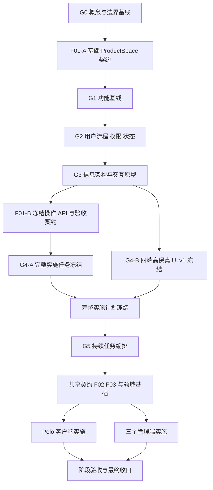

# Polo 产品对齐与交付关卡

本文记录 POL-68 在完成概念梳理后，对“什么时候需要产品用户介入、什么时候可以由研发直接推进”的统一结论。它补充 `CONTEXT.md` 的领域定义和 `refactor-model-map.md` 的技术任务拆分，不替代两者。

## 1. 当前判断

截至 2026-08-10，G0—G3 已完成产品确认，F01-B 也已冻结跨仓 API、Schema、缓存、运行范围、直接切换和验收契约。当前尚未进入正式编码；下一阶段先完成全部正式任务卡和四个产品入口的高保真 UI v1，二者冻结后才启动持续任务编排。

已经可以直接推进的内容：

- `ProductSpace / productSpaceId` 的基础定义，只包含 `personal / enterprise`。
- ProductSpace 与客户端本地 `Workspace / workspaceId` 正交。
- Creator Circle 是分发和经营关系，不是成员可切换的空间。
- 账号、企业角色、创作者资格、Creator Owner 和平台工作人员的身份边界。
- Polo 客户端、企业组织管理端、创作者工作台和平台运营端的产品职责边界。
- App/Skill 的归属、圈子分发、企业导入、算力付款主体和全局治理原则。

已经通过 G1—G3 补齐的内容：

- 用户从一个入口完成目标的完整步骤。
- 每个入口当前版本必须提供的操作级功能。
- 权限不足、资格暂停、企业受限、作品下架、订阅到期等状态行为。
- 页面信息架构、入口、跳转、确认和错误反馈。
- 会被上述用户流程影响的 API 操作粒度和最终验收场景。

上述内容已经采用“研发先形成完整草案，产品用户在固定关卡集中确认”的方式完成评审；后续只有实现偏离已确认流程、成本、权限、数据权属或业务责任时才重新请求产品裁决。

## 2. 四个产品入口及其实施主线

| 产品入口 | 主要使用者 | 当前版本的核心职责 | 重构主线 |
| --- | --- | --- | --- |
| Polo 客户端（成员工作台） | 普通用户、企业 Member、Owner、Manager 的消费身份 | 使用当前 ProductSpace 的 Apps、Skills 和 Polo 助手；管理个人圈子关系；安全切换空间 | S01、P01、P02、P03 |
| 企业组织管理端 | Enterprise Owner / Manager | 成员与邀请、企业 Apps/Skills 导入和分发、成员组、企业总预算、权限、审计与企业设置 | E01—E03、A03、W01、M01、L01 |
| 创作者工作台 | 有效创作者、具体圈子的 Creator Owner；暂停或撤销创作者只读访问 | 创建圈子、管理作品和版本、平台检查、发布、圈子分发、成员和经营数据；资格失效后处理历史与责任 | C01、C02、A01、A02、A04、W01、B01 |
| 平台运营端 | 专用平台工作人员账号 | 账号与组织、创作者资格、订单与结算、健康和异常、作品治理、审计与平台配置 | F03、A04、O01、B01、L01 |

产品体验上，这四个入口边界独立。工程上，企业组织管理端与创作者工作台可以由同一个管理 Web 的不同业务模式承载，但不能复用同一套隐式角色授权或重复写流程；平台运营端继续保持独立身份和系统边界。

Polo 客户端是成员消费客户端，不是第四个管理后台。它只显示当前账号确实拥有的管理入口或带上下文跳转，不再重复承载企业成员管理、作品发布或平台治理写操作。

## 3. 产品用户需要介入的事项

产品用户只需要裁决会改变业务结果或用户可见行为的事项。

### 3.1 功能范围

每个入口必须形成操作级功能清单，并把每项标记为：

- 当前版本必须有。
- 当前版本允许简化。
- 后续版本再做。
- 明确不做。

例如，“企业分发作品”不能只停留在概念层，需要明确当前版本是否包含导入、选择成员范围、停用、版本更新提示和失败处理。

### 3.2 端到端用户流程

需要用真实目标验证完整流程，而不是只评审单个页面：

- 新用户无邀请注册后进入我的空间并第一次使用 App/Polo 助手。
- 用户加入多个创作者圈子，在我的空间获得并使用其作品。
- 用户接受企业邀请、进入企业空间、使用企业目录并返回我的空间。
- App、Polo 助手或 AI 正在运行时，用户终止任务后切换空间。
- Enterprise Owner/Manager 邀请成员、导入作品、设置范围并处理版本更新。
- 创作者获得资格、创建圈子、发布作品并分发到一个或多个圈子。
- 平台工作人员授予或暂停创作者资格、处理异常并执行全局治理。
- 权限撤销、订阅到期、企业暂停、作品下架或本地离线时的恢复路径。

### 3.3 权限、状态、费用和数据结果

下列内容必须显式确认，不能只由界面或代码默认推导：

- Owner 与 Manager 在每个高风险操作上的差异。
- 企业采用创作者新版本时是手动确认、提醒还是自动更新。
- 创作者资格暂停后，圈子、稳定版本、收入和成员权益如何处理。
- 企业欠费、治理暂停、closing 人工责任检查期间分别允许哪些只读、导出、申诉或结算动作。
- 作品被平台阻断后，成员、企业管理员和创作者分别看到什么，以及能否恢复。
- 删除、退出、移除、停用和撤销对数据归属与计费的影响。

### 3.4 信息架构、交互和 UI

前端开发前至少需要确认：

- 四个入口的导航和页面层级。
- 身份满足条件时入口如何出现，身份不足时是否完全不存在。
- ProductSpace 切换、当前空间提示和跨入口跳转。
- 空状态、加载、离线、错误、权限不足、危险操作确认和成功反馈。
- 关键流程的低保真可点击原型。
- 正式开发使用的高保真视觉方向和核心组件状态。

## 4. 不需要产品用户逐项介入的事项

只要不改变已确认的产品行为，以下工作由研发自行设计、评审和验证：

- 数据库表、索引和内部外键。
- 缓存键、序列化格式和本地目录布局。
- 模块拆分、代码组织和内部服务接口。
- 未公开发布阶段的一次性数据转换、旧缓存清理和回滚机制。
- 自动化测试结构、日志字段和性能优化。
- App 沙箱的具体技术方案，前提是满足已经确认的权限边界。

如果技术约束会改变用户可见流程、费用、权限、数据归属或业务责任，则必须回到产品关卡裁决，并用具体场景说明影响和推荐方案。

## 5. 产品对齐关卡

### G0 — 概念与边界基线

产出：`CONTEXT.md`、ADR、当前能力地图和目标代码模型映射。

状态：本轮已基本完成。只有发现现有定义无法覆盖的真实冲突时才重新打开，不恢复开放式访谈。

### G1 — 功能基线

产出：四个产品入口的功能清单、版本范围和明确不做项，见 [`product-function-baseline.md`](./product-function-baseline.md)。

状态：已通过（2026-08-09）。

产品用户确认：功能是否解决真实目标；当前版本范围和优先级是否正确。

通过条件：每项功能都有唯一产品入口、使用角色、当前版本范围和业务结果。

### G2 — 用户流程、权限与状态

产出：关键用户旅程、操作级权限矩阵、主要对象状态机和异常恢复规则，见 [`user-flows-permissions-and-states.md`](./user-flows-permissions-and-states.md)。

状态：已通过（2026-08-09）。

产品用户确认：真实业务是否能完整走通；权限、费用、数据和生命周期结果是否正确。

通过条件：主流程、失败流程和高风险边界都有可验收结果，不依赖开发人员自行猜测产品行为。

### G3 — 信息架构与交互原型

产出：四个入口的信息架构、关键页面线框、可点击流程原型，以及空状态和错误状态。

四个产品入口的完整用户流程分别记录为：

| 产品入口 | 用户流程文档 | 流程组数量 |
| --- | --- | --- |
| Polo 客户端 | [`polo-client-user-flows.md`](./polo-client-user-flows.md) | 11 |
| 企业组织管理端 | [`enterprise-admin-user-flows.md`](./enterprise-admin-user-flows.md) | 12 |
| 创作者工作台 | [`creator-workbench-user-flows.md`](./creator-workbench-user-flows.md) | 10 |
| 平台运营端 | [`platform-operations-user-flows.md`](./platform-operations-user-flows.md) | 13 |

当前共 46 组入口级用户流程。每组流程描述角色、主流程、异常恢复和成功结果，作为 G3 交互原型与后续前端任务的输入。

可视化原型草案：[`design-demos/polo-g3-user-flows/index.html`](../design-demos/polo-g3-user-flows/index.html)。可视化画布由产品用户单独更新；本文档工作只维护已经确认的文字流程和实施契约，不再同步修改画布。

状态：已确认（2026-08-10）。

分入口进度：Polo 客户端 11 组、企业组织管理端 12 组、创作者工作台 10 组、平台运营端 13 组文字流程均已于 2026-08-10 确认，共 46 组。G3 已完成。

产品用户确认：入口是否容易理解；流程是否符合用户预期；关键操作是否缺失或重复。

通过条件：Polo 客户端的 P01/P02/P03，以及三个管理端的前端任务都能从原型获得明确输入。

### G4-A — 完整实施任务冻结

产出：覆盖 F02/F03、企业、圈子、作品、目录、客户端、三个管理端、计费、治理、生命周期和迁移的全部正式任务卡，以及统一任务依赖图。

每张任务卡必须明确：目标仓库、分支、前置依赖、输入文档、范围、非目标、输出、验收条件、需要引用的 UI 设计和允许自动继续的边界。

产品用户确认：任务拆分是否完整，依赖是否符合产品交付顺序，是否存在仍需在编码中临时决定的产品问题。

通过条件：任务编排能够仅依据任务卡持续执行，不需要开发到一半再询问已经可以提前定义的功能、流程、UI 或验收问题。

### G4-B — 四端高保真 UI v1 冻结

产出：四个产品入口各自独立、可在浏览器评审的高保真交互 HTML，覆盖其已确认的全部用户流程，以及正常、空、加载、失败、受限和关键操作状态。

产品用户确认：页面结构、导航、操作路径、文案、视觉、组件状态和角色/权限差异。

通过条件：

- Polo 客户端 11 组、企业组织管理端 12 组、创作者工作台 10 组、平台运营端 13 组流程均可从对应 HTML 评审。
- 产品用户可分四批评审，但四批都必须在正式前端编码前确认并冻结为 UI v1。
- 每张前端实施任务已引用对应 HTML，写清页面范围、状态覆盖、视觉验收和禁止自行改变的交互。
- 用户单独维护的可视化画布不属于本门禁产物，不要求同步修改。
- 外部浏览器流程冻结客户端发起、交接、返回和失败恢复，不在客户端 HTML 复制 Web 页面；既有 Polo 助手内部流程冻结真实组件复用边界，不在 POO-41 静态原型重做内部状态机。

### G5 — 持续实现、阶段验收与最终收口

产出：按冻结依赖自动完成代码、评审、修复、自动化验收、分阶段可运行 Demo 和最终产品验收。

执行规则：只有发现会改变产品范围、权限、费用、数据归属、业务责任或已确认 UI 的真实冲突时，才暂停并提交产品用户裁决；一般工程实现选择、代码组织、测试补充和已定义范围内的问题修复自动继续。

通过条件：所有任务分别达到任务卡验收标准，四个产品入口的可运行结果与 G1—G4-B 一致，旧模型和入口只在 X01 验收通过后清理。

## 6. F01 与产品关卡的关系

F01 的产品与操作契约不需要等待完整 UI，但正式代码实现仍需等待 G4-A 与 G4-B。F01 分成两个已经完成的定义冻结点：

1. **F01-A 基础契约**：确定 ProductSpace 命名、ID、类型、与本地 Workspace 的正交关系、隔离不变量和旧 `organizationId` 的直接切换原则。
2. **F01-B 操作契约**：在 G1—G3 后冻结 API 路径、共享 Schema、命令粒度、缓存、Runtime Scope、返回状态和错误语义，见 [`product-space-operation-contract.md`](./product-space-operation-contract.md)。

这不是新增范围，而是避免在用户流程确认前过早冻结完整 API。

## 7. 推荐交付顺序

执行规则：

- F01-A、G1—G3 与 F01-B 已完成，不再恢复开放式访谈。
- G4-A 必须把所有实施项转成正式任务卡，不能只保留本文内部编号。
- G4-B 必须在任何正式前端编码前完成；高保真 UI 不再与正式实现并行。
- G4-A 与 G4-B 可以并行准备，但只有二者全部通过后才启动 G5。
- Polo 客户端与三个管理端分别建任务，不把跨仓库改造合并到一张不可验收的大任务中。
- G5 按冻结依赖自动继续；仅真实产品冲突触发人工裁决。
- 旧模型删除和数据迁移切换最后执行，且必须以新流程端到端验收通过为前提。

## 8. 产品确认的工作方式

为降低产品用户的研发认知负担，后续不再要求用户决定表结构、接口风格或代码方案。每个关卡由执行方先根据现有定义形成完整草案，再集中提交：

1. 已经能够从现有定义推导出的默认结论。
2. 真实用户场景和可观察结果。
3. 仍无法推导、且会改变范围或业务结果的问题。
4. 每个问题的推荐方案、替代方案和具体影响。

显而易见或已确认的问题不重复提问。需要裁决的问题按主题成批提交，不恢复一问一答式长访谈。

## 9. 开发就绪标准

任何正式实施任务只有同时满足以下条件才可以进入开发编排：

- 依赖的领域概念已在 `CONTEXT.md` 中定义。
- 功能已通过 G1，且明确属于当前版本。
- 主流程、权限、状态和异常路径已通过 G2。
- 页面或跨入口操作已通过 G3；纯后端任务可以不要求页面原型。
- API/Schema、直接切换策略和验收条件已冻结。
- 任务明确修改哪个仓库、哪个产品入口，以及不允许顺带修改的边界。
- 对应正式任务卡已经通过 G4-A；前端任务还必须引用通过 G4-B 的高保真 HTML。
- 完整依赖图已确认该任务的前置任务完成或允许在同一编排批次执行。

未满足条件时，只允许继续完善文档、任务卡和可交互设计 HTML，不启动正式产品代码实现。

## 10. 紧接本轮的工作

1. 集中确认 G4-A：F01—X01 已全部建立正式任务卡，完整 ID、分支、依赖、UI 回写和自动继续规则见 [`implementation-orchestration-plan.md`](./implementation-orchestration-plan.md)。
2. 完成 G4-B：POO-41 已升级为完整 Polo 客户端 UI v1 任务；POL-73、POL-74、POL-75 分别负责企业组织管理端、创作者工作台和平台运营端。
3. 完成四套可交互高保真 HTML，由产品用户集中评审并冻结 UI v1，再把设计引用和视觉验收写回相关实施任务。
4. G4-A 与 G4-B 全部通过后启动 G5：先实现 POL-72 共享契约，再按冻结依赖推进 POL-76/POL-77 和其余任务。
